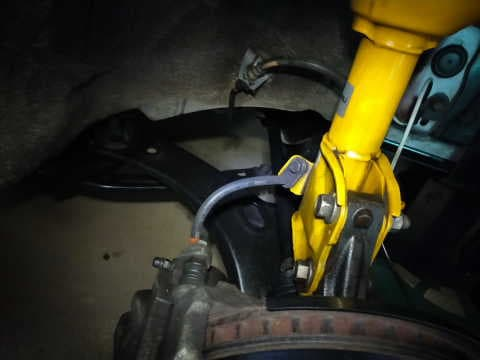
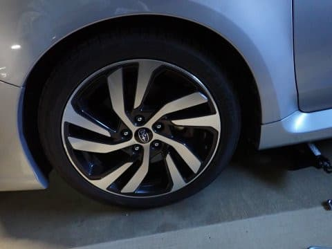

# VMG Levorg君，スタッドレスから夏タイヤに換えたよ…2シーズン，トータル25000km走ったYOKOHAMA IG5+はどのくらい減ったか？

📅 投稿日時: 2023-05-07 04:08:55

えー．

GWも終盤になってきた，

本日の志賀高原ですが．

熊の湯ラストの本日，いつものおこみん

特派員が熊の湯へ行っていたようです…！

5月6日（土）の熊の湯，

あさイチの下半分はまともに見えますが…

こうやって見ると，リフト降り場から

しばらくは廊下になってますね…（涙）

うーん．

あさイチでこれだと，明日のどしゃ降りを

考えれば，今日で営業終了なのはやむなし

と言った感じでしょうか…

まぁ，逆に言えば．

周りに全く雪が残ってない状態で，

良く今日までもたせた

と，コース維持の努力を称賛すべきかも…

ってなことで．

GW最終日を待たずして，本日で熊の湯も

営業終了ですが．

どうやら，[前回の記事](e3d8f1da29c127d3e7bd1a35766705331.md)で悲惨な状態を

お伝えした横手第2ゲレンデも，本日で営業終了と

なったようです…（涙）

（[志賀高原索道協会リフト運行状況ページ](https://shigakogen-ski.or.jp/lift/)より）

横手は第3ゲレンデも終わったので．

これで，志賀高原で明日以降滑れるのは

横手第4，渋峠ペア

の2本のみとなりますが…

果たして，明日の高温＆豪雨に耐えられる

のか…？？

ちなみに，志賀高原は7日の深夜2時くらいから，

既に雨が降り始めていたようで…

今から8日（月）の午後まで降り続けます（泣）

でも．

最新の天気図を見ると，なんだか，

7日深夜から8日朝にかけては気温が冷えて，

横手・渋だと雪になるかも？？？

…まぁ，この状況で数cm積もったくらいでは

なんの救いにもなりませんが…

8日は久しぶりに冷えた朝になりそう…！！

…とはいえ，8日はみぞれっぽい湿った雪が降りつけ，

昼前にはまた雨に変わるような，

あまりスキーに適した天気ではないですが…

とはいえ，来週は気温がそんなの極端に

上がらなさそうなので…

なんとかかぐら・渋とも13・14日の週末まで

もってほしいところ（祈）

…ってなところで，本題へ．

本日も仕事が終わっておらず，家で

過ごしたわけですが．

大事な仕事である，

スタッドレスから夏タイヤへのタイヤ交換

をまだやっていなかったので．

本日，仕事の合間に，タイヤ交換を

やってしまいました～！！

タイヤを外してみると…

6か月ちょいの雪道走行で，汚れやら

凍結防止剤やらがこびりついた，なかなか

すごい状況になってます…（涙）

うーん．

タイロッド・ドラシャ・アーム類，

全て泥と凍結防止剤まみれですね…

ってなことで．

いつも通りきれいに磨く！！

まずはプラスチックのフェンダー内側を

きれいにして…

その後，これまたいつも通り，アーム類を

徹底的に洗って磨く！！

見えないところがピカピカになっているのが

私の車の特徴なのだ！

うーん．

今シーズンは仕事の論外の多忙さや何やらで，

シーズン1.3万kmという，ここ近年まれに見る

走行距離の少なさだったけど…

さすがにもうすぐ5年，11.5万km走っただけ

あって，きれいにしきれないところも

あるなぁ…（泣）

とりあえず，リア側もタイヤを外してみると…

うわ．

これもひどい…

フロントよりも凍結防止剤がより多く

こびりついてる気が…

これでもさびてないのは，いつも塗ってる

錆止めのシャーシコートのおかげかな？

言うまでもないが…

こいつも徹底的に磨くぞ！！！

…うん．

これで少しは見られるレベルになったかな…

こいつもいつも通り，シャーシコートの

スプレーを塗って保護しておきます…

ってなことで，夏タイヤへ交換完了！！

とりあえず，外してみたスタッドレスタイヤを

見てみると…

昨シーズン途中から使い始め，

昨シーズンは1.2万km，

今シーズンは1.3万kmの，

計2.5万km走った，このYOKOHAMA iG-5Plus

ですが．

昨シーズンはリア・今シーズンはフロントで

履かせたこのタイヤ．

まだまだプラットフォームまでは余裕が

ありますね～．

問題なく，まだあと1シーズン履けそうです！

もう一つ，昨シーズンはフロント・今シーズンは

リアで履かせたタイヤを見ても…

まだまだプラットフォームまでは余裕があります！

問題なく来シーズンも履けますね！！

…ということで．

無事3シーズン目までもってくれたようですが．

以前の1シーズン2万km近く走った時は，

2シーズンでタイヤが終わってしまっていたので…

3シーズンもってくれて，かなりお財布的には

助かった感…

スキーに行った回数が例年に比べ少ないのは悲しいけど．

回数が減ったぶん，交通費や宿泊代，

今回のスタッドレスタイヤなどの費用が，

予定よりかなり少ない金額で済んだのは

ちょっと救いかな…

この余ったお金で，板とブーツが買えるな

という危険思想が頭をよぎったけど．

その思想は闇に葬っておこうと今の段階では

思った，Skier_Sだったのでした…
