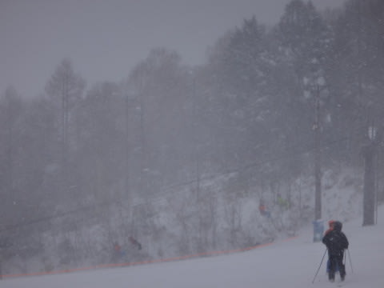
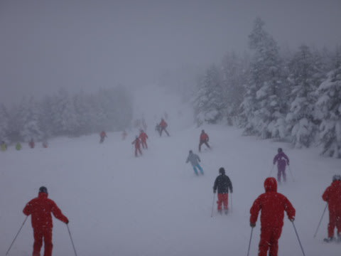
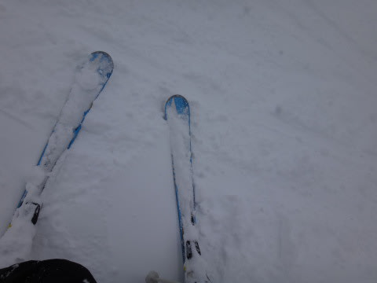

# 12月15日　志賀の速報…結構降ったけど，パウダー祭りではなかった…

📅 投稿日時: 2013-12-16 02:10:58

🏷️ カテゴリ: [2014スキー滑走日記](c992167609b6415052179ee69ea1ea7d8.md)

あう～．

本日も，リフトストップまで滑って，さらに寄り道して

帰宅が遅くなり．

いろいろやっていたらこんな時間だ…(涙)．

ということで，本日は速報モードで．

えー．

本日の日曜の志賀高原は．

朝は吹雪いて…

をを！すごいパウダーか…？

と期待したけど．

積雪は20cmほどで．

それほどのパフパフにはならなかったです…(ちょっと残念)．

焼額は，今日も某都道府県連の講習会が入っていて，

かなりゲレンデ人口密度も高く．

…さらに，午後は強風でゴンドラが止まってしまうという

残念な感じではありましたが．

まぁ，日中もぼちぼち積もったので．

オープンしている部分はブッシュの心配も何もなく．

ゲレンデコンディションはいい感じになってますよっ！

…詳細は，また明日．
