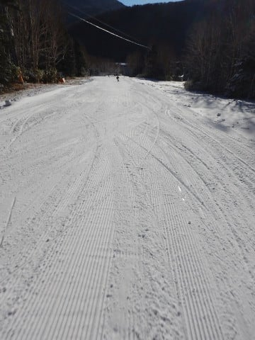

# 2018/12/2(日)の志賀高原・ヤケビ地スキー場詳細…朝イチ最高！終日晴天．午後は荒れたけど，楽しめたよ

📅 投稿日時: 2018-12-04 02:48:10

えー．

やはり本日の志賀高原．

雨だったようですね…（涙）

雪が…雪が解けていく…（泣）

とりえず．

昨日速報した，日曜の焼額．

本日は詳細モードにて…

えー．

土曜の夜から日曜の朝にかけて．

どうやら，わずか1～2cmながらも積雪があったようで…

スキー場周りの路面は，全面うっすら積雪路面になってます．

うーむ．

どうせならこの30倍くらいは降ってほしかった…

で．

あさイチの焼額スキー場は．

リフト待ちもせいぜいこの程度と少なめで．

そして，すっきり晴天となった本日．

あさイチは放射冷却で-5℃近くになった，冷え冷えの朝です．

リフトで上に上がると…

うおおおお！

なんだか，結構コンディション良さそう！

そして．

シマシマバーンさん，おはよう！

いやーーー．

うっすら新雪が乗った上を圧雪してあり．

あさイチは，今シーズン初と言える，

氷点下の冷え冷え雪で，エッジの食いつき

も最高！

これだよ…

スキーってのは，こうじゃなきゃ！

今シーズン初の柔らかシマシマバーンを

切り込んで，大回りしていく，この快感…

実にどれだけぶりか…（感動）

と．

あさイチは強烈快楽バーンを

楽しめましたが．

ただ，だんだんゲレンデの人は増え始め．

9時過ぎには，ちょい人口密度が高く

なってきたかな…

でも，リフト待ちは最大でもせいぜい

この程度だったので．

全然OK！

ピカピカ晴天で，気温がぐんぐん

上がっていったものの．

午前11時ごろまでは，結構いい雪質を

キープしてくれましたね～．

…しかし．

人工雪を打っていないところは．

全然雪が無いですね…

もう一降りほしいところ…

コース脇も，人工雪が打ってないところは

ブッシュが出てます．

コース幅が一番狭いところは，

こんな感じ．

うーん．

ここ，4日の高温＆雨で途切れずにもつんだろうか…

という感じで．

昼ごろには，+7℃と，かなり気温が上がった本日．

昼には，雪はちょっとしっとりとした感じに

なり．

そして，一部雪が茶色くなったところも

あったりして，ちょっとゲレンデが

荒れ始めてきます（ちょい涙）

とはいえ．

荒れた表面の下にしっかり硬い層があり．

ゲレンデにところどころ出ていた，

アイスバーンっぽい硬い層が緩むほどでは

なかったので．

気温が高い晴天の割には，いいコンディション

だったのかも…

でも．

午後2時ごろには，さすがに表面の雪は

結構緩んできて．

ゲレンデは，かなり荒れてきて．

スピードを出すと，かなり飛ばされる

感じになってきました…

だけども，滑る！

荒れていようが何だろうが，滑る！

…と，午後3時を回ったころ．

ゲレンデはガラガラになり．

ほぼ貸切状態に…

滑っているのは，焼額でいつも見かける，

定番のメンバーしかいません(笑)．

日が陰ると，緩んでいた雪が固まってきて．

さらに滑りにくくなってきたけど…

でも，今日もリフトストップの4時．

もう，日が暮れかける時間まで．

しっかり滑りました～！

ってな感じで．

ちょいと雪は荒れ気味だったものの．

あさイチは最高だったし．

それほど混まなかったし．

予想よりは楽しめた感じの本日だったのですが．

うーむ．

4日はやっぱり，すごい高温の雨が降りそう…（涙）

それも5日の夕方まで気温が高くて，雨っぽい

天気が続くので．

ゲレンデはかなりやられそう…

次の週末，大丈夫かなぁ…

7日からの冷え込みに期待っ！！

## 💬 コメント一覧

### 💬 コメント by (サトシ父)
**タイトル**: 心配です
**投稿日**: 2018-12-04 12:39:25

国交省のチェーン規制が心配です…292号線が対象にならないことを願うばかりです。

プロジェクトXは在庫ありで年内登録らしいです、いつ家族に話そうかと思案中www

### 💬 コメント by (yumi)
**タイトル**: 異常気温です😵😵😵
**投稿日**: 2018-12-04 13:20:51

Ｓさぁ～ん😱⛷️💨

今朝の熊の湯はツルツル❗️カリカリで、私の技術では楽しめませ～ん💧

・・・・・

３０分程 待ってお日さまパワーで、🎵～🎵

10:30過ぎの帰り道、蓮池の寒暖計がなんと15℃。

上林の寒暖計に至っては20℃ってどうよ😱

変わり果てたくま🐻ちゃんの姿をFBで公開しています。

良ければ、怖いもの見たさで 覗いてみて下さいませ✨

### 💬 コメント by (若杉勲71)
**タイトル**: Unknown
**投稿日**: 2018-12-04 14:16:26

ヤケビは滑りやすかったですよ。係員の労力で、コースは更に狭くなったものの雪質は◎。2高にもまだ雪が残ってましたよ。

ベランダの大掃除と布団干しのため、早々に退散しましたが、気持ち良かったあ。今日は20000mペースで滑りましたよ。もっとも４ロマでは無理ですが。

明朝の積雪に期待。

### 💬 コメント by (Skier_S)
**タイトル**: すごい高温の雨でゲレンデが…
**投稿日**: 2018-12-05 00:27:30

＞サトシ父さま

そうなんですよ…

私は自分の車にチェーンを履かせたことがないので，

今更チェーンを買いたくないのですが…

これまで20年近く，全くチェーン無しで問題なかったのに，今更チェーンってのも…

しかし，プロジェクトX．

まだ家族に言ってらっしゃらないのですね…

いうタイミングを完全に逸しそうですね

＞yumiさま

熊の湯，ひどかったようですね…

今晩は雪が薄くなりすぎ，圧雪車も入れなかったみたいで，

明日はどうなることか…

明後日木曜は，かなり多くのスキー場が営業できなくなりそう．

でも，金曜からすごい冷えるので…そこに期待！

＞若杉さま

ヤケビは良かったんですね！

今晩の雨にもめげず，明日も普通に営業するみたいですから…

明日朝は，残念ながら積雪はないです．

一晩雨です（涙）

木曜はかなりやばい感じです．

金曜からの冷え込みに期待…

