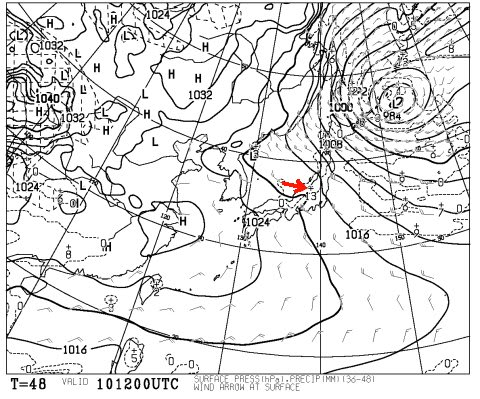

# 明日から1泊2日で志賀高原へ…

📅 投稿日時: 2015-01-10 22:14:12

🏷️ カテゴリ: [日記](cc4b5682fb7b8b144980957a978653fb0.md)

えー．

今日一日．

スキー場には雪が積もっているというのに．

志賀高原ではパフパフだったというのに．

仕事も休みだというのに．

…遠く志賀高原を思いながら，家で掃除洗濯買い物

その他をこなしていた，Skier_Sです．

…んで．

どうやら，本日の志賀高原．

午後晴れ間が出るかも…という，私の予想は外れて（涙），

午後まで雪だったようで…

まぁ，ごくわずかに[晴れるタイミングもあった](https://www.facebook.com/yakebitaiyama/photos/a.533933973368620.1073741847.116999658395389/739976182764397/?type=1&theater)みたいだし．

大外れ，というわけではないのかもしれませんが…

…今日終日雪になってしまったのは．

きっと，日ごろの行いがいい私がスキー場に行かなかった

からに違いない！

…と，思いたいところですが←だれも思わないから

そーゆー理由で晴れなかったわけではなく．

今回の予想が外れた理由を言い訳しますと…

昨日の段階での，10日夜9時の予想天気図がこいつで．

今日の段階での，10日夜9時の予想天気図がこいつ．

…見て分かるように．

志賀高原の等圧線の角度が全然違い，

昨日段階ではかなりの西風…雪が降らない風向き．

今日段階ではかなりの北風…雪が降る風向き…

と，全く変わっちゃってます．

これは，天気図に現れないプチ低気圧の位置が，

昨日の予想より今日の方がちょいと北寄りになり，

このわずかなずれで，風向きが大きく変わってしまった…

ってのが原因で．

…一昨日の最後に予防線を張っておいた，

「プチ低気圧のわずかのずれで天気が大きく変わる…」

というのが，モロそのまま出ちゃいました（泣）．

明日の予想天気図もこんな感じで，

…これまでの予想天気図には全く見られなかった，

謎の低気圧が現れてます．

…とりあえず，明日から2日間も，雪が結構降り続ける

でしょう…

2日間，太陽は拝めなさそう…

でも，2日とも，朝はパフパフになってくれるかも！

ってことで．

本日，妻を連れて病院に行ったところ．

「靱帯も骨も全く大丈夫」という最終診断となり．

回復も早いでしょう，という結論でした～（ぱちぱちぱち～）．

実際に，ここ2日間で劇的に回復してきて．

家の中は，短距離なら松葉づえ無しで移動できるように

なってきたし．

一人で立ったり座ったりもできるようになり，

洗濯，炊事とかも自力でできるようになって．

妻から，「スキー，行っていいよ．行ってきて」

との一言がもらえたので．

明日から1泊2日で，志賀高原へ，復活します！

…とりあえず．

こんな状況に関わらず．

にっこり笑って快くスキーに送り出してくれる妻をもって．

…もしかしたら，私はそうそうめったにない，

幸せ者なんじゃないだろうか…

…と．妻への心からの感謝を込めて．

妻からのプレゼントの2日間，

有り難く．

感謝！
