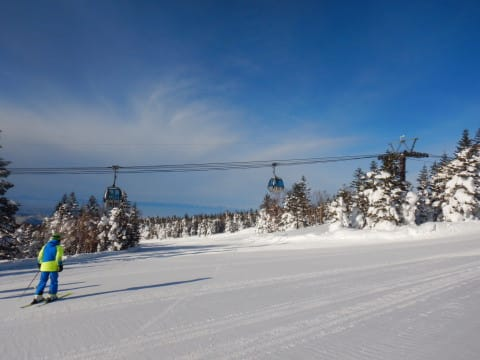
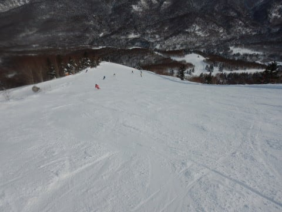
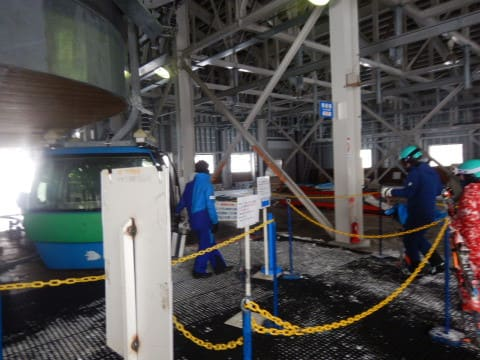

# 2022/1/23(日)の志賀高原焼額山スキー場…初めてファーストトラックというものをやってみたが，これはヤバい．かなりヤバい…

📅 投稿日時: 2022-01-25 00:37:39

🏷️ カテゴリ: [2022スキー滑走日記](cc9cb73e4320f6a97af6fccc37587a61a.md)

えー．

今日の志賀高原は，雲が多いながらも

晴れ間もあった一日だったようですが…

これから31日まで，志賀高原は

弱めの冬型気圧配置がずっと続くという

予想天気図になっていて…

これから31日までの1週間は，

ドサドサ雪が積もることもなさそうだけど，

すっきり一日晴れることもない，

という感じの日々が続くのかな…

うーん．29，30の週末も，

すっきり晴れとはいかなさそうな

天気図だけど…．

もしかしたら，30日の日曜は

かなり冬型が弱まるので，

晴れるかも？

ってなことで，本題へ．

昨日速報レポートした，23日の日曜の

志賀高原，詳細レポートです！

…が．なぜかレポートの前に，

プロローグが…？？？

【プロローグ】

土曜日の夜，いろいろな事情により，

滑る気マンマンだったナイターに

行けなくなったSkier_S．

あぁ…ナイターに行けなかった…

雪も良かったし，天気も良かったし．

あさイチから夕方まで昼休み抜きで

滑っても，まだ滑り足りないのだ！！

ナイター滑らないと，滑り足りない！

もっと滑りたいのだ！！

うおーーーー！！！もっと滑りたい…！！

と，滑りたい欲求にブレーキが効かず，

土曜の夜に宿で悶絶していたSkier_Sは．

とある危険な発想に至ったのだった…

…行くか．

これまで「これだけはやめておこう」と

心に決めていた，

禁断のファーストトラックへ…

ファーストトラック…

それは，1500円を払うことで，

通常営業開始8:30に先立つこと40分．

午前7:50から第1ゴンドラに乗れるという，

焼額スキー場のサービス．

これは，

わずか40分のために，1500円を払える

という，選ばれし民のみが

参加することを許される，

一般人が踏み込んではいけない領域．

…いや．

焼額ナイターは2200円ともっと高いけど，

でも，ナイターは2時間たっぷり滑れるのだ．

さらに，3月末から4月ごろに始まる早朝営業も，

6:30スタートで8:30まで，しっかり2時間

滑れるのだ．

これに対し，ファーストトラックはわずか40分間．

…時間にすれば，ゴンドラ3本分．

わずか40分間のために1500円というのは，

Skier_Sの金銭感覚ではちょいと高いと感じて

いたらしく．

…さらに，ナイターだけじゃなく，ファースト

トラックにも参加すると，もう終わっている人で

あるにもかかわらず，

「いろいろ終わった人」と思われそうだ…という

謎の理由により．

「ナイターは滑るけど，ファーストトラックは

　参加しないよ」

と言い続けていた，Skier_Sだったのだが…

この日はナイターが滑れなかったため，

滑りたい欲求の限界値を超えたらしく．

「行く…明日は禁を犯して，ファーストトラックに行く！！」

と．

誰も禁と決めたわけじゃないのに，

犯罪を犯すような決意で，

ファーストトラック参加を決めたのだった…

【プロローグ了】

ということで．

睡眠時間が短いために，ただでさえ朝が弱い

のに．

いつもより早起きして，やってきました

焼額ファーストトラック！

いやー．

ニューイヤーファーストトラックは，

朝7時からの1時間半滑れるから参加した

ことはあるけど．

通常ファーストトラックは，我が人生で

初めての参加です…！

天気はすっきり快晴で，ゲレンデ状況は

激烈に良さそうな予感…

ってなことで．

人生初ファーストトラックの一番ゴンドラで

山頂に着くと…

太陽がいつもより低い位置にあって，

何だか新鮮！！

そして．

いざ，ファーストトラックの一番

ゲレンデへ！！

…いつもの通常営業だと．

一番搬器で上がっても，ファーストトラックの

シュプールがついたゲレンデしか見れないので，

シュプールがひとつも無いバーンを見ることは

ほとんどないけど…

これは．

これはリアルなノートラックバーン！！！

すげーーー！！

スゲーよ！

ヤケビの圧雪職人，すごいよ！！

ここまで完全無欠な真っ平らバーンを

作り上げるとは…

圧雪の継ぎ目の段差が全くなくて，

ここに足を踏み入れるのは罪なんじゃないか？

と思うほどの美しさ…！！

美しい…

1本もシュプールがついてない，

完璧なシマシマを切り裂いていくのが，

ここまで人間の官能に訴えかけるとは…！

ぐはぁ！！

気持いい！！

気持ちよすぎる…っ！！！

これは間違いなく，今シーズン最高の

快感の1本！！！

これはヤバい．

ヤバい．

いかん．

マズい．

これは…ヤバい！！←語彙力消失

気持いい～！！！！

ただでさえ，焼額の圧雪のクオリティは

高いのだ．

志賀高原の他のスキー場と比べれば，

その段差の少なさ，仕上げの丁寧さが

群を抜いているのは誰もが分かる

ところだけど．

この最高クオリティのまっさらシマシマを

一番にいただく，この罪悪感と，

快感の濃密さ…！！

本数にすれば，ゴンドラ3本．

ギリギリ4本目に飛び乗れるだけの

時間しかないけど…

ヤバい．

これまで「1500円は高いから…」と参加を

ためらってたファーストトラック．

こんなに気持ちいいとは…！！

いけないものを知ってしまった…！！

たぶん．

天気も雪も最高の日は，次から我慢

出来なくなる．

天気と雪がよい日は，1500円払う価値は

十分にあるよ，これ…！！！

ってなことで．

ファーストトラックで貸し切りの

GSコースを3本滑って，

4本目のゴンドラに乗ると，通常営業

開始の時間．

ファーストトラックで滑れる

GS・オリンピックコース以外のコースも

オープンになりますが，

通常営業のお客さんが上がる前に，

これらのコースに飛び込めるので…

第2ゴンドラ側のパノラマコースに

飛び込めば，また誰も滑ってない

シマシマを堪能できます！！

ぐはぁ！！

最高！！

ファーストトラック，最高か！！

しかし．

いかん…

悪いことを知ってしまった…

知らない方がシアワセだったかも…

ってなことで．

通常営業が始まったわけですが．

ここで定点観測の山頂気温は…

-8℃ですか．

この時期としては高めだけど，

まぁまぁの冷え込み．

そして，今日はゴンドラも意外と

混まず…

天気がいい，冷え冷え雪質で

混んでないバーンを滑りたい放題！

11時ごろ，一瞬ゲート外までゴンドラの

列が伸びたけど．

これだけ待ったのはせいぜい2-3回程度で，

今日はストレスなくゴンドラグルグル

できました！

いやー．

天気も良く，人も少なく．

今日も絶好のスキー日和です…

ただ，午後になると，ちょっと雲が

増えていき，うっすらと太陽が

隠れ始め…

残念ながら，すっきり晴天ではなくなり

ましたが．

でも，薄日はさしているので，ゲレンデの

起伏はある程度見えるので，

全然許す！！←誰を許してるんだ？？

そして，午後になるとゴンドラも

飛び乗りだし…

午後には雪が荒れるどころか，むしろ

どんどん締まっていき…

午後になってもトップスピード大回りが

できる，ハイスピードフラットバーン！！

それも，こんなに無人で飛ばしたい

放題とは！！

シアワセだ，今日はシアワセすぎる…！！！

と，今日はファーストトラックから滑っていた

というのに．

いつも通り，昼ごはんタイムもとらず，

ひたすら日が暮れるまで滑り続け…

いつも通り，営業終了まで，

止まらず休まず滑り続けたのでした…

いやーー．

あまりにも良すぎて，休むのがもったいない

一日だったので．

8時間以上，トイレに一回行った以外，

ひたすら止まらず滑ってました…

しかし．

ファーストトラック．

予想をはるかに上回る良さだった…

一日でファーストトラックとナイターの

両方行く人は終わった人

だと思ってたけど．

自分が終わった人になりそうで怖い…

## 💬 コメント一覧

### 💬 コメント by (大阪のK)
**タイトル**: Unknown
**投稿日**: 2022-01-25 08:40:14

S樣、ブログを見ている私には、もう十二分に終わってると思います。

そしてそれが羨ましくもあります😁

### 💬 コメント by (Hide)
**タイトル**: Unknown
**投稿日**: 2022-01-25 08:52:54

あれ？

Sさんまだ終わってない方と思ってたんですね（笑）

28日に行こうと思ってますが何やら世間の雲行きが（悲）

### 💬 コメント by (おおすぎ)
**タイトル**: Unknown
**投稿日**: 2022-01-25 09:11:42

Sさん…

ここから、新たなS'さんの始まりでは⁉️

### 💬 コメント by (りやまやり)
**タイトル**: Unknown
**投稿日**: 2022-01-25 09:30:54

２月の連休に志賀高原行く予定です。Sさんの日記を読むたびに期待が高まります！

ただ１つの不安材料はコロナ感染です。スキーは野外で、しかも手袋、マスク、ネックウォーマー着用で、基本的にリスクは低いと思っています。ですが、ゴンドラ、宿泊施設の食事会場などが心配です。よかったらそのあたりの情報提供をお願いします！

スキー場周辺の宿泊施設での感染、クラスター発生とか、これまでもなかったでしょうか？

Sさんが心がけていることはありますか？

### 💬 コメント by (スシネコ)
**タイトル**: Unknown
**投稿日**: 2022-01-25 12:28:14

Sさんがファーストトラック初めてだったなんて驚きました。それもヤケビで。(　ﾟдﾟ)ﾎﾟｶｰﾝ

ほぼ誰もいないバーンには心が揺らぎます。一度は挑戦してみようかな。その前に道具の見直しからかぁｗ。

今週末、参戦します。お会いできることを楽しみにしております。

### 💬 コメント by (通りすがり)
**タイトル**: Unknown
**投稿日**: 2022-01-25 12:59:26

人が少なくて良かったですね

良識ある人達が控えたおかげじゃないですか？

あなたは県内の方ですか？

楽しげで羨ましいですね

### 💬 コメント by (アリス)
**タイトル**: FT情報ありがとうございます
**投稿日**: 2022-01-25 16:37:12

S様

実は私もFT経験がありません。

たかが40分滑走するのに、1,500円は勿体ないとういう観点からです・・・

今回のブログ拝見して考えが変わりました♪

FTでGS滑って、8:30になったらパノラマ～サウス・白樺方面を滑れば両方のシマシマが堪能できる訳ですね♪それなら1,500円は高くないと思います♪来週の休日にやってみます♪

何かと新型コロナ感染防止対策には賛否両論はあるかと思いますが、個人的には日常生活（市中感染が多い）を営んでいるより、志賀高原でスキーをしているほうが感染リスクは低い感がします。

特にSさんの場合、宿は個室、食事、風呂は部屋、スキーの最中のランチは取らない、リフトもゴンドラも人との距離は十分な訳ですから・・・

私も見習いますね♪

### 💬 コメント by (レインボー74)
**タイトル**: Unknown
**投稿日**: 2022-01-25 16:56:51

火曜日の志賀高原情報

朝の上林-8℃(低うっ！)　蓮池-7℃(なんで？)。終日晴れ渡って気分爽快でした。

朝一のオリンピックは爽快。なんかクローチングしないと気持ち良くない自分が怖い。ひたすらやけびの完璧バーンを満喫したあと、高天の銀嶺を目指します。

最近のパーフェクタは、ファミリーの大御所様でも、一本目はインスペクションしないと危ないという、危険コース。やけびを標準ととらえる私には悪コースに感じます。

今日のファミリーは全く最悪。楽しくない。

銀嶺ざるそばのあとは西舘へ。まずまずだったけど、行っちゃえ！シーズン初サンバレーまで。めっちゃ気持ちいい！

ジャイアントでは明日の技術選長野予選の練習をしてる。林道をプルークしながらの見物も楽しい。

再び西舘を滑ったあと東舘を降りてから寺子屋へ。

寺子屋は、天気良し、人少なし、コース良し。三コース楽しんだあとは、シーズン初の天狗へ。

番号札がまた減ってる。2 5 6 7 9 13

これしか見つからない。増やして欲しいなあ！

やけびへ戻ると、や～っパリいい。すぐには帰りきれず、レインボー(２時)を大幅に超過するはめに。

これだけ動いて、今日はやけびの圧雪の良さを、つくづく思い知らされました。ありがとう、やけび様！

### 💬 コメント by (カトウ)
**タイトル**: Unknown
**投稿日**: 2022-01-25 21:34:32

ファーストトラック！特別感ありますね！なるほど、ヤケビの圧雪は職人技、美しい！

Sさんのブログをみてると私もシアワセな気分になります。

長時間滑っても疲れない滑り方ってありますか？

### 💬 コメント by (Skier_S)
**タイトル**: これからしばらくドカ雪はなさそう
**投稿日**: 2022-01-26 02:19:28

＞大阪のKさま

…まだ終わってない．

終わってないつもりでいます…

＞Hideさま

終わってません！！終わってませんからっ！！

…しかし，コロナ罹患者がここまで一気に増えるとは思わなかった…（涙）

＞おおすぎさま

新たな始まりか，終わりの始まりか…

＞りやまやりさま

焼額のゴンドラは基本的に寒気窓オープン，

乗車待ちの列は相乗りOKの列とNGの列があり，NGの列に並べば1人で乗ることもできます．

宿の食事会場は…私が泊ったところは全てアクリルパーティションが

セットされていました．

ちなみに，私は

・行き帰りは当然車．

・宿を利用する時は1人部屋，素泊まりで，食事はパンやおにぎりの持ち込みとして食堂は利用しない

・お昼もゲレンデレストランは利用せず

…という感じです．

＞スシネコさま

いや．初めてなんです．

早朝スキーとニューイヤーファーストトラックはやっていたのですが，

やはり40分で1500円は壁が高かったので…

ファーストトラック，絶対大回りの板が楽しいです！！

＞通りすがりさま

滑っている分には，やはりガラガラのゲレンデは最高です．

…しかし，修学旅行生などが大量にキャンセルになっているようで，

経営的には厳しそうですが…

ちなみに私は冬の間は実質長野県民と言われています．

＞アリスさま

FT，晴れて雪がいい日ならやる価値はあると思います！

ただ，天気が悪かったり視界が悪かったりしたら，ちょっともったいないかも…

ぜひ一度，天気が良い日にチャレンジしてみてください．

＞レインボー74さま

オリンピックコースで99kmのあと，天狗でのんびりと

極端な一日でしたね（笑）．

今日も残業お疲れ様でした！

＞カトウさま

ヤケビの圧雪，本当にハイレベルです．

他のスキー場の圧雪が荒く感じます…

長時間滑っても疲れない滑り方は，なるべくターンサイズを大きくして，

基本ゆったり大回りで滑ることくらいでしょうか．

でも，私はついつい深い小回りが楽しく，体力を使う滑りをやってしまいます．

私はシーズン初めのYetiから徐々に滑走距離を伸ばして，

志賀高原で滑る頃には長距離を滑れる体を作っているので…

やっぱりいちばんいいのは，たくさん滑って体を鍛えることかも？？

### 💬 コメント by (かずみ)
**タイトル**: Unknown
**投稿日**: 2022-01-29 13:28:57

ファーストトラックの快楽を知ってしまったのですね☺️私達も、条件の良い日をみて参加していました。焼額山のシマシマ中毒にご注意です😉

### 💬 コメント by (Skier_S)
**タイトル**: ＞かずみさま
**投稿日**: 2022-01-29 22:59:17

しってしまいました…

知らないほうがシアワセだったかも．

今後，条件がいい日は私も我慢できなくなりそうです…

