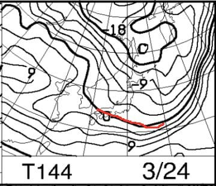

# なんと！3月21日（木）は祝日じゃないか！…春分の日の志賀高原の天気は？

📅 投稿日時: 2019-03-20 01:53:42

🏷️ カテゴリ: [スキー天気予想](c6554f5c3c106093b511a8daae23757e8.md)

今日の志賀高原特派員からの

レポートによると．

気温は上がったものの，

コンディションは良かったようですね…

そして．

焼額山．

本日も，人工雪を打っているようです！

昨日も打っていたようなので．

二晩連続ですね…

（[焼額山FB](https://www.facebook.com/yakebitaiyama/posts/2089753471119988)より）

でも．

人工雪を打っているのは，2ゴン側

サウスコースのように見えますね…

GSコースも人工雪を打ってるのかな？

とりあえず．

この時期に人工雪を打つスキー場を，

私はかつて見たことが無いのですが…

すごいぞ，焼額！

…という，焼額山の努力に感心しながら．

焼額山のホームページを見ていたら…

春営業の案内が出ていたんですが．

（[焼額山HP](http://www2.princehotels.co.jp/ski/shiga/files/pdf/2019spring.pdf)より）

うむ？？

これを良く見ると．

昨シーズンまでは，4月に入ると土日のみ

営業だったんですが…

なんと！！！

今シーズンは，4月以降もGWまで，

休まず毎日営業するようです！！！

素晴らしい…

素晴らしいよ，焼額っ！！

ってな感じで．

ここしばらく，志賀高原は．

リフトが減ったり，

営業期間が短くなったり，

圧雪がかからなくなったり．

いろいろ残念なことも多かったけど．

（全部中央エリアの話だなぁ…）

しかし．

3月になって人工降雪を打ったり．

営業日数を増やしたり．

焼額山，すごいぞ！！！

って，いいニュースのあとは．

実は．

今週木曜日って，祭日じゃないか！！

休みじゃないか…っ！

という，さらに嬉しいことに気づいて

しまったので．

…21日木曜が，どんな天気になるか，

ちと予想してみましょうか…

まず．

前日の20日，水曜日．

明日の，850hpa気温図を見てみると…

うげ．

水色の+6℃線が志賀にかかってます…

地上天気図は，降水域志賀にかかってないので．

20日は，志賀でも昼間に+8℃前後まで

気温が上がって，曇～晴れの一日に

なりそう…！

そして．

肝心な，21日木曜の祭日の850hpa気温図は．

この日は，水色の+9℃線が

志賀高原にかかるので．

昼間は，志賀高原でも+10℃を超える

高温の一日になりますね…（涙）

で．

地上天気図を見ると．

こんな感じで，

志賀高原に見事に降水域がかかってます（激涙）

…これは．

21日の志賀高原．

夕方ごろに，液体が降ってきそうな感じです．

で．

最後にオマケの，

22日朝9時，金曜の850hpa図は…

うーん．

志賀にギリギリ0℃線がかかってるかどうか．

そして，降水域も志賀に引き続きかかっているので．

…21日夕方の降り始めから22日の朝まで，

液体か固体か，微妙なものが降り続けそう…

午後に向かって冷えそうなので．

途中からは雪になってくれそう．

そして．23，24日の土日ですが．

850hpa図を見ると…

この2日間は，0℃線が志賀より南に

下がり，ひえそうですね…！

そして，地上天気図は．

どちらも志賀には降水域が

かかっておらず．

2日とも晴れそうかな～．

ってな感じで．

まとめると．

21日（木・祝）：朝は曇り空．

　朝から気温はプラス．

　雪質は，朝はちょっと締まってるかもしれないけど．

　すぐに緩み始め，春の雪になっていく（涙）

　昼間の最高気温は+10℃近くまで上がり，

　かなり雪は緩みそう．

　午後，どこかの段階で，降り始める．

　おそらく夕方．

　運が良ければ，リフト営業終了まで降らず，

　終了後に降り始める．

22日（金）：朝は雨～みぞれ．

　山頂付近は湿った雪かな？

　朝の気温はギリギリ0℃くらい．

　午前中に気温が下がっていき，

　雨は雪に変わり．

　終日雪がぱらつきそう…

　昼間だけで10cm近く積もるかも

23，24日（土日）：結構冷え込む．

　22日にどのくらい雪が積もるかに

　よるけど，

　21日に解けた雪が固まったアイスバーンか？

ってな感じでしょうか…

うーむ．

木曜祭日は，なんとか夕方まで

天気はもつかな…

週末の天気は，明日詳細予想します！

## 💬 コメント一覧

### 💬 コメント by (若杉勲71)
**タイトル**: Unknown
**投稿日**: 2019-03-20 17:41:42

水曜日の志賀高原情報

レインボーのあと、蓮池14ど、上林19ど。土日は6時半から15時半まで滑っている、普通ではないヤケビ券のま○ば先生

が、13時半にやめたくらいの雪ですが、奥志賀はムチャクチャ良かったようですよ。エキスパートを12本も滑った友人もいます。ゆみりんはダウンヒルの雪質に嬉しすぎる悲鳴をあげていました。

午後は寺子屋に上手い人が集まりましたよ。上手い人はいい雪に集まりますね。妻が初ファミリーを無難に滑りきりました。凄すぎる。亭主の危機ですが、最高です。皆さん、志賀はやっぱり凄すぎですね。

### 💬 コメント by (Skier_S)
**タイトル**: 若杉さま
**投稿日**: 2019-03-21 00:04:48

やっぱり，今日も気温が上がったんですね…

でも，朝は良かったみたいですね．

奥志賀は昼間も良かったんですか…

奥さんは明日もいらっしゃるのですか？

明日，焼額でお会いしましょう～！！

### 💬 コメント by (Rikoriko)
**タイトル**: Unknown
**投稿日**: 2019-03-22 07:56:52

はじめまして。いつも楽しく読ませていただいています。

私達夫婦はスキー好きが高じて公務員を早期退職し、冬だけ志賀高原の麓に住んでいます。

お天気の良い日だけ滑りに行くのですが、前日微妙な天気予報の時はこのブログをチェックしてから出発しています（笑）。

テレビの天気予報よりも的中率が高く、しかも志賀高原に特化されていて、バーン状況まで予測されているので欲しい情報が満載！！

ありがたいです。

昨晩はナイター終了まで滑られたということはもちろん今日も志賀におられるんですよね。

今日の麓は朝から厚い雲に覆われていて風もすごいので結局滑りに行くのは断念しました（涙）。山頂の状況はいかがでしょうか？

### 💬 コメント by (Skier_S)
**タイトル**: ＞Rikorikoさま
**投稿日**: 2019-03-22 22:10:18

ご愛読ありがとうございます～！

今日も志賀を滑ってました．

山頂は…

結構残念な感じでした．

午前中，時折日が差して，

ガチガチバーンが緩みだした数時間だけは

良かったんですけどね～…

また明日も，バーンは硬そうで．

冷え冷えなので，アイスバーンは緩まなさそうです（涙）

