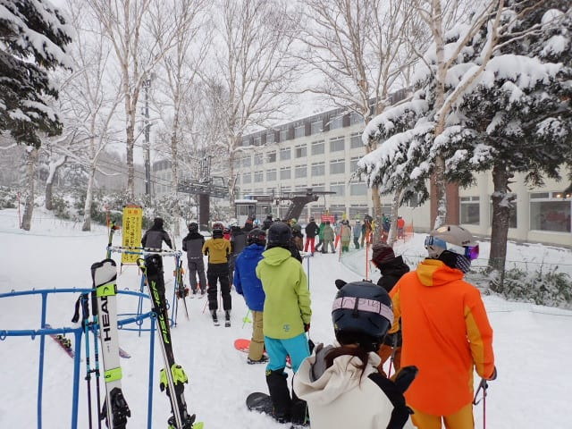

# 2024/12/8(日)の焼額山スキー場詳細レポート！…終日冷え冷え雪が降り雪質はトップシーズン並み！午前はリフト待ちあったけど午後はガラガラ

📅 投稿日時: 2024-12-10 05:25:01

ということで．

昨日速報レポートした，日曜の焼額山の

詳細レポートです！！

えー．

まず．

昨晩から明け方にかけてほぼ雪がやんでいて．

朝にやっと降り始めた感じだったので，

朝イチは思ったほど雪が積もっておらず，

駐車場の積雪を見ても昨晩から10cm

積もったかどうか…という残念な積雪（涙）

朝は結構な勢いで雪が降ってたので，

一晩そのペースで降っていてくれれば

いいものを，なぜ夜中に降らず

リフト営業開始前に降り始めるのか…

嫌がらせかな？？

積雪がなかったせいで，本日も営業するのは

第4ロマンスリフト1本のみです…

ってなことで．

いつも通り，8:30営業開始前から並びますが．

営業開始直前の列でこの程度なので．

うーん．昨日より人が少ないかな？？

8:30営業開始の朝イチのリフトに乗ると…

それほど積もったわけじゃないけど，

ゲレンデ全面，新雪が覆ってますね！！

そして…

今日もオープンしているサウスコースは，

完全にコース全面真っ白で，コース幅

いっぱい滑れますよ～！

ブッシュは全くないですよ～！！

ということで．

朝の1本目のゲレンデに飛び込みますが…

しっかり締まった圧雪の上に冷え冷え雪が

5cmほど乗った，気持ちいいバーン！

…先週までのイエティと違いすぎる！！

気持ちいい！！

ビバ！天然雪！！

朝のうちはリフトもそれほど混んでおらず，

気持ちよく滑れますが…

いかんせん，今日は気温が低いうえに

雪も降り続け，さらに低速で長い4ロマと

なると…

焼額メンバーが「4ロマの刑」と呼ぶ，

吹き曝しの4ロマで冷凍人間にされる

辛さを味わえます（涙）

これがゴンドラか高速リフトなら

いいんだけど，ペアリフトは長くて

寒すぎる…

さらに，午前10時ごろはピークで，

リフト待ちも出てきました…（泣）

ただし，リフト待ちがあった時間はごく

わずか．

11時半には，さらに雪が強くなり，

風も強く吹雪気味になったこともあり…

みんな早めに昼休みに入ったのか，

リフト待ちは11時半以降，ほぼゼロに

なりました！

この雪の降りはかなり強く．

しばらく経つと，ゲレンデの上に

いい感じの勢いで雪が積もりはじめ…

ちょっと前が見にくいし，ゲレンデは

ボコボコとまではいわないけど，少し

荒れ気味になってきました…

もう，リフト1本乗っているだけで

これだけ雪が積もるくらい，強く降る

タイミングでは結構降ったし，寒いし…

その寒さと，遅いペアリフトで冷凍人間化

されるのと，ゲレンデがちょっと荒れて

来たのもあるのか…

午後のゲレンデの人口密度はかなり低く．

こんな幅の広いゲレンデを好き放題

滑れるなんて…

あぁ…

比べちゃいけないけど．

先週までのイエティとは偉い違いだ…

ゲレンデは多少荒れたとはいえ，

ボコボコのコブになったわけではなく，

このように積もった新雪がモサモサに

蹴散らされた感じの雪で，

雪もアイスクラッシュの重い雪と違い，

さらさらした冷え冷え天然雪なので，

滑りにくいというより，天然雪を蹴散らす

快感を存分に味わえる荒れ方で．

私にとっては久々の天然雪を存分に

味わえるシアワセバーン！！！！

16時の営業終了時間のころには，

人も少なかったこともあり．

バーンがそれほど踏まれず，

バーン全体がプチ新雪状態になり…

見ての通り，粉雪を巻き上げる

プチ新雪バーンを楽しめました～！！

ってなことで．

今日もお約束通り，レストランでのお昼

休憩など取る時間も惜しみ，

ひたすら休まずナイター照明が着く

16時の営業終了まで，

ほぼ貸し切りの幅いっぱいの天然雪

ふかふかバーンを思いっきり大回り

できる，先週までのイエティとの違う

すばらしさに涙を流しつつ，

我がホームゲレンデを堪能したのでした…

帰って車に戻ると．

車の上に20cmほど雪が乗っていたので．

予想通り，昼間だけで20cmほど積もった

みたいです…

雪はいい感じで降ってくれているし，

今週も冷えるので．

今週末までに，順調にいろんなゲレンデが

オープンしてくれそうです～！！

とりあえず．

ゴンドラや高速リフトは動かなかったけど．

ここ数シーズンの中では恵まれた，

焼額スキー場のオープンの週末でしたよ～！！！

## 💬 コメント一覧

### 💬 コメント by (レインボー77)
**タイトル**: Unknown
**投稿日**: 2024-12-11 06:06:12

火曜日の志賀高原情報

冷え込んで、かみかみ硬めの感激バーンを満喫していたら、10時頃から、リフトになかなか乗れない外国の子供や初心者が沢山。

待っている間に身体が冷えきり、またまた昼という時間帯までゲレンデに居れませんでした。そろそろレインボー(２時まで)を返上しないといけなさそう。

### 💬 コメント by (Skier_S)
**タイトル**: >レインボー77さま
**投稿日**: 2024-12-12 02:00:46

あら…リフトが1本しかなくて，そこに初心者がやってくるとつらいものがありますね…

4ロマは寒いので，寒い日に4ロマのみだと身体も冷えるし，私も日曜の本格雪降りの中，

一日滑り続けるのは結構辛かったです…

でも，そんな中スーパーキッズ2人がラストまで滑っていたのに驚き！！

