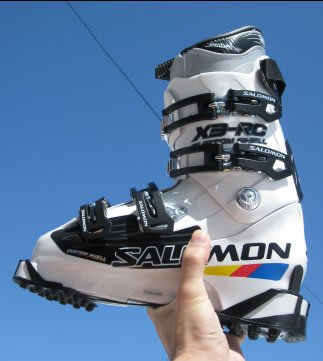
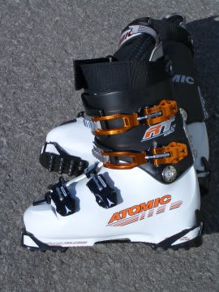

# ニューブーツ　SALOMON　X3-RC買ったよ

📅 投稿日時: 2011-04-14 01:07:13

🏷️ カテゴリ: [スキー雑談](c1f9d2cb7478308da16419928ea3945e9.md)

えーーー．

買っちゃいました．

っつーか，もうデビューさせてるんですが．

ニューブーツです．

SALOMON X3-RC．

なんで，ブーツを買うのがシーズン途中の

こんな変な時期なのか，気になる人も多いかと思いますが．

それは…

まず，安いというのが一番の理由ですね～．

あと，シーズン途中だと，シーズン中の感覚が身についており，

足を入れた瞬間にブーツのフィット感や違和感が感じられ，

合う・合わないが判別しやすいとか，膝入れしたときに

真っ直ぐ膝が入っているかどうかの判断などがしやすい

とかっていうのもありますね～

かつて，シーズンオフにブーツを買って，緩めの

ブーツを選んでしまい，実際雪上に出たときに

違和感を持ってしまったという失敗をしたことも…

なので，私がブーツを買うのはだいたい4月から5月なんです．

んで．

前のブーツは，'07 ATOMIC RT-CS 130

丸4シーズン以上，酷使してきました…

で，かつて[ここ](http://blog.goo.ne.jp/skier_nobu/e/86361b8bed7971733a83e959b4f52600)に書いたように．

私の足型はかなり変なので，かなりブーツに手を入れないと，

履けません．

いろんなところがあたって痛いんです．

なので，いったん買ったブーツも，滑っては当たり出しをして，

また滑っては調整して…

と繰り返して，シェルが安定するまでに，

大体ひとシーズンかかっちゃいます．

んだもんで．

こんなめんどくさいこと，そうそう繰り返したくないし，

また痛い思いをしたくないし．

一旦ブーツを買うと，大体4-5シーズンは履いちゃいます．

前のRT-CS130も．

インナーブーツを途中で新品に換えてまで，4シーズン履いて

きましたが…

さすがに2代目インナーも120日以上履いたので．

そろそろヘタって穴があいて．

それだけじゃなく，タングもひびが入って割れてきたので．

そろそろ寿命かな～，って．

んで，このATOMICブーツ．

結構気に入っていたので，またATOMICブーツを買おうかと，

RT-FR130あたりを狙っていたんですが．

なぜかSALOMONに戻ってしまったという…

（RT-CS130の前は，[SALOMON](http://blog.goo.ne.jp/skier_nobu/e/0b574669f26d041286356d768dc58523)を履いていた．

こいつも6シーズン以上履いた気が…）

なぜSALOMONを選んだのか．それは…（続く）
