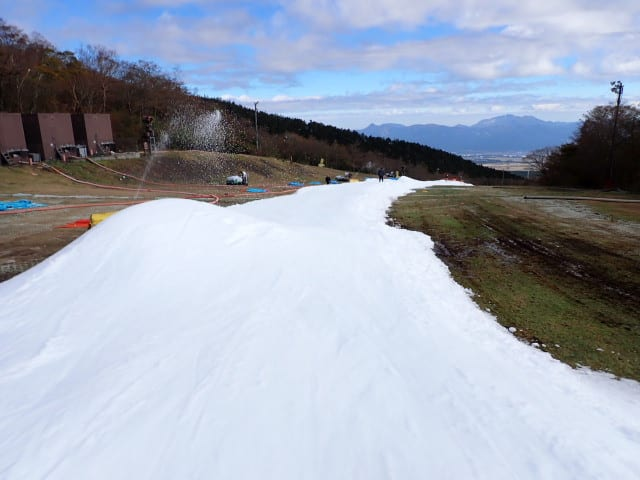
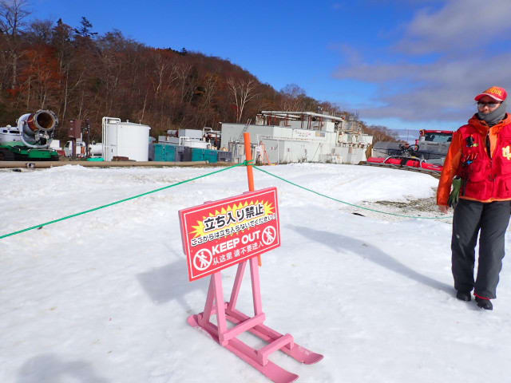
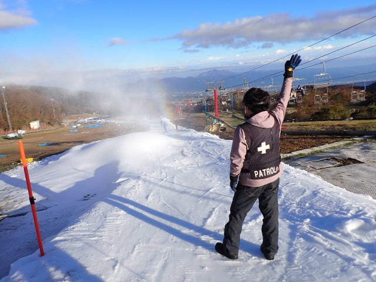

# 2024/11/9(土)，再オープン翌日のイエティ詳細レポート！…ゲレンデは細いものの雪の厚み十分．意外と混まなかったよ

📅 投稿日時: 2024-11-11 02:46:11

🏷️ カテゴリ: [2025スキー滑走日記](cacd3fbf84d4a679ee61a5894c3f95e14.md)

やっぱり，どう天気図を読んでも

11月16日の横手・熊の湯のオープンは

無理だろう…

という結論しか出てこない今日この頃，

うーん．

11月になったら冷えると思っていたのに，

かなり辛いシーズンインになりそう…(泣)

ということで，本題へ．

高温＆悪天候の雪解けで11日間の長きに

渡った営業休止から復活したイエティ，

土曜に滑ってきた詳細レポートです…！

…晴天で始まったこの日．

朝9時オープンを待つ行列はそこまで長くなく，

今日は思ったほど混まなさそうな予感…

ちなみに，再オープンから11/12(火)までの

間は，ゲレンデの維持のためナイター営業無しの

17時終了です．

ってなことで．予定通りの9時ぴったりに

ゲートオープン！

2週間ぶりにゲレンデに戻ってきましたよ～！！

ってなことで．

朝1番ではなかったけど…

5番目くらいのポジションで，あさイチの

シマシマを頂きます！

気温は高いので，圧雪かけたてのあさイチの

バーンはちょっと柔らかめに感じましたが…

2本目以降は硫安が効いて，結構しっかりした

いいバーン！

コース幅は結構狭めでしたが，

昨日滑った人曰く，昨日は雪がもっと厚く，

全然広げられてなかったので，今日は

これでもかなり広がったとのこと…

そして今日も，最後の落ち込み手前での

一時停止をやっていました…

感覚的に，オープンの週と同じくらいの

コース幅ですかね…

でも，厚みは全然違って，今日の方が圧倒的に

厚い！！

悪天候での営業停止に懲りて，今回は

かなり厚めに雪を積んだみたいです…

…しかし．11月も10日近くになって，富士山が

冠雪してないなんて，これまでなかった気が…

で．朝のうちはスタート位置での滑り出しの

人数制限はやっていませんでしたが．

それでも，朝のうちはコースの人口密度も

低めで，コースも十分厚く穴が開いたり

してないし．硫安でコースも締まっていて．

幅が狭いってのはあるけど，予想以上に

快適に滑れました…！

そして，今日一日リフト待ちはほとんどなく…

午前中は混んでもせいぜいこんな程度の

リフト待ち．

ただ…タイミング的に運が悪いと，コース

最後の一時停止で数分間待たされます…

この待ちは全くない時もあれば，

団体さんがどっと来たときは長めで，

かなりムラがありました…

でも，一時停止待ちが長い時はリフト待ちは

なかったし．

一時停止待ちで人数が絞られるからか，

コース上の人口密度もそこまで高く

ならなかったから…

そこまで不満は感じず．

リフト待ちが長くてコース上の人口密度が

高い普段のイエティに比べればずっとマシ！

ただ…

タイミングによってはちょっとコース上の

人が多い時もあったかな…

午前10時半を過ぎてくると，一時停止待ちの

列がかなり伸びたこともあり…

一時停止待ちに人が溜まらないよう，

今度はスタートでの人数制限を始めました…

11時ごろ，スタート待ちのピークがちょっと

伸びましたが．

スタート制限がかかると，前に人が少ない

状況で滑れるから，こっちがいいかも…

ただ．

意外なことに…

スタート制限をしても，スタート待ちがあった

のは30分程度．

11時半ごろになると，お昼休みに向かった人が

多いのか，驚くほどガラガラになり…

え？

コース上の人がムチャクチャ減ったんですが？？

こんな前後に誰もいない状況で滑れていいんですか？？

そして，リフト待ちもないし．

お昼の11時半から13時ごろまではガラガラで．

かなり…というか，すごい快適に滑れました～！

…ただ．

結構コース幅が狭いところを大人数が滑るので，

コースも荒れてきて．

その狭いところに造雪した雪山ができ，

滑りにくくなってきたからか…

午後1時にいったん臨時でコース整備する

ことになり．

圧雪車が1往復する間，20分弱の短い

時間，コースクローズとなりました…

そして13時半前，コース整備終了後に

コースオープン！！！

整備後に来た人はボーダーさんが多く，

ボードを履くのに時間がかかるボーダー

たちを横目に，本日2度目の，目の前に

誰もいないコース整備後のピカピカ

シマシマをいただきま～す！

いやーー．

この1本だけでも滑りに来たかいがあった

感じ…

で．ナイターがない代わりに格安午後券が

販売されたこの日．

午後は混むんじゃないか…と思ったけど．

ナイターがないからか，いつもは午後に

混むイエティが午後になってもそれほど

混まず．

まぁ，それでもコース上はこの程度の

人口密度になることはあったけど，

リフト待ちはほぼ無し！

午後3時ごろにはまたスタートのコントロールが

入ったので，コース上の混雑もちょっと

マシになり…

コース上の人口密度も少なめになり．

一時停止待ちもなく．

ナイターがない本日．

イエティでこんなにガラガラな午後が

あっただろうか…？？

という午後になってました．

ただ．

夕方遅くになると，コース上に雪山も

できてところどころ滑りにくく…

最後の落ち込みはかなり掘れて，

U字の溝状にえぐれて凸凹になって

いたので，ちょっと滑りにくかったけど．

でも，今回は雪の厚みがあったので，全く

土が出てませんでした～！！

ってなことで．

本日はナイターが無いので，17時で営業終了．

終了するころには日が暮れてきて…

16時50分にはコースクローズ．

今日も最後までたっぷり滑ったのでした…

今日はリフト待ちも少なく，

予想以上にガラガラで．

スタート待ちやコースの一時停止待ちが

あっても，昼間だけで50本という，

数年前の土砂降りでガラガラだった日の

記録に並ぶほどの本数が滑れたので．

かなり満足できた1日でした～！！！

今後高温が続きそうですが．

これだけの雪の厚みがあれば，

また営業中止になることはないと思います…！
