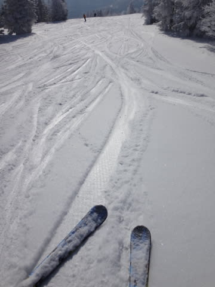

# 2月10日の志賀高原は…うほほほ．晴天だったのだっ！！

📅 投稿日時: 2014-02-10 21:59:19

🏷️ カテゴリ: [2014スキー滑走日記](c992167609b6415052179ee69ea1ea7d8.md)

むはははは．

来た．

来たのだ．

待ちに待った，晴天の一日がっ！！！

本日は，明け方まで雪が降っていたものの，8時ごろから

雲が切れ始め…

リフト開始の8時半には，太陽が顔を出しましたっ！

いやー．

リフト開始ちょうどから晴れるなんて，

神様は私の日ごろの行いをちゃんと見ているんだな～←昨日までは悪天候でしたが？

朝の気温はマイナス11度と，いい感じの冷え方ですな．

そして，ゲレンデは…

圧雪の上に，うっすらと新雪が乗っていて．

うはー！気持ちいいっ！

むちゃくちゃ軽いよっ！

新雪が積もってないと錯覚するほど軽い雪だよっ！

これは，オリンピックコースに行かねばっ！

…と，オリンピックコースへ向かったところ．

…うむ．

思ったほど深くない．

ブーツパフくらいかな…

でも．すごく軽くて．

なんだか，新雪なのに，気持ちよく超快感大回りができるんですがっ！

もう，お日様の下，新雪を蹴散らして，

こんな快楽大回りができるとはっ！

これくらい蹴散らされても，積もってないみたいな

軽さなので，手を新雪に突っ込むほど傾きながらの

大回りができるんですがっ！？

うほほほほほほ～っ！！！

うはははは～っ！

もう，叫び声をあげながら滑っちゃいます．

＃オリンピックコースで叫びながら滑っている人を

＃見かけた，という方がいたら．叫んでいたのは

＃おそらく私です…

圧雪コースもGoodっ！！

脳内麻薬出まくり超シアワセハッピーバーン！

平日なので，人もいなくてガラガラっ！

神様，ありがとう～っ！！

そして．

今日は娘も新雪を堪能．

快晴の中，娘も大喜びで滑り続けた一日でした…

…って感じで．

今日は．

終日天気は快晴で．

リフト待ちも全くなく，ガラガラで．

気温も低く，雪質は最高で，

…と，3拍子そろったシアワセな一日だったんですが．

…だけど．

夕方になってくると．

そうです．

新雪が積もった日は．当然．

凸凹様のお出ましです．

朝は超快適だったオリンピックコースも，

景気よく全面コブになってます．

コブ溝は，先週の雨で固まった硬い下地が…（涙）

そして，一の瀬メインバーンも…

アイスバーンの上にコブコブちゃんが大量発生．

だけど．

しっかり夕方まで晴れてくれて．

やっぱりスキーは太陽の下でやるもんだなぁ，

と．

夕日が沈むまで，たっぷり滑ったのでした…

PS.

当然のごとく，今日もナイターに行ってます(笑)

今日もダイヤモンドナイターは，シマシマの最高バーンでしたよ～！！

