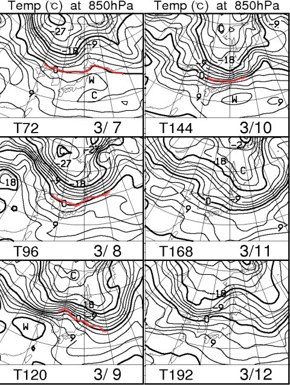
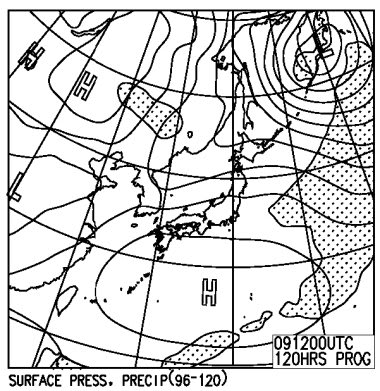
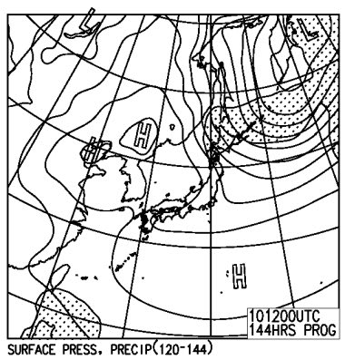
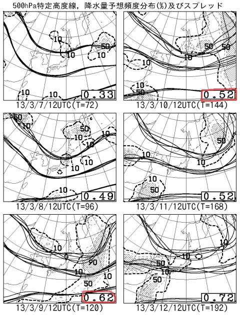
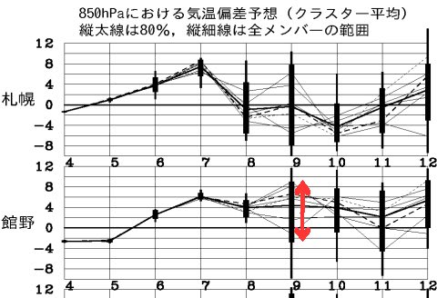

# 定番！今週末の志賀高原スキー場の天気やいかに？

📅 投稿日時: 2013-03-06 02:50:18

🏷️ カテゴリ: [スキー天気予想](c6554f5c3c106093b511a8daae23757e8.md)

なんだか．

…3月，ですね．

そろそろ．

春…なんですね．

どーでもいいですが，

「いつか春がやってくるさ！」

ってのは．

『いずれいやな時期がやってくる』

という意味にしか思えない，Skier_Sです．

…意味のない会話はさておき．

定番の今週末の志賀高原の天気予想，いってみましょうか…．

…

…

…

春，ですね．

…こんな感じで．

850hpaの0度線．

これから週末まで，かなり北，東北のあたりに停滞して，南下しませんね…

っつーことは．

志賀高原でも，昼間はがんがんプラスの気温に上がりそうです…

これから週末まで，雨は降らなさそうですが．

日差しで雪が解けちゃいますね～．

逆に雪も降らなさそうなので．

ゲレンデコンディションは悪化の一方でしょう…

土曜の地上天気図は…

こんな感じで，晴れそうですね．

日曜も…

うん．

降らなさそうな天気図ですね…

今のところ．

ってことで．

今のままの天気図なら．

土日とも，基本的に晴れ．

…日曜はちょっと雲が出るかも．

朝は前日の日差しで解けた雪が固まった，固めの雪．

昼間は気温がプラスまで上がり，日差しで解けた，春の雪．

二日とも，ぽかぽか陽気の春スキーになりそうです…

ただし．

FZCX50を見ると．

こんな感じで，土曜日9日と日曜日10日のスプレッドは，0.62と0.52と，かなり大き目の数字．

特定高度線もクラスタ間ばらつきが大きいですね～．

そして．850hpa気温偏差ですが．

…こーんな感じで，9日の予想値，クラスタ間のばらつきが結構大きいです．

んだもんで．

まだ，9日と10日の予想精度はまだ低いということが分かりますね～．

ってことで．予想天気図は今後大きく変わる可能性が大きいです．

…また，直前に予想します…
