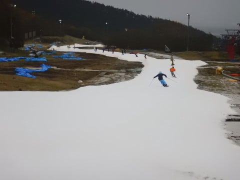
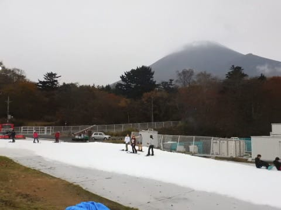
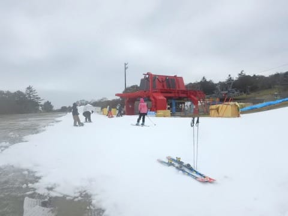
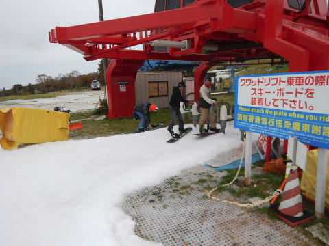
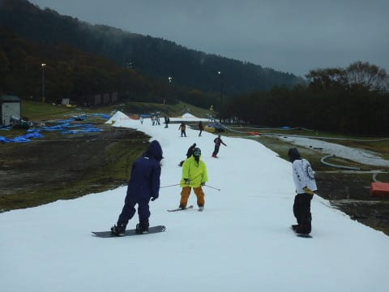

# 10月28日（土），台風接近中のYeti速報＆動画…雨はそれほどひどくなく，ガラガラ！

📅 投稿日時: 2017-10-29 00:00:12

えー．

本日．

イエティへ．

ええ．

逝ってきましたよ…雨の中（涙）．

しかし．

今シーズンのイエティ．

オープンの週は良かったものの…

その次の週は高温による雪解けで営業できず，

その次の週は台風で雨，

そしてその次の週（今週）も台風で雨…

と．

呪われている，今シーズンのYetiですが．

…呪われているのは，Yetiのオープン直後だけにして

ほしいところ…

この呪われた状況がシーズンいっぱい続かないことを

全身全霊で祈るばかりです…

ってことで．

今日のイエティは．

朝，オープンの8時にはパラパラと雨が降っていましたが．

その後は，雨が降り続ける予想に反して，

降ったりやんだりを繰り返す感じで．

結構，雨が降ってない時間が長かったかも…

午前中も午後も，雨は時々降る程度で．

降ったとしても，ごくたまにウェアが

しっとりするくらいの降り．

幸いにも，昼間の営業時間帯はザーザーぶりに

なることは無かったです…

午後はザーザー降りになることを覚悟していたのに…

よかった…

ってな感じの天気だったので．

富士山も時折姿を現すほどでした．

うーむ．

本来なら，終日雨が降りっぱなしの予報だったのに．

雨がそれほど降らなかったのは．

きっと．

私の祈りが効いたに違いないっ！！←だーかーらー，違いまくりだから

コース自体は，イエティのスタッフの執念なのか．

決して広いというわけでは無いものの．

シーズン開始時並みのコース幅は確保されていて…

一昨日の再オープンの段階では，まだかなり

雪が少なかったらしいリフト乗り場近辺も，

オープン時同等レベルの雪の量が着けてありました…

もう，シーズンで3度めの，全面雪付け⇒営業開始を

繰り返したYeti．

ここまでくると，スタッフの執念を感じますね～．

で．

本日は，天気が悪い予報だったので．

リフトも終日，完全飛び乗り状態！

リフト待ちなどというものは全く

存在しない一日でした～！

コース上の人はそこそこいましたが…

雨もそれほどひどくなく，

リフト待ちは無かったので．

まぁ，意外と楽しめたかも…？？

さすがに今日は，ナイターまでは滑らず，

16時のコース整備タイムには切り上げました．

でも，いつもよりは本数がいっぱい滑れたな！！

ということで．

定番の，Yetiコース状況の動画です…

午前11時ごろ撮影です．

最後のリフト乗り場のところを見てもらえれば，

飛び乗りだったのが分かるかと…

という感じで．

今日は速報でしたが．

明日また，詳細レポートやります～！
