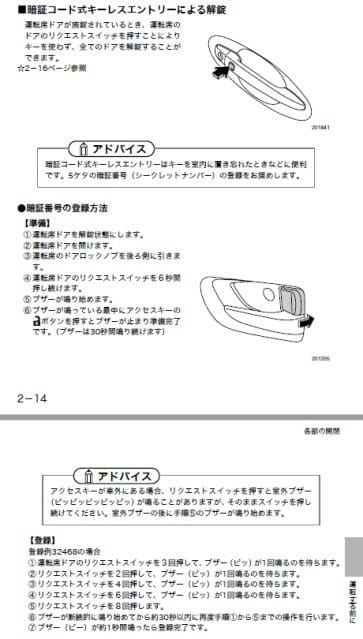

# スバル車はドアノブのボタンで暗証番号を入力すれば，鍵なしでもロックが解除できるんですが…

📅 投稿日時: 2017-08-02 02:11:05

🏷️ カテゴリ: [車](cba0e8330b3f2ded7c1addfacc75d4547.md)

えー．

なんだか，最近車の話題が多いのですが…

今日も車の話題を．

知っている人は多いと思うんですけど．

キーレスエントリがついているスバル車には，

ほぼ標準でついている，暗証番号式キーレスエントリ．

…この機能を知らない人が意外と多かったので，

ちょっとここでネタにしてみますか…

えー．

キーレスエントリがついているスバル車では，

鍵を持った人が，車のドアノブにふれるだけで

ドアロックが解除でき，ボタンを押せば施錠

できますが…

＃LEVORGだと，ボタンは無いんでしたっけ

スバル車は，ドアロック解除用の暗証番号を

車に設定しておけば．

この，キーレス解除ボタンから暗証番号を

入力するだけで，ドアロックが解除

できるようになります．

スバル車オーナーでも知らない人がいるようなので，

設定手順は[ここから](https://www.subaru.jp/afterservice/tnst/)マニュアルを参照してください…

レガシィの場合は，こんな設定方法です．

（[SUBARUウェブサイト，LAGACYマニュアル](https://www.subaru.jp/afterservice/tnst/legacy/le07/pdf/A2500JJ-C_for_browse.pdf?downLoaditemRadio=pdf%2FA2500JJ-C_for_browse.pdf&downLoaditemRadio=&x=96&y=19)参照）

設定，ちょっとめんどくさいです…

でも．

設定が終われば．

なんと！鍵を持ってなくても暗証番号で

ドアロックが開けられます．

例えば，暗証番号を１２３４５で設定した場合，

＃推測しやすい11111と12345は設定できないようになっているようですが…

レガシィなら運転席ドアの解除ボタンを，

1回押して，「ピッ」となるまで待ち．

2回押して，「ピッ」となるまで待ち．

3回押して，「ピッ」となるまで待ち．

4回押して，「ピッ」となるまで待ち．

5回押して，「ピッ」となるまで待てば．

ロックがガチャンと解除されます

＃LEVORGはトランクの解除ボタンを利用

これを設定しておけば．

鍵を持ってなくてもロックが開けられるので，

誰かに鍵を貸しちゃったとか，

鍵を忘れてガレージにやってきた，

とかいう場合でも．とりあえずカギを開けて

荷物だけは出し入れことができます．

さらに．

これを応用すれば，

電池を抜いたキーレスエントリを予備キーとして

車の中に隠しておけば．

＃電池が入っているキーレスエントリを

＃車の中に置いておくと，閉じ込め防止のため

＃ロックされないので電池を抜いておく

鍵をなくしてしまった場合でも，

暗証番号でドアロックを開けて，

予備キーで車を動かすことができます…

＃電池がないキーレスエントリでも，

＃スタートボタンにピッタリあてると

＃エンジンが掛けられます

まぁ，これもほとんどのスバル車オーナーの方は

知っていると思いますが…

あえて記事にしてみました←ネタ切れ？？

## 💬 コメント一覧

### 💬 コメント by (つーちゃん)
**タイトル**: Unknown
**投稿日**: 2017-08-02 20:15:15

ご無沙汰してます。

うちもスバルですがメカニカルキーなので知りませんでした！

なかなか面白い機能ですね。

蛇足ですが、プッシュスタートとか鍵を挿さずに回すタイプは

なんだか好きじゃないんですよねぇ

キーを挿してONに回してメーターイルミが一段落してからスタート！！

っていうなんかこう儀式的な物が無いと気合いが入りません(笑)

### 💬 コメント by (マルハバ)
**タイトル**: うちも昨秋から・・
**投稿日**: 2017-08-02 23:14:08

スバルなんですが・・全く知りませんでした。

それどころか、追従オートクルーズだとか

アイサイトに関する使い方もまだ分かっておらず

女房に教わっている次第であります（汗）

### 💬 コメント by (Skier_S)
**タイトル**: やはり，意外と知られていないのですね…
**投稿日**: 2017-08-03 01:09:30

＞つーちゃんさま

お久しぶりです～！

メカキーだと，この機能は知らないですよね…

私は今の車になって4年間，自分の車では

キーをひねるという行為をしなくなったので．

久しぶりにキーをひねる車に乗ると，

懐かしさを感じます…

＞マルハバさま

あら．

ご存知なかったですか．

設定の手間はちょっとめんどくさいですが，

ぜひ使ってみてください．

アイサイトも，慣れないとあれですが．

私は，渋滞ではもうアイサイト無しで走れないように

なってきました…

### 💬 コメント by (Unknown)
**タイトル**: Unknown
**投稿日**: 2018-09-17 14:06:35

ボタンではなくドアノブをガチャガチャして暗証番号を入力する方法ですが、実は初代レガシィからできますよ。

### 💬 コメント by (Skier_S)
**タイトル**: Unknownさま
**投稿日**: 2018-09-18 02:25:58

あら．

スバル車，かなり昔から暗証番号式ドアロックがあるんですね．

メカキー時代からあるとは…

っていうか，初代レガシィからですかっ！！

それはすごい…

でも．

最近のスバルユーザーでも，知らない人が結構多い

機能だと思います（笑）

