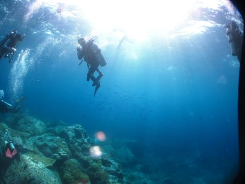

# 子連れコモドダイビングクルーズagain　その29　Castelへの再チャレンジ

📅 投稿日時: 2011-10-01 00:54:57

🏷️ カテゴリ: [ダイビング日記](ce3a7a8d424d112fce83ee85c81a0e344.md)

なんだか．

やっぱり徒然スキーヤー日記だけあって．

スキーのレポートの方が人気があるみたいですね…

んだけど．まだまだ，コモドダイビング日記続きます

＃まだみんな飽きてないと信じたい…

-------

さてさて．

あけて5日目…8月18日．

＃ああ．もう1ヶ月半近く前だ…

朝から晴天！

今日がダイビング最終日です．

楽しい月日が過ぎるのは早いもの…

＃このレポートの進みは遅いけど

で．

本日の予定としては．

明日の朝の飛行機が早いので．

潜水病リスクを避けるため，午前中の2本でダイビングは終了．

潜りに行かない午後は，コモドドラゴン見物の予定です．

で，午前の1本目のダイビングは，流れの関係上朝食後に．

なので，いつもよりちょっと早めに7時から朝ごはん．

あー．

ここは，インドネシアなんですけど…

ご飯と味噌汁がおいしい！

んで，朝ごはん終了後は．今日の1本目のダイビング．

3度目（私にとっては2度目←ここ強調するところ）のCastelへ潜りに行く予定です．

ここで，私としては1度目のCastelへ行けなかったリベンジをしたいところ．

私　「…どうする？娘，起きたときにはダイビング行かないでって言ってたけど…」

妻　「娘，ご飯いっぱい食べて満足したのかな」

私　「私はCastelまだ1回しか入ってないんだよね～．前回留守番して最高のダイビングを

　やり損ねたから，次はリベンジさせて欲しいなぁ…」

妻　「今はゴキゲンみたいねー」

私　「ってことなんで，留守番お願いしたいんですが」

妻　「この様子だったら，新しいDVD見せたら，1時間ぐらい黙って見てるんじゃないかな」

私　「え？」

妻　「私も潜りに行く！」

私「…ええっ！？」

…まぁ，うちの妻も，Castelじゃなかったら，娘と留守番していたんでしょうけど…

行き先はあのCastel.

なんとしてでも潜りに行きたいというのはわからんでもない．

…ということで．

まず最初に，妻がダイブデッキに消えて．

ブリーフィングが終わるころに，DVDを見ている娘を置いて，

リンダさんに娘をお願いして，私がこそっとダイブデッキに下りて．

速攻でウェットスーツ着ながらボートに飛び乗り，ダイビングへ向かったのだった…

＃あらためて思うけど，ひどい親だ…

私「娘，すまん…」

さて．

2度目のCastel．

リベンジなるか？？

エントリー後…

透明度はいい！30m以上…いや，40mは抜けてるか！

これまでのコモドで最高の透明度！

魚も…

…

そこそこ，出たな．

まぁ，ぼちぼち，出たな．

あれ？

おや？これでダイビング終わり？

なんか，いつものCastelと比べると，撮影枚数がずっと少ないんですが…

…端的に言って．

ハズレ

ですな．

いや，普通のダイビングに比べたら，十分すごいかもしれないんだけど．

なんにしろ，潜ったところがCastel.

期待値が，「昨日のCrystalよりずっとすごい」

というところだったので…ハードルがちと高すぎたか．

…あるいは．

置いていった娘ののろいか…

本船に戻ると．

意外と娘が機嫌よくお迎えしてくれたので．

とりあえず，一安心…

しかし．

こんな写真が残っているダイビングが

「物足りない」

と言ってしまうって，コモドで潜っていると，

やっぱりいろいろ常識からずれていく…
