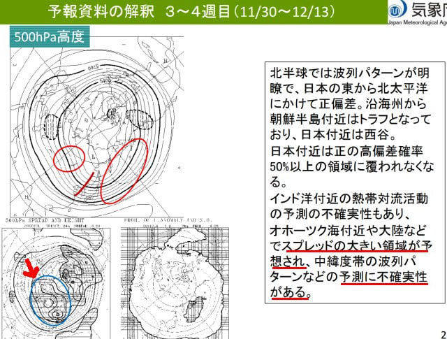

# 12月13日までの1か月予報を見てみた！…12月上旬も長野・新潟のスキー場は低温にはならなさそうだけど，異常高温傾向は緩和しそう

📅 投稿日時: 2024-11-15 04:13:54

🏷️ カテゴリ: [日記](cc4b5682fb7b8b144980957a978653fb0.md)

ということで．

今日もなんだか時間がない（泣）

でも，深夜にまた睡眠時間を削って

記事更新！！

…しかし．

最近，平日は天気系の記事ばっかり書いてる

気がするんですが…

なぜか最近，Yetiの滑走レポートより，天気

記事の方がアクセスが圧倒的に多いんですが…

なんでだろ…？

ってなことで．狙ったわけではないけど，

今日も天気の記事です…

今日は木曜ということで．ご存じの気象庁

1か月予報の発表日です！！

さぁ．

これから1か月の予報となると．

12月中旬となる，12月13日までの予想．

志賀高原も順調なら高天ヶ原クワッドも

オープンして，雪の早いシーズンなら

焼額のゴンドラも動き出している

時期になりますが…

果たして，12月上旬は冷えるのか，

気温が高いままなのか…！！？？

見てみましょう…

えい！！

…ぉぉ…

1週目，2週目は高温の確率が60％と，

相変わらずの高温予想だけど．

11/30以降の3，4週目は，平年並みの確率も

40%と，久しぶりに超高温傾向から外れる

予報になったよ…！！

まぁ，平年並みより下がる可能性は低いけど．

でも，これまでよりはマシな予報です！！

詳細を見てみると…

1週目，11/16-11/22までの200hPa流線関数を

みると，西日本が高圧性循環の赤丸に覆われて．

これだと，偏西風が緑線のように北寄りに押上げ

られる感じになりますね…

そのせいもあって．

1週目の850hPa気温を見ると，ちょい気温が高め．

ただ，緑色の平年比+2℃の領域に長野や新潟は

入っておらず．

平年比+1℃～2℃の間に収まりそうで，

これまでよりは気温が下がる傾向ですね…

18，19日に予想されている寒気の南下が

効いてるのかな？

そして，

11/23-11/29の2週目の200hPa流線関数を

見ると．

今度は日本の西に青丸の低気圧性循環が

見えて．このあたりは緑線で描いたように

偏西風がちょっと南側におされるかも

しれないけど…

ちょっと低圧性循環が西に寄りすぎ．

本州はその影響は受けなさそうかな（涙）

だもんで．850hPa気温を見ると．

日本より西側はちょい気温が低めながら…

本州の東側は，緑色で示した平年比+2℃の

領域に入ってしまい．

11月23日から29日の11月下旬の新潟や

長野は平年比+2度を越えて，気温が

高そうな気配です…（泣）

うーん…11月はダメか…！！

と思いながら，3，4週目となる11/30-12/13の

200hPa流線関数を見ると．

おっと！！

今度は西日本を中心に，本州が大体青丸の

低圧性循環に覆われて，日本付近で偏西風が

南下しそうな予想になってきました…！！

3，4週目の850hPa気温を見ると…

あれ？？

偏西風が南下しそうな予感なのに，

緑色の平年比+1℃の領域に入って

しまっているんですけど…！？？

平年より冷えないの…？？

まぁ，それでも赤い0℃線は志賀高原より

南まで下がってるし，まぁそこまで

高温じゃないかな…

あとさらに，上の図面の右側の解説に，

「高温傾向はやや控える」と書いてあります．

なので，上の図より気温が下がる可能性が

高い，と気象庁の達人は見ているようです．

どういうことかというと…

この下の図の赤矢印で示した，青く囲まれた

部分．

ここのスプレッドが大きい（予想のずれが大きい）

ことが示されていて…

予測に不確実性があるため，高温傾向の

予想を割り引いて考えるということのようです．

ということで．

コンピュータ予想ほどは高温にならないだろう…

と気象庁の達人がみこんでいるわけで．

それはつまり，下のグラフの赤矢印の，

3，4週目の期間の850hPa気温．

コンピュータ予想のこのグラフより実際の

気温は下回る可能性が高い…という

見立てですね！！

その見立てが正しいなら，赤矢印の期間は，

平年並みかそれより1℃高くなるかどうか…

とかいうあたりに落ち着くのかな…？？

うん．

もし，そうであれば．

平年より冷える

というほどのいいニュースではないものの．

平年比+3℃が続く

という最悪のニュースは逃れて，

平年並みかそれよりちょっとプラス

という，ここしばらくではかなりまともな，

普通の気温になりそうという予想だと

いうことで．

恐怖の12月を恐れて眠る必要はなく，

ちょっと安心して夜も寝られそう…

と，この1か月予報を見て胸をなでおろす

Skier_Sだったのでした…

## 💬 コメント一覧

### 💬 コメント by (けんけん)
**タイトル**: Unknown
**投稿日**: 2024-11-15 06:48:53

ちょっと安心できる予報でしたね。あとは、冷えるのに西風ってのが怖いです。

### 💬 コメント by (Skier_S)
**タイトル**: ＞けんけんさま
**投稿日**: 2024-11-16 02:20:49

ちょっと安心できましたが…

確かに，12月上旬のころは冷えるけど西風パターンが怖い…

ただ，今シーズンはパノラマコース上部の人工降雪機で早くゴンドラが動くことに

期待…！

