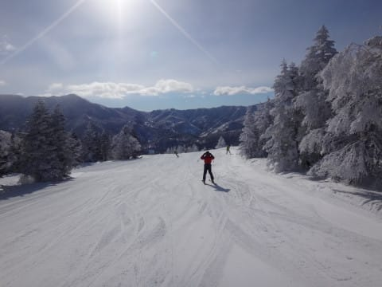
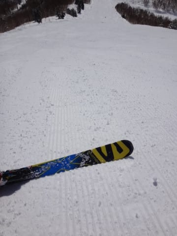
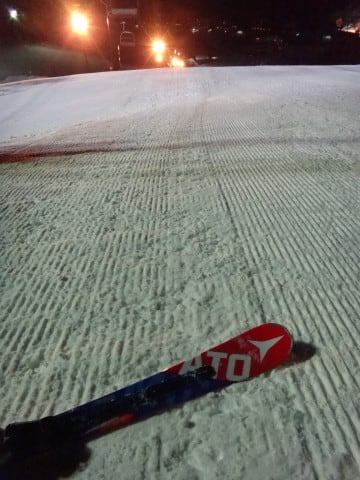

# 2月25日（土）の志賀高原は…晴天！！朝のうちは意外とよかったけど，午後はやっぱり固め（涙）

📅 投稿日時: 2017-02-25 23:31:00

えー．

本日も，志賀高原に来たわけですが．

…朝，志賀高原の登り路に全く積雪がなかったので．

木曜日の土砂降りのあと．

昨晩からの積雪がないゲレンデは，

きっと全山アイスバーン祭りに

違いない…（涙）

…と．

覚悟して．

やってきました焼額山頂．

気温は…⁻10℃ですか．

冷えてます．

無駄に冷えてますね．

これだけ冷えれば，がちがち氷斜面ですよね…（涙）

で．

ゲレンデに出ると…

うむ？

…え？？

これは…？？

アイスバーンではなくて，

結構やわらかいシマシマなんですが…っ！！？

なんてことだ．

超気持ちいい，しっかり締まったシマシマバーンなんですけど！！

これは，超快適ハイスピードシマシマバーンなんですが！！？？

ええ？

まさか．

こんな快適シマシマバーンを滑れるとはっ！！

天気はすっきり晴天！

そして．

ゲレンデは想定外の気持ちいいバーンと来れば…

いや，意外といいじゃないですか！

うーむ．

雨のあとの金曜，わずかにうっすらと積もった雪．

それが効いているようですね～．

良かった…

全山アイスバーン祭りじゃなくて，良かった！！

…ただ．

コース上．ところどころ．

氷のコロコロが出てましたが…

ちょっと残念だけど．

全面アイスバーン祭りに比べれば．

100倍マシ！

そして．

コース上の人も．

先週に比べれば，少な目かな～．

午前10時過ぎには，駅舎の外に列が伸びるタイミングも

あったけど．

でも，昼にはガラガラになり．

で．

オリンピックコースは，午前の早い

段階から，ちと硬い下地が出てきたのもあり…

ガラガラで，誰も滑ってないよ！

固いのが嫌いじゃなければ，すごいかっ飛ばせる

気持ちいハイスピード自由落下バーン！！

いや．

こんなきれいな晴天で．

日差しもあるのに…

気温は低めで．

雪は終日緩まなかったですね～．

この日は意外と午後になっても，

混んでいるというほどではないけど．

人は多めだったかな～

意外と，午後にもゴンドラは駅舎の外にまで

列がつくタイミングが…

まぁ．

でも．

基本的には空いてるんですけどね～．

だけど．

午後の問題は．

人が多いというより．

うむ？

こ…これは．

ツルツルアイスバーンというほどではないけど．

板が流される，結構固い下地が…（泣）

午後は結構，硬い斜面エリアがコース上に広がり．

氷のコロコロも増えてきて…

夕方になると．

厳しい…

これは，厳しいよっ！！

…って感じの，氷のコロコロ＆

固い斜面を．

やっぱり夕方リフトストップまで，

滑り続けたのでした…

うーむ．

今日はすっきり天気も良く，

気温も低く，冷え冷えだったので．

…木曜の雨が，惜しいっ！！

…これは．

きっとたぶん．

ナイターに行ったら，またやわらかい

圧雪かけたてシマシマが楽しめるのに違いないっ…！

と．

いつも通り，ダイヤモンドナイターへ繰り出した

わけですが．

…え？

こ，これは…

氷のコロコロ地獄っ！！？？

…って感じで．

ナイターバーン全面に広がる，

殺人コロコロに泣かされながらも．

たっぷりナイターを滑ったのでした…

うーむ．

今晩，雪が積もってほしいけど．

無理かな～．

## 💬 コメント一覧

### 💬 コメント by (まいる)
**タイトル**: 今日は
**投稿日**: 2017-02-26 10:38:55

おはようございます。

今日は焼額で午前中ボードで滑って帰ります。

1ゴンは混んでますねー

ウエアは、ヤマレコのと同じですが、運よく発見できるか・・

### 💬 コメント by (しんちゃん)
**タイトル**: お礼
**投稿日**: 2017-02-26 11:37:19

昨日はご一緒させていただきありがとうございました。

ナイターすごく楽しかったです。

後ろにいると氷のコロコロが顔に当たって痛かったですけどね(^^ゞ

Ｓ様の滑りは、コロコロにも負けず、余裕さえ感じられるキレッキレターンでした。

またお会いした時はよろしくお願いします。

### 💬 コメント by (michi)
**タイトル**: Unknown
**投稿日**: 2017-02-26 17:42:52

Sさま

昨日はお会い出来て良かったです。

何時もよりたくさん滑ったので今朝は筋肉痛でした(^^;)

ステッカーも頂きありがとうございました。

また宜しくお願いします。

### 💬 コメント by (Skier_S)
**タイトル**: 斜面は固かったけど，楽しめたかな～
**投稿日**: 2017-02-27 03:11:05

＞まいるさま

今日も午前は1ゴングルグルしてたのですが…

お会いできませんでしたね（泣）．

1ゴン，11時ごろはすごかったですね～．

でも，すぐガラガラになったので良かったですが（笑）

また次の機会にお会いしましょう…！

＞しんちゃんさま

いやーー．

濃厚なナイターでしたよね．

ゲレンデ状況がちょいと残念でしたが…

また一緒に滑りましょう～！！

＞michiさま

昨日はご一緒できて楽しかったです．

息子さんのかっ飛ばしスキーが

凄かったですね～．

スキー場まで近いのがうらやましいです…

また焼額にお越しの際は

よろしくお願いします～！

