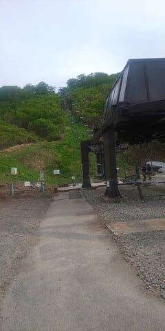
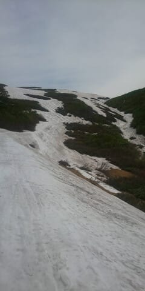
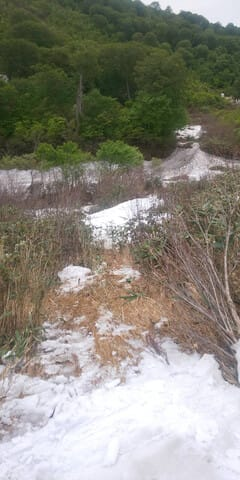

# 6月7日(金)の月山スキー場の状況，特派員レポート！…沢コース，大斜面ともにぎりぎり．板を脱いでのリフト乗り降りだけど，ゲレンデアクセスはまだマシ

📅 投稿日時: 2024-06-08 00:02:53

本日の月山スキー場の状況が，特派員から

送られてきましたよ～！！

ちなみに，今週末の土日が終わったら，

17日間のリフトメンテナンスに入る月山．

リフトで滑れるのは，実質この週末が

ラストになると思いますが．

この写真の左下にあるように，

リフト券は通常より500円安い

5000円になるようです…！

そして，リフト乗り場にはもう雪がついて

おらず．

板を脱いでのリフト乗り降りになりますが…

ゲレンデからリフト乗り場までは，

最終形態のリフト下から上がってくる

形ではなく．

雪があれば滑り込めるこのルートでの

アクセスになるようで．

ゲレンデからリフトのアクセスは，

最終形態よりはちょっとマシっぽい

ですね…

リフト降り場も全く雪がなく．

一瞬，リフトを降りてからこのルートを

ゲレンデまでひたすら登らなくては

ならない最終形態か？？？

と思ったところ．

板を履いて乗れるときは，リフト降り場

から滑っていけるこのコース．

板を履いてはいけないけど，かろうじて

歩いて乗り越えられるみたいで…

このルートを通ってゲレンデに出て

直接トラバースルートに出るところは藪が

出てきたものの．

ちょっと登ればトラバースルートに出て，

大斜面に行くことができるみたいです…！

ただ…

6月上旬にしては，もう異常に雪が

少なくなっているようで．

雪の多い年の6月下旬レベルですね（泣）

沢コースも細いし，大斜面もかなり

滑れるところは狭くなっています…

いや．

これ，大斜面ももう終わりですね（泣）

というか．

大斜面からリフト降り場に向かうところ．

一部板を脱がなきゃいけないみたいで…

藪漕ぎが始まる感じですね（涙）

これは…

日曜までもつのかな？？

ヘタすると，日曜は大斜面アウトかも？？

沢コースも，一番下のところは板を

脱がないとやばい場所があるみたいだし．

リフト乗り場付近もこんな感じだから…

うーん．

今シーズン，6月10日からリフトメンテ

というのは，いい読みだったのかもしれない

ですね．

ということで．

ついさっき仕事が終わったばかりなのに．

これから睡眠時間1時間で月山に行く予定．

大丈夫か…？？
