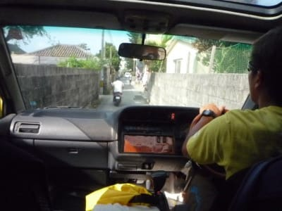
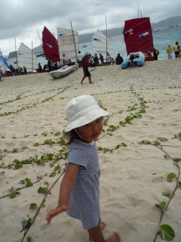
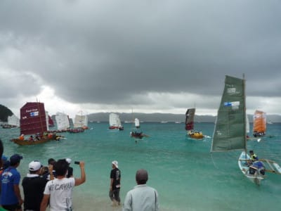
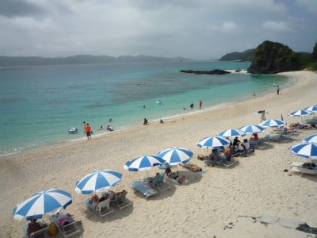

# 2010年7月，2歳の子連れで座間味でダイビング！その9…3日目の朝は，娘とサバニレーススタート見物へ

📅 投稿日時: 2021-10-05 01:26:09

ってことで．

今日はまたダイビングネタに戻るわけですが．

…そういえば，ダイビング雑誌の

[「マリンダイビング」を出版していた
水中造形センターが7月に倒産](https://www.tsr-net.co.jp/news/tsr/20210714_03.html)し，

マリンダイビングが7月発売の８月号以降

出版されておらず．

もう一つのダイビング雑誌「Diver」も

隔月刊になった後，昨年からしばらく

休刊になっていたところ，[さらに来年まで
休刊期間を伸ばすという案内](https://diver-online.com/archives/column/16996)があったり．

ついに，本屋さんから「ダイビング雑誌」

というものが消え去ってしまいましたね…

やはり，コロナのダイビング業界への

影響は甚大だったようですね…（涙）

あぁ…

早いところコロナが収束して，海外や

沖縄にまた安心してダイビングに行ける

ようになって欲しい…

そして．

スキー雑誌も，スキージャーナル無き今．

スキーグラフィックのみがかろうじて

生き残っているところですが．

はたしてスキー雑誌も，いつまで

生き残れるかも心配…

ってな悲しい話をしたところで．

今日の本題．

コロナ前の平和だった時代の

ダイビング日記です～！

ーーーー

ってなことで．

明けて3日目…

朝はいい天気です！

朝7時半から，宿で朝食を食べますが．

今日のダイビングも，午前2本，午後1本．

…今日も，子守り番を決めなくては

ならないわけで．

朝ごはんを食べながら，夫婦で

作戦会議タイム．

作戦会議の結果…

美しい譲り合い精神で，午前2本は

妻が潜って，

午後1本は私が潜る…と言う形に

なりました．

実はこれは美しい譲り合いでも何でもなく．

今日の午前は，昨晩前夜祭が行われた

「サバニレース」のスタートがあるから

見に行きたくて，私が午前中に子守りに

しただけです…（笑）

で，宿の主人がサバニレースの役員を

やっているらしく．

会場に向かう車に一緒に載せてもらって，

ビーチまで送ってもらいます…

サバニレースのスタートは，宿から車で

5分ほどの，古座間味ビーチ．

車を降りて，ビーチに向かうと…

をを！

レースに出場するサバニが，

いっぱい並んでますね！！

会場では，昨日の娘の踊りを見た人たちが

声をかけてくれました．

娘の踊り，結構印象に残ってるのね…

レースは今回が11回目．

スタートは座間味の古座間味ビーチ．

ゴールは那覇…

のはずが，今年は強風で座間味の港に

なったようです．

スタートゴールともに座間味とはいえ，

慶良間の島の間をぐるっと回る結構長い

コース．

…しかし，こんな船で那覇まで

行くんだねぇ…

なんと．トップのチームは4時間くらいで

那覇まで行くらしいです．

高速船でも1時間以上かかるのに…！！

スタート前に神事？らしきものや

神にささげる踊り？

やらがあって…

各チーム，スタート準備に取り掛かります．

そして．スタートの号砲直前の緊張の

一瞬．

各チームが円陣で気合を入れて…

コース変更の影響などで，予定より

遅れまくって10:45スタート！！！

いっせいに30チーム近いサバニが

ビーチから沖に飛び出していきます．

うわーーー！

かなり壮観！

早いチームはあっという間に沖に出て

行きますが…

遅いチームは波打ち際でひっくり返って

一生懸命水を掻き出してるやつも…

でも，15分ほどでほとんどのチームは

はるか沖合いに出て行きました…

ってなことで．

サバニレースのスタートを見送った

あとは．

この古座間味ビーチで1時間ほど遊んで，

娘はゴキゲンでした…！

…まぁ．

こんなきれいな海で遊べてゴキゲンに

なれければ，満足できる海は日本には

無いぞ…

## 💬 コメント一覧

### 💬 コメント by (マルハバ)
**タイトル**: ダイビング雑誌
**投稿日**: 2021-10-05 07:36:40

もう廃刊になった diving world の愛読者だったんですが、

何年か読んでると記事が繰り返しなのに気付くんですよね。

それだけ新ネタが少ない遊びなんでしょうね、

月刊の定期出版というのは無理があったような気も・・

スキーと一緒で「ホイチョイ・プロダクション」バブルの遺物だったのかな～？

### 💬 コメント by (Skier_S)
**タイトル**: ＞マルハバさま
**投稿日**: 2021-10-06 04:36:09

あ，ありましたね～．

Diving World.

すっかり忘れてました．

マリンダイビングも，毎年同じネタだし，内容が初心者向けで

ダイビングを始めてある程度経つと，読まなくなるんですよね…

かといってマニア向けにすると，読者数がかなり少なくなって

売れないんでしょうね…

