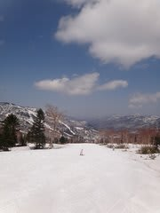

# 3連休最終日！5月5日の志賀高原スキー場は

📅 投稿日時: 2011-05-06 01:03:48

🏷️ カテゴリ: [2011スキー滑走日記](ca488c98cfb9169941c3e73770dcefb56.md)

さて．

3連休最終日となりましたが．

…今日もいい天気ですなぁ．

しかし，今日も朝イチはしっかり冷え込んでいます．

ガチガチではないけど，アイスバーンになってます．

…しかし，ピステンの掛け方がちょっと荒く，

でこぼこやらキャタピラの跡やら残ってるんですが…

で，一の瀬のメインバーンは．

朝9時ごろには緩み始め，10時には結構やわらかい斜面に

なりました…

一の瀬下半分は，9時過ぎにはちょっとドボドボした感じに．

しかし，朝のうちは結構人が多めだったけど…

昨日よりは人が少ないので，一の瀬メインバーンは

昼ごろになっても多少荒れる程度で，完全なコブにはなら

なかったです．

朝のうちは，そこそこ人がいましたが，昼前になると

かなり人口密度は下がりましたね～．

昼ごろにみんな帰っちゃったんですかね．

午後は，クローズを前にした寂しい感じのゲレンデになりました．

この時期としては気温が低めだったので，一の瀬メインバーンの

上半分は，終日いい感じの雪でした．

いやー．しかし，恵まれた3連休でした．

GWで，これだけの好コンディションで滑れたことは

近年記憶にないですね～．

一の瀬も高天ヶ原も寺子屋も，まだぜんぜん土が出てきてません．

あ…パーフェクターコースの取り付き部分は土が出てたか．

でも，それ以外は，いつも土が出てくる高天ヶ原のコブ斜面

も全面真っ白．

一の瀬の天狗やパノラマもこの時期に全く石ころを踏む心配がなく

全面滑れる状況．

うーーーん．

あと2-3週間は余裕で営業できそうなのに．

今日で営業終わっちゃうとは…

休憩所のそばコーナーのおじさんも言ってた通り，

「もったいない」

って感じです．

まだまだ滑れるのに！！！！

明日以降も営業を続けるのは，

熊の湯

横手＆渋

奥志賀

の3箇所だけとなります．

ということで．

今週末は，奥志賀と横手方面へ行きます…
