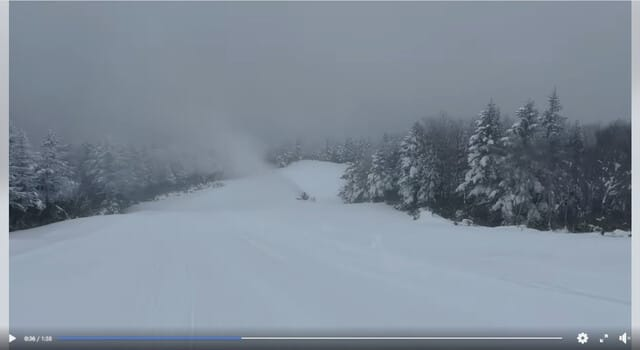
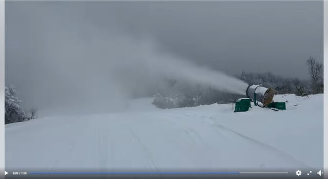
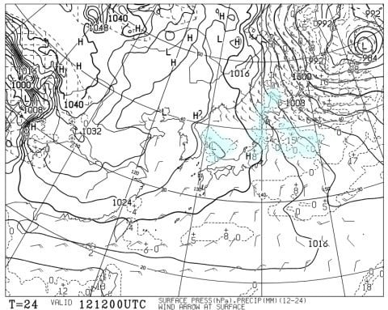
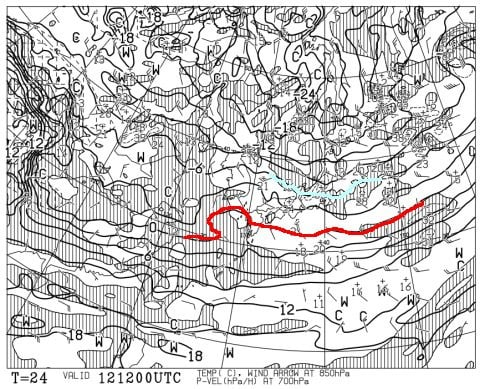
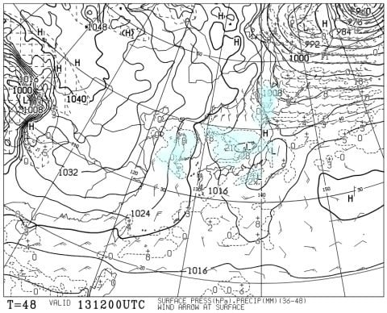
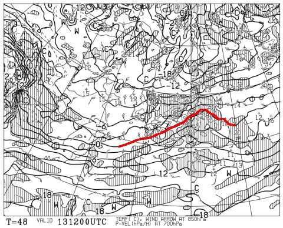
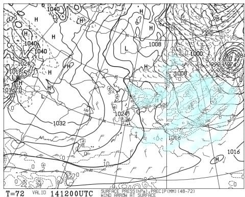
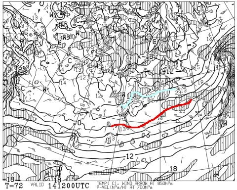
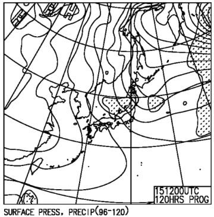
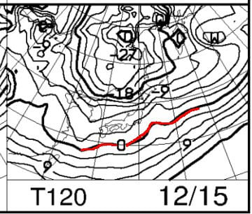

# 12月14，15日の週末の志賀高原の天気は…土曜は冷えて雪が降ったりやんだりの一日，日曜は小雪時々晴れ間も．2日とも冷えるよ！

📅 投稿日時: 2024-12-12 01:34:52

🏷️ カテゴリ: [スキー天気予想](c6554f5c3c106093b511a8daae23757e8.md)

えー．

昨日の記事に書いたように．

本日12月12日から，焼額山の第2ゴンドラが

動き出しますよ～！

で．

焼額山のFacebookを見ると，オープン前に

パノラマコースに人工雪を打っている

動画が見られます！！！

これ，[以前の記事](e7f0efb8711f7e8903eea13a484062b99.md)に書きましたが．

今シーズン，パノラマコースに新設された

人工降雪設備が早くも大活躍ですね…！

動画を見ると…

これ，第2ゴンドラ降りてしばらくいって，

一つ目の落ち込み手前のところ．

新しいブーム式の降雪機が動いてますよ！！

([焼額山スキー場Facebook](https://www.facebook.com/yakebitaiyama/videos/594872942907409/?ref=embed_page)より．以下同じ)

そして，いつも雪が薄めで，

第2ゴンドラオープン後はブッシュが出る

ことが多い，2番目の落ち込み部分でも

人工降雪機が動いていて…

そうそう，ここに人工降雪を乗せて

欲しかったんだよな…って感じ！

さらには白樺とパノラマの分岐点の

あたりも，2台の人工降雪機が

動いているし．

…これまで，第2ゴンドラオープン直後は

人工降雪がなく，下地が柔らかいので

すぐにブッシュが出てきたけど．

今シーズンは，第2ゴンドラオープン

直後でも，ブッシュに悩まされずに

済みそうな感じ…！！

素晴らしい！

…ただ．

パノラマに集中的に人工降雪を打っているので．

第2高速のオープンが遅れるという副次効果が…

いつもなら4ロマの次は2高の唐松コース

がオープンだったけど．

今週末，第2高速は動いてくれないのかな…

でも，この人工降雪の下地があれば，

シーズンインが速いだけじゃなく，GWまで

雪がもってくれる確率もかなり上がりそう！！

ってなことで，本題へ．

今日は水曜深夜恒例の，週末の志賀高原の

天気予想です！！

まず．

12日木曜の地上天気図を見ますが…

ふーむ．

降水域はうっすら日本海側にかかる程度．

それほど雪は積もらなさそう…

850hpa気温図を見ると．

水色の-6℃線が志賀高原にかかっているので，

これはかなり冷える…！

次に13日金曜の地上天気図ですが．

これは…日本海側に降水域がかかっていますが，

キレイな冬型じゃなく，志賀はちょうど

降水域の境目なので…

うーん．そこまでドサドサ積もらないか．

13日の850hPa気温図は，

赤い0℃線が志賀高原まで近づくので．

ちょっと気温が上がりそうだけど，

それでも十分寒いよ！

そして，14日の土曜は…

地上天気図を見ると，そこそこの冬型！

西風気味なので，すごいドサドサ積もら

なさそうだけど…

でも，朝も10cmくらいは積雪があり，

終日雪が降って，昼間も10cmくらい積もるかな？

この日の850hPa気温も，水色の-6℃線が

志賀高原にかかっているので…

朝は-10℃，昼間も-5℃以上に上がらない

かなり寒い日になりそう…！！

最後に日曜の地上天気図を見ると．

うーん．日本海に雪雲を示す網掛けが

がかかっているけど．

西風っぽい…

この日も雪が降っても積もるほどじゃないかな？

850hPa気温は，赤い0℃線はかなり南に下がる

けど…

-6℃線は土曜より北上していて，志賀より北に

行っちゃってるので．

土曜ほど冷えないか…

ということで，まとめると．

12日(木)：朝は積雪10cm？

　そこそこ冷えて雪が降ったりやんだり．

　昼間もちょっとだけ積もりそう．

13日(金)：朝はうっすら積雪．

　昼間は曇り空，時折雪がぱらつく．

　気温は木曜より暖かいけど，

　朝は-7℃，昼間最高-2℃くらいなので

　十分寒い．

14日(土)：朝までに10～15cmくらい積もる．

　朝は-10℃近くまで冷え込んで寒い．

　朝の道路は本格雪道なので注意．

　あさイチは圧雪の上にうっすら新雪．

　天気は終日パラパラ雪降り．時折強く降る．

　昼も数～10cm積もるかな．

　雪が柔らかいので，昼過ぎにはバーンは

　荒れそう．

15日(日)：曇り～小雪の一日．

　朝は-8℃程度かな？

　朝の積雪は数cm．

　あさイチはトップシーズンの柔らか

　圧雪！

　終日そこそこの冷えだけど風は弱く，

　西風なので志賀は晴れないまでも穏やかな

　天気．

　晴天でなくても，トップシーズンの雪が

　楽しめる一日

という感じでしょうか…

とりあえず．

大雪というほど積もらないまでも，

毎日5-10cmずつくらい積もり続けて，

気温は冷え続けているので．

徐々にゲレンデは良くなっていくし．

まだ全面滑走可能じゃないけど，

この週末も冷えるので，雪質はかなり

良さそうな感じ…！！

焼額は今週末からゴンドラも動き

だすし．

いい週末になりそうな予感…！！

## 💬 コメント一覧

### 💬 コメント by (レインボー77)
**タイトル**: Unknown
**投稿日**: 2024-12-12 15:51:57

木曜日の志賀高原情報

朝の蓮池が-8℃と冷え込みました。雪は全く期待外れで少しだけ。

目指すは本日解禁の第二ゴンドラ。でも期待のパノラマの壁の状態がよろしくない。氷の塊に足をとられて転倒した人も。

私は最初の2時間はニゴン8本、最後の1時間は四ロマで気持ち良く滑って11時30分終了。

明日もパノラマの雪が良くなるとは思えないんだけど、、、

### 💬 コメント by (レインボー77)
**タイトル**: Unknown
**投稿日**: 2024-12-12 18:24:58

＞ レインボー77 さんへ

＞ 木曜日の志賀高原情報... への返信

レポートありがとうございます

自分は新年早々からの参戦になりそうです

今シーズンも宜しくお願いします🙇

### 💬 コメント by (レインボー77)
**タイトル**: Unknown
**投稿日**: 2024-12-12 19:32:01

？？？

### 💬 コメント by (Skier_S)
**タイトル**: コメント遅くなりました．
**投稿日**: 2024-12-13 09:21:26

＞レインボー77さま

2ゴンオープンしたけど，氷のコロコロが多かったみたいですね…

土曜には改善しますよ！（と信じている）

＞？？？さま

レインボー77さんにコメントしようとしたのでしょうが，お名前がレインボー77さんになってます…

うーん．

どなただろう…

### 💬 コメント by (アツシ)
**タイトル**: Unknown
**投稿日**: 2024-12-13 21:15:26

コメントの右下にある「返信する」をクリックすると、メッセージ作成画面に飛ぶのですが、名前はコメントの方の名前がデフォルトで入ってますので、それを消してから自分の名前を入れないといけない仕様になってます。

### 💬 コメント by (Skier_S)
**タイトル**: ＞アツシさま
**投稿日**: 2024-12-14 00:45:52

スマホからの操作ですか？

私は大体PCを使っているのでよく知らなかったのですが，今はそんな仕様になってるんですね…

