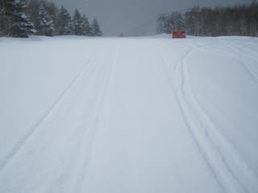
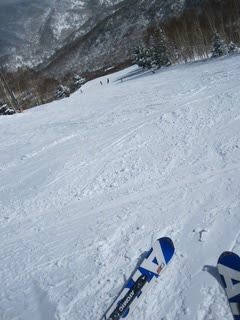
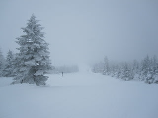
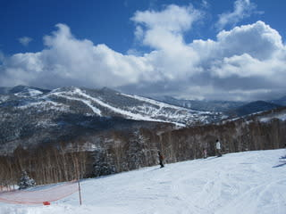
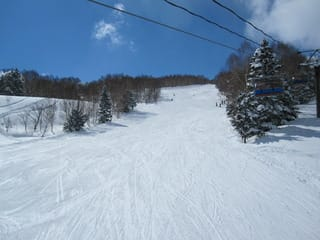

# 3月27日，日曜の志賀高原は…

📅 投稿日時: 2011-03-28 02:58:15

🏷️ カテゴリ: [2011スキー滑走日記](ca488c98cfb9169941c3e73770dcefb56.md)

さすがに志賀日帰りはちょっと疲れましたので，

詳細レポートは明日にさせてもらうとして．

とりあえず，この日曜の焼額．

雪は，ホントに3月末か！！！？

というくらいに良かった．

終日良かった．

朝からリフトストップまで，最高気温がマイナス4℃と

低かったので，ずっといい雪でした．

天気も午前は降っていたけど…

午後は良くなりました．

スキー場に人は結構戻ってきた感があります．

午前中は最大ゴンドラ10分待ちになったので…

でも，午後はがらがらでした．

帰りの高速も，先週よりずっと車が増えてましたねー．

中野市街のガソリン入手状況は相変わらずで全く問題なしです．

セルフのスタンドで，レギュラーリッター152円くらいですか…

とりあえず，今日はもう寝ます…

おやすみなさーい
