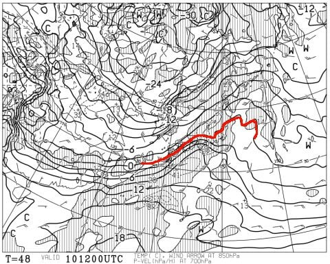
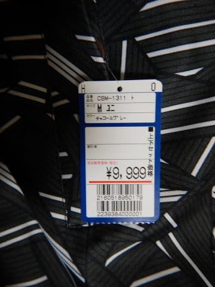

# はたして，9999円のスキーパンツは使い物になったのか？？

📅 投稿日時: 2018-02-09 01:04:10

🏷️ カテゴリ: [スキー雑談](c1f9d2cb7478308da16419928ea3945e9.md)

どうやら．

皆さんの必死の踊りが効いてきたのか．

10日夜の850hpa予想気温の0℃線．

こんな感じで…

ををを！！

志賀高原の南に下がってくれました～！

このままの天気図なら．

志賀高原の10日の夜中．

雪がチラチラぱらつく程度で．

雨にならずに済みそうな予感…

…でも．

まだ分からない．

まだ決まったわけじゃない．

雨の確率は減ってきましたが．

雨にならないよう．

まだまだ情熱的に，休むことなく．

冷え冷え踊りを踊り続けましょうっ！

…ってな前フリのあとは．

本題へ．

…さて．

[物欲選手権番外編](e08f88a704470a5656ebc84fecc72aa08.md)で．

また大敗し．

上下セットの定価9999円の激安のスキーウェアを

Getしたわけですが．

…さすがにジャケットはいろいろ安っぽすぎて使い物にならず，

パンツだけ使っているわけで．

このパンツ，そろそろ2か月ほど使ったので．

果たして，9999円上下セットウェアのパンツは

使い物になったのか…？？

ってのをレポートしてみようかと．

（…しかし，上下9999円って安すぎ…）

この激安ウェアを，実際しばらく使ってみたところ．

まぁ，意外と寒くない．

予想外に，防寒については

高いモデルとそんなに変わらない感じ．

さらに，防水加工もされており．

新品時はまーまーの水はじきでしたが．

じきに撥水性が無くなります…

まぁ，ここは．

毎週使っていると，高いウェアでもすぐに撥水加工の

効きが悪くなっていくので，こんなもんかな．

で，太もも部分とかはかなり太く，

かなりの余裕があるので．

脚を曲げても突っ張ったりすることがなく，

足を動かす邪魔にはならないです．

ポケットも普通だし．

このあたり問題ないかな．

…だもんで．

まぁ，最低限の基本性能はOKっぽいんだけど．

でも．

やっぱりある，問題点．

太さに余裕がるということは．

シルエットが太すぎて，ビデオで見ると，

すごい足の太い人が滑ってるみたいに見える…

そして．

股上が異常に深く．

さらにチャックの上のスナップボタンの

押さえが弱いので…

前かがみになると，プチンとスナップボタンが

外れちゃいます（涙）．

でも，サスペンダーがついているので，

スナップボタンが外れても

ズボンがずり落ちることはないのが，

まぁ救い…

でも．

サスペンダーの長さを短めに調整しても．

滑っているうちに調整部分がずれていき．

だんだんサスペンダー長さが長くなっていくという…

やはりここらへんに，

安さの影響が出てますね…（涙）．

ってことで．

不満点はあるものの．

意外とあったかいし．

上下セット1万円を切るウェアの

パンツだ…と割り切れば．

まぁ，使えないこともないかな…

と思ったものの．

もう一回おんなじモノを買うか？？

と聞かれると．

「No!」

と答えるよなぁ…

と思った，Skier_Sなのでした．

## 💬 コメント一覧

### 💬 コメント by (かず)
**タイトル**: Unknown
**投稿日**: 2018-02-09 05:47:15

Sさんのせいではありません　午後ライブカメラでかなり降ってたの確認して　土曜の天候をかみして早めにしただけですよ〜昨日朝は駐車場で-21℃と冷えてました

### 💬 コメント by (ほっぽ)
**タイトル**: Unknown
**投稿日**: 2018-02-09 06:40:56

昨日の志賀高原は朝から晴れて、ほぼ終日晴れました。

今週は天気安定していて私のようなスキーヤーにはありがたいです。

残念ながら今日で帰宅するので３連休お会いできないのが残念です。

次回は2/17~18の週末に久々に参上します。

http://www2.tokai.or.jp/nana_hoppo/

### 💬 コメント by (はっち)
**タイトル**: 妻のウェアは
**投稿日**: 2018-02-09 19:45:03

上下合わせて8800円。

3900円ジャケットは防寒機能が全くなく、ジャケットの下にダウンジャケットを着ています。

4900円のパンツはそこそこ温かく動きやすいみたいです。

もう一回似たようなモノを買うか？　”Yes!” だそうですｗ

### 💬 コメント by (olaf2125)
**タイトル**: 我流では効果が薄いようです
**投稿日**: 2018-02-09 20:18:55

師匠、冷え冷え効果が最大なる踊り方をご教示下さい。m(_ _)m

### 💬 コメント by (Skier_S)
**タイトル**: 冷え冷え踊りの効果が出たか…？？
**投稿日**: 2018-02-10 04:07:27

＞かずさま

えええ！-21℃？？

それは寒いですね…

コンディションはいかがでしたか？？

＞ほっぽさま

詳細レポートありがとうございます～．

8日はやっぱり積雪ほとんどなかったんですね…

残念．もう少し降ってほしかったけど…

でも，いい天気で滑れたようで，良かったですね！！

また17日の週末にお会いしましょう！

＞はっちさま

えええ？

私の上を行く8800円ですか…

新品でそれはすごいですね．

中古より安い…

私9999円も，ジャケットは防寒ヤバそうです．

パンツはマシです…

しかし，8800円ウェア，もう一度購入したい

レベルだったんですね…

＞olaf2125さま

どうやら効果はあったらしく，10日は雨に

ならずに済みそうです…

いや，今のままの天気図通りなら，ですが．

なので，まだどうなるか分からないので，

踊り続けた方がよさそうです．

効果が最大になる踊り方は…

…

…私もまだ良く分かってません（爆）

### 💬 コメント by (葛飾のS)
**タイトル**: 9999
**投稿日**: 2018-02-10 19:01:57

アルペンスポーツデポでバーゲン始まりました😍

スキーパンツの旧品が9999円で売ってましたー。

お買い得だと思いますよー😊

### 💬 コメント by (Skier_S)
**タイトル**: 葛飾のSさま
**投稿日**: 2018-02-10 21:24:44

あら．

もうバーゲンですか…

パンツ型落ち9999円！？？

…でも．

今のパンツがあるから，もうしばらくは

大丈夫そうです…

