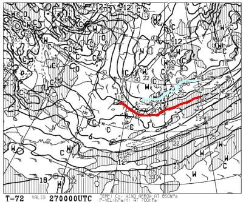
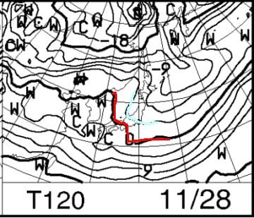

# 熊の湯スキー場11/26(金)オープン！…そして11/27(土)は冷える．降る．積もる！

📅 投稿日時: 2021-11-25 03:13:48

えー．

志賀高原の熊の湯スキー場．

今回の冷え込みにより．

11月26日（金）のオープンが決定した

ようです！！

いやー．

週末を待たずしてのオープンになりましたね！

([熊の湯スキー場Facebook](https://www.facebook.com/kumanoyulift/)より）

ちなみに，今日の横手山．

積雪はあったものの…2-3センチと

ごくわずか（涙）

天然雪だけで滑れるのはまだまだ

積雪が必要です…

天然雪がほとんど無かったので．

横手山では昨晩から人工降雪機は

フル稼働してはいるものの．

ちょっとまだ茶色いところが残って

いますね～…（ちょい涙）

でも．今日の午後は，そんなにリフトは

混んでなかったようなので．

そこは良かったのかな？

ってなことで．

今週末，横手や熊の湯方面に出かける方が

多いだろうし．

今週末までに雪が積もるのかどうか，

1億4000万人のこのBlog読者の方全員が，

気になって身悶えしていることと

思います．←いや，このBlog読者が濃い人が多いとはいえ，

全員がこの時期に身悶えする人ばかりじゃないから．

そもそも日本人口を超える量の読者は居ないから

果たして今週末までにスキー場に雪が

積もってくれるのかどうか…

天気予想を行ってみましょう！

まず．25日ですが…

850hpa図を見ると，0℃線はギリギリ

志賀高原．

これは…一の瀬方面では，日が射す昼間は

人工降雪は厳しいかな…

熊の湯はほぼ全日人工降雪機が

動かせる気温だと思います！

地上天気図は…

日本海側に雲がかかってますが，

等圧線が横縞なので，西風で志賀に

雪が積もらないパターンですね…

日本海側・白馬は降るかな．

そして，26日の金曜日．

850hpa気温の0℃線は本州の

太平洋側まで下がっているので．

これは，志賀高原は終日人工降雪が

打てそうな気温…！

ただ，地上天気図を見ると．

この日もまだ西風で，志賀には

雪雲は届かなさそう…（涙）

がんばれ，人工降雪機！！

で．27日の土曜日の850hpa気温は…

をを！！この日は水色の-6℃線が

志賀高原に！！

これは冷える！

あさイチの横手は-10℃近くまで

冷えるかも！！

そして，この日の地上天気図は…

うむ？

水色の降水域が朝鮮半島の付け根から

日本に向かって伸びてますよ！？？

…これは…JPCZ！！

この，JPCZが出るということは…

結構雪が降る目安です！！

これが出ると，日本海側は結構な雪が

降ります！

JPCZが志賀より東に向かって流れる

ようなパターンでは，西風で志賀には

積もらないのですが，

今回のJPCZは，朝鮮半島から志賀より

西側，能登半島の西くらいに吹き込んで

いるので…

これは，志賀も北風で雪が降ります！！

そして，赤く印した，+49の数字．

これは49mmの降水量を示すので…

積雪だと，49cm！！！

27日，新潟近辺は50cm，

志賀でも20～30cm．

それ以上積もるかも！！

27日の土曜は期待！！！

…でも．

出来れば週末の前に降って

ほしかったんだけど…

とはいえ，27日の積雪で，

28日の日曜からオープンするスキー場が

出てくるんじゃないかな？？

そして．

28日の日曜の850hpa気温は…

西から0℃線が近づいてきてるけど，

この日も水色の-3℃線が志賀にかかって

いるので．

この日も冷えますね～！

この日の地上天気図は，高気圧に

覆われているので．

昼ごろまでちょっと雪雲が残るか

もしれないけど，

午後は晴れていくかな？？

ってなことで．

まとめると．

25日（木）：志賀は降らない．白馬・新潟の

　標高1500mくらいから上は積雪！

　志賀は人工降雪機フル稼働！

　

26日（金）：結構冷える．志賀は積もらない．

　人工降雪機フル稼働！

　白馬・新潟の山麓は結構標高が低い

　ところまで雪，10cmほど積もるかな？

27日（土）：激冷え．志賀は朝は-10℃

　くらいまで冷える．そして朝から降る．

　積もる．

　日ごろの行いがよければ，志賀でも

　明け方に20cmほど積もってるかも．

　一日中雪．昼間も降り続けコースは

　モフモフになりそう．寒い．

28日（日）：この日も寒い．

　午前中は雪がチラチラ，

　昼に向かって雪が止み，その後

　晴れていく．

…ってな感じでしょうか．

で．

その後は…

…

ええええ！！

なんだ？

30日，水色の+6℃線が志賀に

近づいてますよ！？？

30日，降れば液体の気温ですよ！？？

そして，地上天気図を見ると…

30日はギリギリ大丈夫だけど．

1日に降水域が…

これ，30日夜中から1日昼前に

かけて．

空から液体が降ってくるパターン

ですね…（涙）

ただ．

12月1日の昼過ぎのどこかのタイミングで

雨は雪になって…

それから2日まで，また雪が積もりそう．

その後，3日もまた一瞬気温が上がりますが．

その次の4日の日曜．

FEAS26を見てみると…

これは…またすごい天気図だ！

水色の-6℃線が志賀にかかって，

等圧線は見事に縦縞だから…

12月4日の土曜日，この天気図の通りに

なれば．

また，志賀でも朝は-10℃近くまで

冷えて，新雪が20～30cmくらい

積もっても不思議じゃない天気図です！

しかし．

出来れば，3日に積もってくれば．

焼額が気持ちよく4日にオープン

できるんだけどなぁ…

ちょっと，降るのが1日遅い…

…まぁ，1週間以上先のFEAS26なので．

この予想からずれる可能性は高いですが…

とりあえず．

11月30日と12月3日に，ちょっと気温が

上がる危機があるけど．

11月27日，12月1日，12月4日は雪が積もり

そうで．

そろそろスキー場が続々とオープンしそうな

予感…！！

## 💬 コメント一覧

### 💬 コメント by (koi)
**タイトル**: Unknown
**投稿日**: 2021-11-25 08:06:45

先日白馬が気になると質問させて頂いた者です、いつもありがとうございます！降雪がとても楽しみです

もしかして…敢えて勉強のヒントになるような用語を使ったり、白馬にもちょいちょい触れていただいてますか…とても嬉しいです、勉強します

### 💬 コメント by (雪山飛狐)
**タイトル**: Unknown
**投稿日**: 2021-11-25 19:07:58

徒然さん、Yeti的で色々教えて貰った李です。滋賀のスキー場続々オープンして、今週は滋賀ですかね。白馬も大雪が降り、本日12時で五竜スキー場が急遽オープンしました。金土日基本五竜で滑る予定です。

### 💬 コメント by (Skier_S)
**タイトル**: 白馬方面オープン！
**投稿日**: 2021-11-26 02:03:16

＞koiさま

はい．

白馬方面の積雪予想もちょっと書き加え，

さらにいろいろ説明も細かく書き込んでみました…

参考になったのなら嬉しいです～！！

八方尾根，明日オープンですね！！

＞雪山飛狐さま

コメントありがとうございます～！

そして，Yetiではお世話になりました．

金土日に五竜ですか！いいなぁ…

私は今週末はまだ志賀のシーズン券が使えないので，

アサマ2000で滑る予定です…

