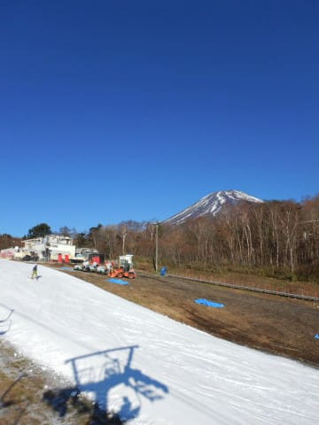
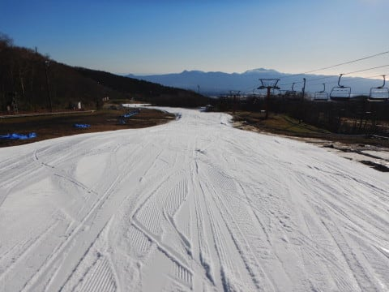
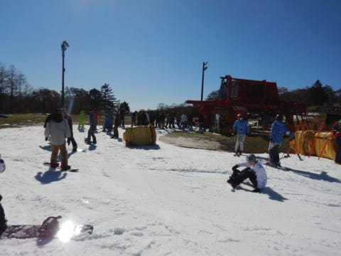
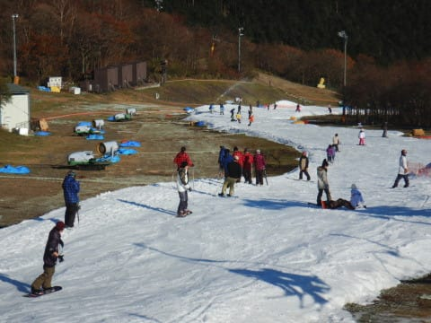
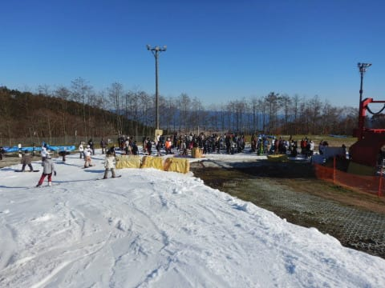

# 2019/11/17(土)のイエティのゲレンデ状況速報＆動画…終日晴天！午前ガラガラ，午後混み混み

📅 投稿日時: 2019-11-17 00:22:08

ということで．

昨日は，深夜1時過ぎの

終電で帰ってきたのに．

今日は朝5時に家を出て，Yetiへ

行ってきました～！

…ってか．

冷静に考えると，今日はホントは

スキーに行ってるどころじゃ

なかった気がするんだけど…

…いや．気のせいだ．

気のせいに違いない…

ってなわけで．

今日は寝不足気味なのに．

なぜかナイター前半まで滑ってきて

しまったので．

帰宅は夜10時近く…（涙）

だもんで．

本日は速報モードにて！

えー．

本日のYetiですが．

朝から雲一つない快晴でスタート！

晴天で太陽は射しているけど，

気温は低めで，雪も締まっていて．

コース幅も先週までよりちょっと広がり，

そのうえ，朝のうちはゲレンデも

超ガラガラで，午前中は結構快適に

滑れました～！

なぜか，昼前までは，

この時期のYetiとしては信じられないくらい

ガラガラで．

リフト待ちはこの程度で，

1分くらい．

隣のペアリフトが動いてないのに，

ガラガラです…

でも．

昼を過ぎると，ゲレンデの人が一気に増え．

リフト待ちも5分を超えて．

午後になってから，隣のペアリフトが

営業を開始するような状況でした…

午後は，クワッドリフト待ち3～5分

くらいですかね．

ペアリフトは待ち0で乗れました．

ってなことで．

いつものコース状況の動画を載せておきます．

午後2時ごろ，コースの混雑がピークになって

きたころのコース状況です．

ってなことで．

詳細レポートは，また後日…

## 💬 コメント一覧

### 💬 コメント by (ジョナサン)
**タイトル**: お疲れ様でした
**投稿日**: 2019-11-17 12:44:50

昨日リフトで同乗した者です。ステッカーありがとうございました。あれから心が折れて撤収しましたよ。やはり平日ナイター味わってしまうと辛いです。また某国出張とのことでお体にはご注意下さい、ってタフなお方なので心配いりませんね(笑)私の師匠(プルーク先生ね)にS様の事を、伝えたらやはり毎週見てるので知ってましたよ。あ、私もS様を載せておきました。https://twitter.com/hagiwara473/status/1195650602014892033

### 💬 コメント by (Skier_S)
**タイトル**: Unknown
**投稿日**: 2019-11-17 17:46:25

>ジョナサンさま

昨日はありがとうございました～！

4時間かけてのイエティ、お疲れ様です。

現在、出張の飛行機待ち中です。

また来週日曜も、イエティになりそうです…

シーズン中、志賀にお越しになることがあれば、

またお会いしましょう！

### 💬 コメント by (ほっぽ)
**タイトル**: 11/17　イエティナイター
**投稿日**: 2019-11-18 20:47:06

Ｓさん

毎週の海外出張、ご苦労様です。

その合間にイエティでスキーとは、本当にサイボーグのような体ですね。(^^;

さて、私も昨夜はＦＳＷ帰りにイエティで一滑りしてきました。

平日ナイターを知ってしまうと、日曜ナイターでも混んでて厳しいです。

月曜日が雨予報だったので無理して日曜ナイターにしましたが、

今は結構な勢いで雨が降っており、やはり昨夜で正解だったようです。

滑走レポートはアップしておきました。

そして、今日帰宅したらヤケビから封書が届いており、

ヤケビ限定シーズン券当選の案内でした。

全山共通のズン券買うのでヤケビ限定はナイターくらいしか使いませんが、

折角当選したので有難く交換させて頂こうと思います。

今年の運はこれで使い果たしたようです。(^^;

http://www2.tokai.or.jp/nana_hoppo/

### 💬 コメント by (Skier_S)
**タイトル**: >ほっぽさま
**投稿日**: 2019-11-19 19:56:26

ヤケビ限定シーズン券あたったんですか！！

うらやましいです…

これは、ナイター滑りにいかないといけませんね(笑)。

