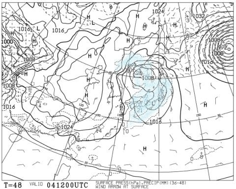
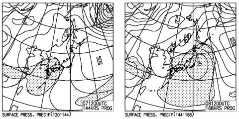

# 志賀高原スキー場，今日は激烈高温でストップ雪に（涙）．果たして今週末までに雪は積もるのか？…って，週末に雨になる可能性もあるの？？（涙）

📅 投稿日時: 2020-03-03 01:40:21

えー．

本日．焼額山の公式ホームページを見たら，

なんと．このような情報が…！

（[焼額山ホームページ](https://www.princehotels.co.jp/ski/shiga/informations/corona/)より）

…うむ．

スキー場を利用する者にとって，いろいろ

不便は避けられないけど…

でも，ゲスト間の感染を防ぐための対策を

ちゃんと考えてくれることは，

評価せねばなるまい…

あぁ…

早くコロナウイルス騒ぎが収まる

ことを願うばかり（祈）．

で．

本日の志賀高原ですが，

複数の特派員からの情報によると．

朝は晴天でいい感じだったものの．

気温がぐんぐん上がり，昼前には

強烈なストップ雪になっちゃった

ようですね（激烈涙）

あぁ…まだ3月になったばかりというのに．

なぜ…なぜもうこんなひどい雪に…（泣）

ってことで．

本来なら本日，日曜の志賀高原詳細レポートを

書く日なのですが．

…果たして，この高温はいつまで続くのか？？

長く続いて雪が解けてしまいそうなのか？

この週末までに，雪質は回復しそうなのか？

…ってあたりがものすごく気になるので．

詳細レポートは明日に回して，

今日は今週一週間の志賀高原の天気を

予想してみましょう…！

まず．

3月3日ひな祭りの日の850hpa気温図ですが．

この日は赤い0℃線は志賀高原より南．

水色の-3℃線も志賀より南にあるので．

この日は，雨の危険性は無く，

そこそこ冷えた一日になりそうですね…

そして，3日の地上天気図は．

…うーむ．

志賀には降水域がかかってないので．

冷えるけれども，降水量はなさそう（涙）

おそらく，この日の朝は，結構固めの

バーンコンディションになりそうな

感じですね…

午後はすっきり晴れるので，

気温は終日マイナスだけど，

日当たりが良いところは，ガチガチ

バーンがちょっと緩むかな．

で．

4日(水)の850hpa図ですが…

うーーーん．

この日は赤い0℃線がギリギリ志賀に

かかるかどうか…

というくらいなので．

この日は朝からちょい気温が高め．

午前のうちから，プラス気温にまで

上がりそう…

そして．

この日の地上天気図を見ると…

本州ほぼすべてを降水域が

覆ってます…

これは…

降れば雨か雪か微妙な所．

おそらく，山頂付近は雪でも，

スキー場下部は雨かみぞれっぽい

感じになりそうな気温…

…とりあえず，今から冷えるように

踊っておかないと！

で，次は5日（木）の850hpa気温図ですが．

この日は水色の-9℃線が志賀に近づいてます！！

朝はまだ気温がそこまで冷えないけど，

午後には志賀高原は10℃クラスにまで冷えそう！

寒いです！！

そして，地上天気図を見ると…

これは見事な冬型！

そして，日本海側には降水域が

かかっているので…

これは，降ります．

そして，積もります．

5日は雪が降り続けの一日になりそう…！

昼間で20cmほど積もるかな？？

そして，6日（金）の850hpa気温図ですが．

この日も赤い0℃線は本州の南まで

下がっており，結構冷え冷え！

そして，地上天気図は高気圧に

覆われすっきり晴れそうです！

6日の金曜日は，5日に積もった雪が

冷え冷えでキープされており，

コンディション良さそう！！

…ってことで．

この雪質が終末までもってくれると

いいんですが…

7，8日の850hpa気温を見ると．

…微妙…

7日，8日どちらも，微妙に0℃線はわずかに

志賀高原より北．

これはちょっと微妙な感じ…

そして，地上天気図を見ると．

左側の7日は，降水域がまだ志賀に

かかってないので，土曜日は

まだ晴れそうですが…

8日はヤバい．

本州全域，網掛けの降水確率予想に

覆われそうです．

うーむ．

まだ8日の予想精度は低いけど．

雨にならなきゃいいんだけど…

…しかし，まだ3月になったばかりというのに．

なぜこの時期に，雨の心配をせねば

いけないのか…（涙）

ってなことで．

まとめると．

3日（火）：志賀高原は-5℃くらいまで冷えそう．

　2日の高温で溶けた雪が固まった，硬めのバーン．

　昼間も気温が低いままなので，

　終日緩まなさそう…

　午後は日当たりが良い一部だけ

　わずかに緩むかな．

　天気は曇り，午後は晴れそうかな．

4日（水）：朝は曇り空，朝から0℃近い高温．

　昼間はわずかにプラス気温になり，

　…そして，降ります．

　山頂はギリギリ雪だけど，麓は液体か？？

　運がよければふもとまで雪でいてくれそうだけど…

　気温が高いべちゃべちゃ雪．

5日（木）：早朝から冷え始め，朝イチはまだマイナス2-3℃

　くらいの高温っぽいけど，午後に向かって

　激烈に冷え，夕方は-10℃近くまで冷え込む．

　朝からひたすら雪が降り続ける．

　昼間だけで20cmほど積もってくれるかも？

　でも，風が強く，荒れた吹雪の一日．

6日（金）：朝から冷え冷え！天気は朝は曇ってるかも．

　でも，じきに晴れる．

　前日の冷え冷え雪が積もっており，

　天気は晴れでいい感じのスキー日和！

7日（土）：気温は高め．昼間は0℃を超えそう．

　天気も晴れそうなので，昼間は日差し＆

　高温で，雪が緩みそう…（涙）

8日（日）：まだわからないけど…雨か雪が微妙な所

と言った感じでしょうか…

うーーむ．

今のところ，7，8日の週末は，気温がちょいと

上がりそうで，雪質はあまり期待できなさそう…

なぜ．

なぜ，3月になったばかりというのに．

こんなに気温が高い週末が続くのか…（涙）

とりあえず．

この予想が外れるように．

一心不乱に祈り，踊り続けるしか

なさそうです…（泣）．

## 💬 コメント一覧

### 💬 コメント by (かず)
**タイトル**: Unknown
**投稿日**: 2020-03-03 11:17:55

３レインボーさん昨日はありがとうございました

本日は朝カチカチ？午後滑走性はよくなったのでしょうか？

昨日は向かい風が強かったですが朝最高  その後板つかみがひどくなり奥志賀に移動し快適でした １４時にゴンドラ側降りましたが途中から板つかみ発生 今週は微妙な天気ですね…

### 💬 コメント by (レインボー)
**タイトル**: Unknown
**投稿日**: 2020-03-04 14:30:42

お借りします。こちらこそありがとうございました。

火曜日は足つかみは出現しなかったかと。前日のザクザクが凍ったので、表面はプラス5度だったけど、全般に硬い滑りやすい斜面だったと思います。おかげでレインボーに遅刻しそうになりました。

今日水曜日は、ヤケビ、奥志賀は快適。ところがスケート靴を忘れたので、ファミリーは困りました。

