# 4月18，19日の週末の志賀高原スキー場の天気は？…土曜は雨，日曜は曇り．気温は平年並みで暖かいよ

📅 投稿日時: 2020-04-16 01:12:02

えー．

そろそろ，自分が行けないスキー場の

天気を予想するための

モチベーションが失われつつある

今日この頃，皆様いかがお過ごし

でしょうか…

そういう今，何を支えにして

スキー場の天気予想をしているのかというと．

特派員の皆さんのレポートで，

自分の予想がどれだけ当たっているか

を確認して．

「ふふふ．当たったぜ…」

と，ハードボイルド風につぶやくのが，

予想を続けていく唯一の心の支えな

わけで．←これで大外ししたら再起不能な心の傷を負うのでは…？？

果たして，今日も予想は当たったのか？

さっそく，特派員のレポートを見てみると…

今日は朝からすっきり晴れ！

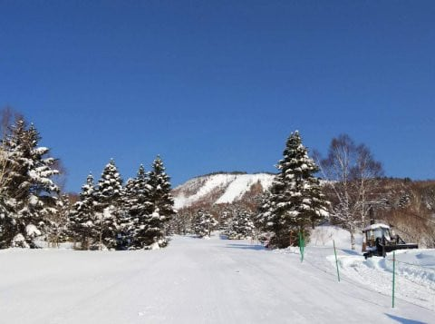

あさイチの気温は，-2℃をちょっと下回る，

いい感じの冷え具合で．

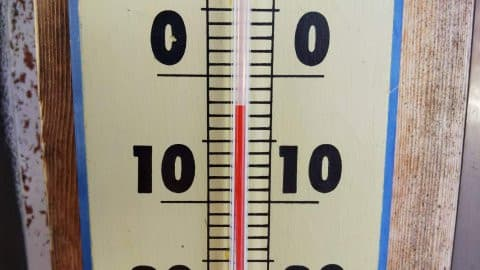

ゲレンデは昨日までの雪が圧雪された，

柔らかい，いい感じのシマシマッ！！！

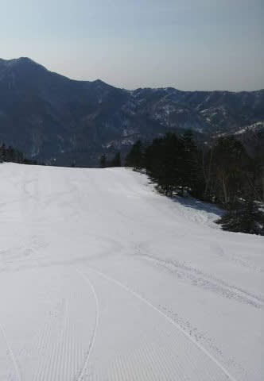

あさイチは最高のコンディションだったようです…！！

…

…が．

晴天で日差しが強かった本日．

あっという間に雪が緩んでしまい．

10時前には雪が緩み始め，

で．昼間の山頂の気温は+4℃くらいまで

上がってしまったというのもあり，

11時過ぎには，結構全面滑りが悪い雪に

なっていったようです…（涙）

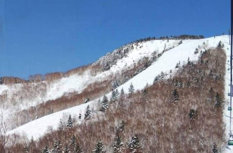

ということで．

私の予想を振り返ると．

　朝は晴れてそう！　←当たり

　朝は-3℃程度かな？　←誤差1℃以下，だいたい当たり！

　昨日まで積もった雪が圧雪されて，朝イチは

　この時期としてはかなりいい感じの圧雪！　←これも当たり！！

　ただ，日が射しそうなうえに，　←当たってます

　昼間は+4℃くらいまで気温が上がるので，　←ぴったり正解

　日が当たるバーンは昼前には板の滑りが

　悪い雪になりそう…　←ドンピシャ当たり！！

…ふっ．

今日もまた，予言レベルで予想を当てて

しまったようだぜ…

いや．

しかし．

日曜の段階で，水曜の志賀高原の

天気，気温，雪質を

ここまで正確に当てるとは．

すごいと思いません？？思いますよね？？

（自分のための予想じゃなくなってきたので，

　誰かに褒めてもらってモチベーション維持しようとしている）

ってなことで．

今日も自分とは関係ない，今週末までの志賀高原の

天気予想です！

えー．

まず，16日(木)の850hpa図を見てみますが．

ふーむ．

赤い0℃線は志賀高原よりわずかに北．

あさイチは日が射しそうなので，

朝は放射冷却で0℃を下回るか

もしれませんが．

すぐにプラス気温に上がりそう…

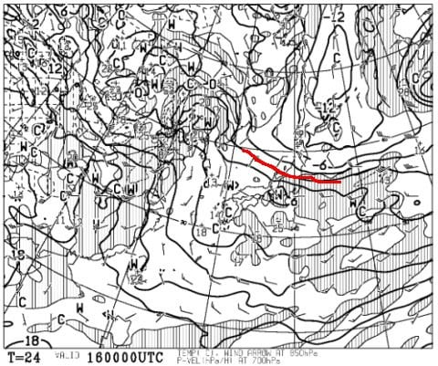

地上天気図は，プチ低気圧が

九州南，東海，関東沖などに

パラパラ発生しているので．

朝は晴れるけど，午後は雲が

増えていく感じかな…

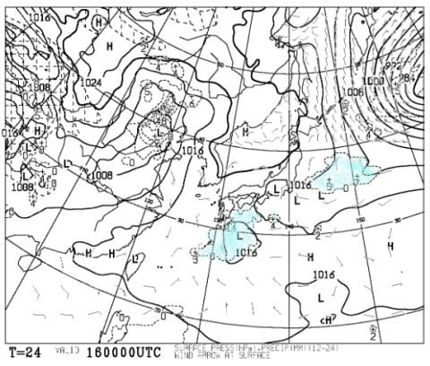

まぁ，昼間は+3~5℃くらいに上がり，

午前中に日も射すので．雪は緩み

そうですね…（涙）

で．

17日(金）の850hpa図を見てみると．

この日も，0℃線は志賀高原よりわずかに北．

朝はマイナスに冷え込みそうだけど，

午後は気温が+5℃を超えてくるか…

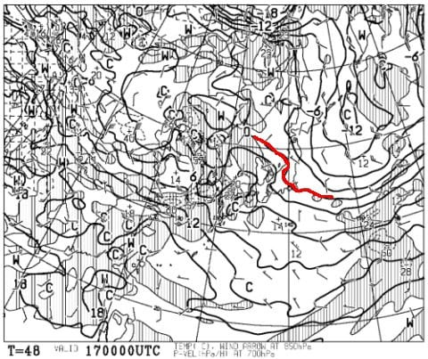

そして，この日の地上天気図は．

基本的に高気圧に覆われ，

晴れそうな気配．

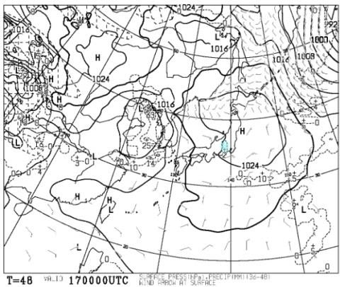

…てか．

この時期は，晴れると雪がザブザブに

なっていくので，曇ってくれた方が

いいんですけどね…

そして，週末18日(土)の850hpa図は…

うぎゃーーー！！

水色の+6℃線が志賀高原に近づいてますっ！！

これは，朝からプラス気温ですね…（涙）

そして，+6℃の等温度線，かなり細かく

凸凹しているので…

これは，天気が荒れる印です（泣）

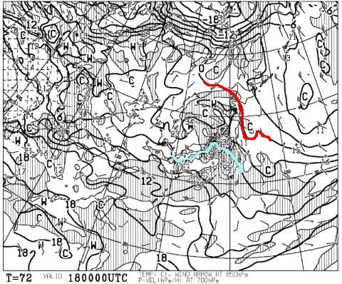

ってなことで．

地上天気図を見てみると…

…

…

低気圧がすっぽり本州を覆ってます（激涙）

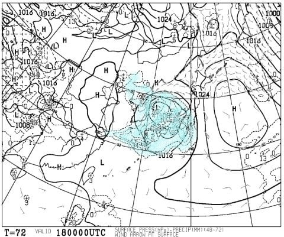

…これは．

この日は，朝から雨ですね．

…そして，終日雨ですね．

…さらに，時折強く降りますね．

皆さん，土曜はダメです．

雨です．

風も強いです．

覚悟してください…

そして，19日(日)の850hpa図を見てみますが…

…この日も，水色の+6℃線が志賀高原に

近づいてますね．

これは，朝からプラス気温ですね．

あさイチから，雪は緩そうな感じ…（涙）

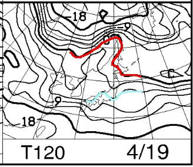

そして，地上天気図は．

うーん．

ギリギリ低気圧は東に抜けて

暮れているので．

明け方まで雨が降り続けて

いるかもしれないけど，

朝9時ごろには止んでそう…

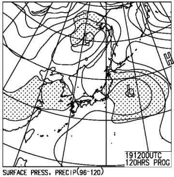

この日は，雨の後のドロドロ雪で

滑ることになりそうです(涙）

ってなことで．

まとめると．

16日(木)：朝の気温は-2~3℃くらいかな？

　あさイチは晴れて，放射冷却で固まった

　ガリガリバーン！

　でも，朝のうちから気温が上がり，

　日差しと相まって朝から雪は緩め．

　午前中には，水を吸って重い春の

　雪になっていきそう…

　午後はちょっと雲が増えるかもしれないけど，

　基本的に青空が覗く一日．

　昼間の気温は+3~5℃程度と，それほど

　高くは上がらないけど，日が当たるので

　かなり暖かく感じそう．

17日(金)：朝の気温は-2℃程度かな？

　朝は晴れ．雪は朝イチは表面がカリカリに

　固まった感じだけど，すぐに緩んで

　朝からしっとり重い雪に．

　昼間の気温は+5℃を上回り，日差しも

　相まって暑いくらいに感じるかも．

　昼間の雪は高温でザブザブに溶けた

　水を吸った雪になり，ゲレンデは

　荒れていく．

18日(土)：諦めてください．

　朝から雨です．一日雨です．

　時折強く降ります．

　そして，風も強いです．

　ゴンドラは動かないかもしれません．

　気温は朝から+5℃程度とかなり

　高く，高温の雨で雪は激しく

　解けていきます（涙）

19日(日)：この日の明け方まで雨が残るか…

　リフト営業開始のころに止みそう．

　朝から気温はプラスで，昨日の

　雨を吸って，ところどころ水たまりの

　ようになった湿った雪．

　天気は終日曇り空．

　かなり水っぽいバシャバシャした雪を

　滑ることになりそう…（泣）

…ってな感じでしょうか．

うーむ．

どうやら，この週末はスキーには

あまり適さない感じの天気ですね…

でも．

ここしばらくが冷えすぎてただけで．

この18，19日の気温が，4月の平年並みの

気温なんですが…

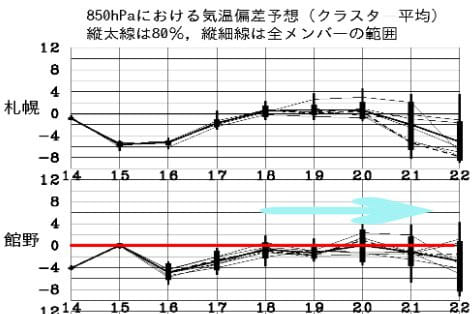

まぁ．

週末を過ぎた後，21日までしばらく平年並みの

気温が続くけど．

なんだか，22日以降，またちょっと

冷えるかも…？？

とりあえず．

今は，GW後まで滑れるよう，

少しでも雪が長持ちするよう，

祈りましょう…

（最近だんだん，GW以降も緊急事態宣言が解除されない気がしてきたけど…）

## 💬 コメント一覧

### 💬 コメント by (ゆーき)
**タイトル**: 悩むな
**投稿日**: 2020-04-16 06:07:42

野沢も終わってしまう状況で、

行ける日は行ったほうが良いけど、

土曜はどうにもならない、

日曜もジャブジャブ。。。

### 💬 コメント by (覆面特派員（バレバレ😅）)
**タイトル**: Unknown
**投稿日**: 2020-04-16 07:48:54

Ｓさぁ～ん😁✌️🤤

Ｓさんの名誉の為に 白状しまぁ～す😅

朝イチの気温は－3℃ でしたぁ～✌️

温度計🌡️の 写真📸、実は２本目で、

（この日だけ いつもは１本目ダョ🐷）

１本目は 滑りたい一心で throughしちゃいましたぁ～～～⤴️✌️💖⛷️💨

本当は perfect でぇ～す🎵💖🎵✌️💖

### 💬 コメント by (ほっぽ)
**タイトル**: 週末
**投稿日**: 2020-04-16 08:07:10

Ｓさん

待っていました志賀高原天気予報！(^｡^)

やはり18日は悪天候ですか。

最初から雨と分かっていたら、なかなか行けません。

日曜日もザブザブの予想ですし、今週末は自粛が妥当かな。

野沢もおんたけも終了して、長野県ではいよいよ志賀高原だけになってきました。

（正確には今週末は八千穂も営業しますが）

志賀高原はゴンドラ下山が無いので営業は続けると思いますが、

外圧にどこまで耐えられるか？心配です。

### 💬 コメント by (かず)
**タイトル**: Unknown
**投稿日**: 2020-04-16 12:21:08

自分の地元は特に緊迫感はありません  万が一には備えて仕事の対応検討する位で休みは自宅  そちら精神的にも大変と思いますが頑張りましょう！

来年の板とりあえずもう作って確保済と連絡ありました！試乗会の時期にある程度は作るのかな？って思ってます  来年落ち着いてる？？笑笑……  

個人的にはGW志賀に集中なんて……

### 💬 コメント by (タカ)
**タイトル**: Unknown
**投稿日**: 2020-04-16 14:08:09

かぐらの営業4月19日で終了すると公式に出ました。プリンス系列の焼額山も危ないかもしれません

### 💬 コメント by (レインボー)
**タイトル**: Unknown
**投稿日**: 2020-04-16 21:13:31

プリンス常連のH多さん情報によると、ヤケビは、19日をもって、ホテルもスキー場も終了するとか。

もう交換もタイヤも済ませた私は、心志賀にあらずなので、確認はしておりませんが。

### 💬 コメント by (なるなる)
**タイトル**: Unknown
**投稿日**: 2020-04-16 21:13:42

週末の天気が悪いようで、なんだか気持ち良く諦めがつきました。

仕方ないので、車のタイヤ替えます。

来シーズンまでに騒ぎが収まって、最初からアホみたいに雪が降る事を祈ります。

### 💬 コメント by (ほっぽ)
**タイトル**: 志賀高原も
**投稿日**: 2020-04-16 23:53:26

Ｓさん

リゾートは4/19で終了、ヤケビも4/19終了らしいですね。

そして全国緊急事態宣言に週末の悪天候。

どうやら私の今シーズンは終了になるようです。

また来シーズンも何事もなくヤケビでお会いできることを楽しみにオフシーズンに入ります。

### 💬 コメント by (Skier_S)
**タイトル**: 緊急事態宣言全国へ
**投稿日**: 2020-04-17 01:05:45

＞ゆーきさま

この土日は，ちょっと天気はダメっぽいです…

いろんな意味で，家でじっとしておくのが吉な週末かもしれません（涙）

＞覆面特派員さま

そうだったんですね…！！

やったー！パーフェクト！！

でも．

営業終了になったら，志賀高原の麓に住んでても行けなくなるのが厳しいですね…

＞ほっぽさま

今週末はかなり厳しい天気になりそうです…

少なくとも土曜はダメです．

雨が降り，ゴンドラが動かなさそうなので…

中央エリア，焼額は今週末がラストっぽいので，

熊，横手，奥志賀がどこまで頑張るか…

＞かずさま

来年の板，製造済みで良かったですね…

来シーズンはちゃんとスキー場が営業されるよう祈るばかりです…

＞タカさま

かぐらも志賀中央エリアも終わりますね（涙）

野沢もおんたけも終わり，おそらく焼額もアウトだと思います…

＞レインボーさま

ヤケビもダメっぽいですね…（涙）

私ももう今週末に夏タイヤに換えちゃいます．

あぁ…私のスキーシーズン，なし崩しに終わっちゃうのか…

＞なるなるさま

今週末は，緊急事態宣言が無かったとしても，

スキーに適した週末とは言いにくい天気です（笑）．

来シーズンに期待しましょう！！

