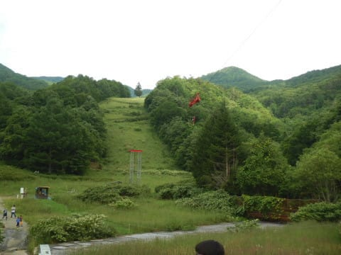

# 沖縄に行けなかったので，日帰りで志賀高原に行ってみた（志賀高原への忠誠心が高い…）

📅 投稿日時: 2020-08-14 01:55:38

🏷️ カテゴリ: [日記](cc4b5682fb7b8b144980957a978653fb0.md)

えー．

今日も，

本来なら座間味で潜っていたはず

で．

この土曜まで沖縄でのんびりくつろいでいた

はずなのですが．

沖縄に行けなかったどころか，今日は

いろいろ仕事が飛んできて．

本日は家で一日スマホを握りしめていた

うえ，明日金曜の朝イチ出社が決まった

Skier_Sです…（涙）

なんだか．

この夏休み，あまりにもいろいろ

仕事関係のご無体がありすぎて，

とても夏休みどころじゃなかったので，

沖縄に行けなくて良かったのかも

しれない…

（自分を騙す言い訳ではなく，あまりもの

　想定外の事態が連続したので，今回は沖縄に

　行ってたらいろいろリアルにヤバかった…）

…とはいえ．

さすがの9連休，

完全にずっと家でじっとしているのも

悲しいので，なぜか昨日はぶらっと

日帰りで志賀まで出かけ…

（行く先が志賀高原ってところが，

　志賀高原への忠誠心の高さを

　表している)

志賀高原に行ったついでに，

噂の，蓮池―ジャイアントを繋ぐ

パルスゴンドラの工事現場を見て

きました～！

…でも，

…これ，ホントに12月までに

完成するのか？？

と，心配になる進み具合ですね…

山の駅側は，まだ駅舎どころか設備は

一切できておらず，まだ土台を

これから作るところみたいで．

そして，ゴンドラがかかるルート上の

木は伐採されているものの…

ジャイアント側の駅の予定地も，まだやっと

土を均しているところ．

…ちなみに，駅舎はここ，ジャイアントリフトの

下のスペースにできるようです．

…これ．

ゴンドラ降りてからジャイアントリフトに

乗るときは，結構ぐるっと歩いて

登る感じですね…

ゴンドラのジャイアント側駅舎から

ブナ平方面を眺めますが…

ブナ平・西館に行くには，基本的に

下りだからいいけど…最後の

上りがきついか？

（工事資材運搬用のケーブルがかかって

　いますが，分かりますでしょうか…）

とりあえず，このパルスゴンドラ．

今年12月完成のようなので．

乞うご期待…

## 💬 コメント一覧

### 💬 コメント by (たお)
**タイトル**: Unknown
**投稿日**: 2020-08-14 09:07:38

Ｓ様

沖縄残念でしたね。志賀高原参考になりました。（笑）私も子供に星を見せたく、週末に春から予約した志賀高原に行く予定です。時期も時期なので、ホテルに確認したのですが、意外にウェルカムでした。やはりキャンセルが多く厳しいようですね。首都圏ナンバーなので、密を避けてドキドキコソコソと志賀高原様子見て来ます。

### 💬 コメント by (アリス)
**タイトル**: ゴンドラの利用目的が不明です
**投稿日**: 2020-08-14 11:17:01

S様

お世話になっております。

索道協会の投資目的が理解できないです。

パルスゴンドラはどういう客層が利用するのか不思議でなりません。電車とバスを乗り継いで来た日帰りのお客さんが山の駅～ジャイアントを利用？

それともジャイアント宿泊のお客さんが、山の駅～ジャイアントを利用？

一の瀬、焼額山をベースにしているスキーヤーには不要なものですね。

### 💬 コメント by (Skier_S)
**タイトル**: ダイビングに行きたかった…
**投稿日**: 2020-08-15 01:25:02

＞たおさま

沖縄に行けず，ちょっと残念でしたが．

今年は行っていたら行っていたで，仕事がヤバかった気が

するので，まぁ行けなくて良かったのかも…と諦めてます．

志賀高原は，この時期も観光客がボチボチいましたよ．

…密になるほどいませんが．

みんな日帰りみたいで，宿はガラガラです…

＞アリスさま

うーん．

私もジャイアント～山の駅間の移動ができてうれしい人ではないので，

このゴンドラの目的が良く分かりませんが，おそらく公共交通機関で

泊りに来た人の，バスを含めた移動範囲拡大のために

ちょっと役立つのかなぁ…

という感じです．

一の瀬に止まっている人の横手山方面への移動，

熊の湯・横手に泊まっている人の一の瀬方面への移動は，

ちょっと楽になるかも…

### 💬 コメント by (Skier_S)
**タイトル**: ダイビングに行きたかった…
**投稿日**: 2020-08-15 01:25:09

＞たおさま

沖縄に行けず，ちょっと残念でしたが．

今年は行っていたら行っていたで，仕事がヤバかった気が

するので，まぁ行けなくて良かったのかも…と諦めてます．

志賀高原は，この時期も観光客がボチボチいましたよ．

…密になるほどいませんが．

みんな日帰りみたいで，宿はガラガラです…

＞アリスさま

うーん．

私もジャイアント～山の駅間の移動ができてうれしい人ではないので，

このゴンドラの目的が良く分かりませんが，おそらく公共交通機関で

泊りに来た人の，バスを含めた移動範囲拡大のために

ちょっと役立つのかなぁ…

という感じです．

一の瀬に止まっている人の横手山方面への移動，

熊の湯・横手に泊まっている人の一の瀬方面への移動は，

ちょっと楽になるかも…

### 💬 コメント by (西舘)
**タイトル**: Unknown
**投稿日**: 2020-08-17 12:18:03

恐らく、山の駅施設利用者を増やしたいのだと思います。

我が家は公共交通機関利用なのでバス利用で湯田中か長野駅へ出るのですが、山の駅施設利用者は、バス待ちしている人くらいで、レストラン利用者もあまりいないと思います。

極楽さんは確か過去にブログで美味しいと書いていらしたけど。

ビール祭りとかイベントしてるけど、行く気にならん。

わざわざ行って帰ってくるにはベルグレベルのケーキで吊って貰わんと。

歩かなくてもアクセスできるから来てね、てことでしょうが、私はベルクかアスペン（アップルパイ込）で食べるまと思います。

完全に話題に乗り遅れてますが、ジャイアント→横手山へは池の平利用の方が近いですが、ジャイアント→蓮池の連絡路から池の平バス停に出るのが薮の上を歩いて行かねばならず、昨シーズンは雪に埋もれました。

バス停もよく分からないし。

こーいう所を改善して欲しい！ゴンドラ作るより費用掛らんと思うけど。

発舗バス停への下り坂が運転手さんには大変なストレスらしいし時間も掛かるから、山の駅と発舗を結ぶゴンドラ掛けてバスは止めるとかにすれば意味があると思うのだけど、協会はズレてますよね。

### 💬 コメント by (Skier_S)
**タイトル**: ＞西館さま
**投稿日**: 2020-08-18 01:53:51

スキーシーズンは，山の駅を利用する人は少ないですよね．

どこのゲレンデとも繋がってませんから，バス待ちの人以外は

ほとんど利用していないのが現状かと…

まぁ，ジャイアントとつながることで利用者が増えればよいですね…

山の駅と発哺を結ぶゴンドラもいい案ですが，その時は

発哺に泊まる人の荷物をゴンドラで運ぶのは厳しいので，

バスは止められないような気がします…

