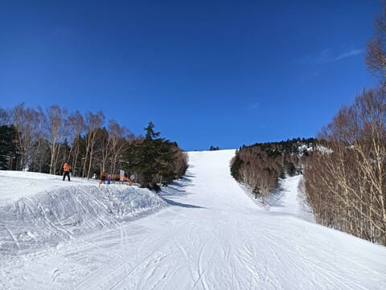
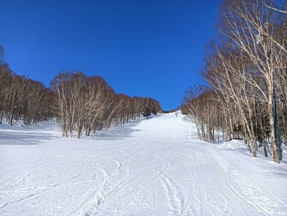
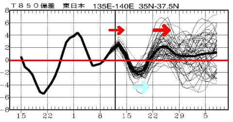

# 気象庁1か月予報では，これから1週間は冷えてその後1週間は高温(泣)．そして3月13日の志賀高原スキー場は晴天なれど気温は高めの春スキー

📅 投稿日時: 2025-03-14 02:41:26

🏷️ カテゴリ: [日記](cc4b5682fb7b8b144980957a978653fb0.md)

私の一番嫌いなシーズンである春が

やって来つつありますが…

いや．春になっていることはまだ認めたく

なく．

先週末もゲレンデはいい感じで冷えてたし，

いまだに冬だ！！…と信じているのですが．

というか，まだあんまり春だという

まだ春が来ている感じが薄いのは，

なんだか，今年はまだあんまり花粉症が

ひどくなってないんですよね～…

…今年は花粉が少ないのかな？？？

ってなことで．

頑なにまだ冬だと信じているわけですが．

そんな期待を裏切るように．

本日の志賀高原は春だった

という，特派員レポートがやって来ました(涙)

一見天気が良くていい感じに見えますが…

かなり気温が上がったようで，焼額は

完全に春の雪になっちゃってたみたいです…

でも，緩んだ春の雪ながらもガラガラで

バーンもフラットで，楽しめたみたい

ですが…

まぁ，このガラガラのフラット具合

なら，楽しそうですよね…！！

朝イチの気温は-1℃と，朝にしては高すぎる

気温で始まったみたいですが．

朝イチはまだガスが出て，視界が悪かった

ようで…

バーンは夜のうちに冷えて，ザラメが

固まった硬めのシマシマバーン！

朝のうちは雲が多かったものの．

9時過ぎから徐々に晴れはじめ…

10時にはすっかり快晴！！

…ホントに人が誰もいないし，

バーンもフラットで滑りやすそう…

気温が上がって日が射したものの，

午前中はそこまで緩まず，しっとりした

感じながらもエッジが効く雪だった

ようで．

奥志賀の第3あたりは，昼頃でも

最高だったみたいです…！！

ちなみに，午前中は日が当たらない

西向きの一ノ瀬ファミリーは，

下半分はしっとりした春雪だったものの，

正面バーンは，午後になってもカリカリ

バーンだったみたいですね．

午後の高天ヶ原はしっとりした雪ながらも

結構よかったみたいです…！

焼額は雪は結構緩んだものの，

バーンはそこまで荒れず．

午後遅くになってもDEACONを履いて

いれば大回り可能なレベルだったとの

ことで．←DEACONを履いたことのない人にはわからない表現だよね？？

春スキーと考えれば，天気も良くて

ガラガラで，かなり楽しめる一日

だったみたいです…！！

しかし．

一番最後に送られてきた，滑走面を拭いた

この写真を見て．

あぁ…春だなぁ…

と思わずにいられなかったのでした…（涙）

という特派員レポートのあとは．

そうです．

木曜なので，気象庁の1か月予報が出る日です！

ざっと眺めてみると…

うーん．

1週目は気温が低くなる確率が50％で，

そこそこ冷えそうだけど…

2週目は気温が高くなる確率が60％！！

これはかなり気温が上がりそう…（涙）

3，4週目はまぁ平年並みかわずかに

気温が上がる程度ですね…

850hPa気温グラフを見ても，

左側の赤矢印で示した，これから今週末の

15日くらいまでは気温が高いものの，

そのあと水色矢印のように17日から

20日ごろまで冷えて，

さらにそのあと，右の赤矢印で示す

22日～27日くらいまで，ちょっと気温が

上がりそうです（泣）

うーん．

冷えてくれそうな17日から20日ごろに

かけて，雪が降ってくれるといいんだけど…

確かに18，19，20日あたり，850hPa気温の

赤い0℃線は結構南に下がっていて，冷えそう

ではあるものの…

地上天気図を見ると．

この3日間で雪が降りそうなのは，降水域の

網掛けがかかっている19日だけなん

だよな…（泣）

うーん．

せっかく冷えるのにあんまり雪が

降らなさそうなのが惜しい…

17日に結構降ってくれそうなので，

そこに期待かな？？

とりあえず．

これから2週間ちょいで，高温→低温→高温と，

人間に対する温度変化耐久試験か？？

という天候になるので，覚悟のほどを…

しかし．

16日の日曜，志賀高原で雨になるか雪になるか，

かなり微妙なんだよな…

朝は雪でも，午後は雨になるかも？？

そして，風も強そうだし…

日曜は，風が無くて雪になってくれればベスト．

風があって雨になったら最低．

…どっちになるか，まだ正確に読めない…

ホントにきわどい．

とりあえず，また明日，直前予想します…
