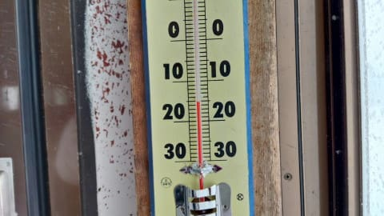
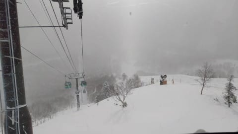

# 今日は12月27日の志賀高原詳細レポートとお思いでしょうが…これから志賀高原に行ってきます！

📅 投稿日時: 2021-12-28 00:15:15

🏷️ カテゴリ: [日記](cc4b5682fb7b8b144980957a978653fb0.md)

えー．

本日も，志賀高原の特派員から写真が

送られてきましたが．

写真を見ると，朝は-15℃と激冷えで…

昨晩から30cmほど積もったらしく，

圧雪バーンは圧雪の上にうっすら軽い

新雪が乗った，いいコンディション！！

天気は基本的に終日雪降り激寒ながらも，

時折薄日が差すほどの天気だったようで…

もう完全にトップシーズンですね！

いやー．冷えてる．

今シーズンは，いい感じです！

ってことで．

明日28日の志賀高原は，朝はまた-15℃

くらいに冷え込む，激冷え！！

今晩からひたすら雪が降り続け，

朝までに20cm，ブーツパフくらい

積もってるんじゃないかな～．

午前中はかなりの雪降りだけど，

午後は雪の降りが弱まり，

もしかしたら時折日も射すかも…

ただ，終日-10℃を上回らない冷え冷えで，

雪質は最高だと思います！

ってなことで．

実は明日，仕事の休みが取れました！！（ぱちぱち）

このご無体職場で，平日休みが取れるとは…！！

（仕事納めの日だけど）

だもんで．

明日日帰りで志賀高原へ行ってきます～！！

…いや．

29日は用事があるので，日帰りで家に

帰らなきゃいけないんですよ…

そしてまた30日から志賀高原へ舞い戻ります～！

そうです．

25，26日　志賀

27日　家に帰って仕事

28日　日帰り志賀

29日　家で用事

30日～　志賀

と．

なぜかこの5日間で，志賀と家を

何回往復してるんだ状態です．

でも，最大限志賀高原に行こうと思ったら，

気づいたらこんなプランになってました．

ご無体仕事ならぬ，ご無体スキーかも…

ってなことで．

今日はこれから寝て，3時半出発です～！

…いつも通り，睡眠3時間ですね…

土曜から中2日はさんで，また睡眠3時間か…（涙）

とりあえず，明日も志賀高原滑ってます～！！

PS.30日から1月1日までの3日間の天気図が，

　ニュースで大雪と言っていた12月25日～27日までの

　天気図のコピーみたいになってきた…

　30日はそこそこだけど，31，1日は，また積もりそう！！

　年越しパウダーデーになりそうです！！

## 💬 コメント一覧

### 💬 コメント by (しんちゃん)
**タイトル**: 激冷えでも感覚的にマシ
**投稿日**: 2021-12-28 00:18:02

本日のヤケビ、激冷えでした。でも、風が弱いのと、降雪も粉雪程度、若干日が差し、少し明るい時間があったこともあり、感覚的には冷え冷え感がマシでした。

（月）は白樺コースが、圧雪の上にうっすら新雪のってて最高でした～！！

### 💬 コメント by (なるなる)
**タイトル**: Unknown
**投稿日**: 2021-12-28 19:14:52

昨日、志賀高原から帰ってきたのですが、明日行きます。

自分がこんな事するなんて思ってもなかったです…

まぁ、急遽行ける事になったので、仕方ないですが、何で帰ってきたのか、

何をやっているのかと考えてしまいますw

これが、普通に出来てしまうSさん凄すぎます。しかも、日帰りで…

### 💬 コメント by (ももも)
**タイトル**: Unknown
**投稿日**: 2021-12-28 21:04:51

S様

お久しぶりです。お正月、久しぶりの志賀です。お会いできたら嬉しいです！

質問です。一の瀬で夜に食事ができるところはありますか？　子供も一緒なので飲み屋不可です。

### 💬 コメント by (Skier_S)
**タイトル**: 日帰り志賀はやっぱきつい
**投稿日**: 2021-12-29 02:47:05

＞しんちゃんさま

今日の志賀はパウダー当たりデー！

最高でした…シアワセ…

＞なるなるさま

あら．中1日で志賀復活って，誰かさんと同じですね（笑）．

そんなことをするようになったとは終わった人たちの仲間入りかも…

今度はいつまで志賀高原に滞在ですか？

＞もももさま

お久しぶりです～！

お正月は私もいつも通り滑ってますので，またお会いしましょう！

一の瀬で夜食事できるのは，一の瀬無料休憩所の大勝軒，

あとはホテルジャパンの「かもしか」はカレーやナン，タンドーリチキンなどが

食べられます．

そして，ヴィラ一の瀬にある中華料理101ですかね…ここは夜10時までやってます

