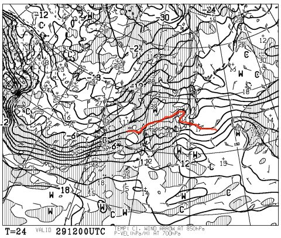
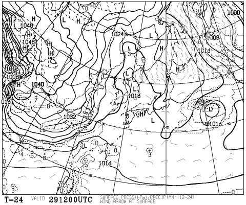

# 予想天気図が改善！29日は晴れそうっ！…30日は微妙だけど

📅 投稿日時: 2012-12-29 01:21:22

あーー．

数日前から，29日は雨…

と．予告してましたが．

私の強い念波がスキーの神様に届いたのか．

29日の予想天気図が，大きく変わりましたっ！晴れそうですっ！

以前の予想では，29日の850hpa0度線が東北地方まで北上する予想でしたが…

こんな感じで，信州は何とか0度前後に収まりそうです．

さらに．

こんな感じで．点線に囲まれた降水域も，日本上空にはかかってません．

ということで．

29日は，早朝まで雪が降るけど…

気温が上がる昼間は，降らないで晴れます！

ちょっと気温は上がって，雪が緩みぎみかも知れませんが…

夜までずっと降らないで持ちそうですね～．

30日も，志賀高原は雪が降らなさそう．

うーん．昼ごろ，かすかに降るかもしれませんが…

この日は結構気温が上がるので．降ったらミゾレっぽい雪になります．

まぁ，どちらにしろこの日は基本的には曇り．

気温は高め．雪はちょいと緩むでしょう…

で．30日夜から，激烈に冷えます．

31日は，日本海側は激烈に積もって，パウダー祭りでしょう…

でも，志賀高原はそれほど積もらないパターンかな～．

ってことで．

この年末，壊滅的な雨は回避され．

ちょっと安心なのだ…
