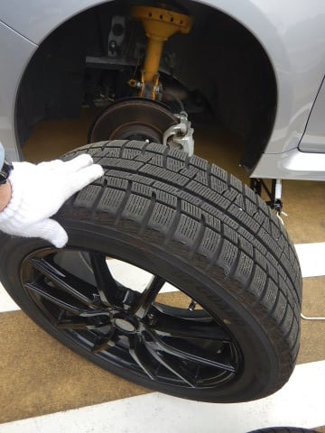
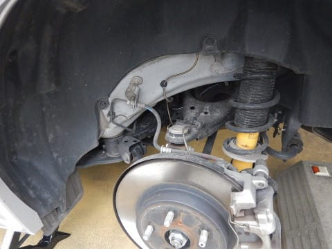

# LEVORGのスタッドレスを夏タイヤに交換したよ！1万8000km走ったYOKOHAMA iG5+はどのくらい減ったのか？

📅 投稿日時: 2019-05-14 01:22:00

🏷️ カテゴリ: [車](cba0e8330b3f2ded7c1addfacc75d4547.md)

えー．

スキーシーズンはひたすら滑りまくっている私．

そのせいで，車のタイヤを換える暇が

全くなかったのですが．

…なにぶん，11月に入ってから．

引っ越しと法事＠関西某所でつぶれた週末を除くと

（引っ越しの週はさすがにスキーに行ってないとして．その前後にはしっかり

スキーに行っているところが普通はありえない）

仕事が休みなのに，スキーに行かなかったのは，

1月4日と5月1日の2日のみ．

さらに，その2日とも．

どちらも前後の日は志賀高原に行っていて，

自宅滞在時間は24時間程度…

ということを考えると．

実質11月からほぼ休み無しで

滑り続けてきたわけで．

志賀高原のシーズンが終わったこの週末は，

土曜に日帰りかぐらとして．

久々に日曜は一日スキーに行かず．

シーズン中にできなかったいろんな

いろんないろんなことをやる日にしたわけ

ですが…

スキーに行かなかったものの，やることがいっぱいありすぎて，

休んだ感じがしなかったけど…（涙）

そんな中，大事なお仕事の一つが．

LEVORG君に履かせていたスタッドレスを

夏タイヤに履き替えさせること．

ちなみに，夏タイヤからスタッドレスに

履き替えるのは，購入したタイヤの

ホイール打ち込みと同時に

近所の[ガソリンスタンドでやってもらった](ea8a4c7dd515219417167a3871ffdc9c3.md)ので．

このLEVORG．

自分でタイヤを交換するのは初めてになります…

ってなことで．

スペアタイヤが無いこの車．

まず，車載工具のジャッキがどこにあるのか

から一瞬悩んでしまいましたが．

トランク下収納の，この部分．

この底の板を取り除くと，ジャッキが

あります…

ってことで．

タイヤ交換開始！

まず，フロントタイヤを外して…

減り具合を見てみますが．

うーむ．

プラットフォーム近辺を見てみると．

やっぱり1万8000km走ってるからか．

なんとなく，プラットフォームまでの

残量の半分以上はもう減っちゃってる気が…（涙）

うーん…

やっぱり3シーズンは無理か…（泣）

次はリアタイヤを見てみますが．

リアはフロントより荷重配分が少なく，

負荷が軽いから，減りはさすがにフロントより

少ないですが…

BRレガシィの時には，リアタイヤは

ほとんど減らなかったことを考えると．

さすがリアへのトルク配分が多いLEVORG 2.0．

レガシィに比べると，かなりリアも減ってますね…（涙）

これは，リアとフロントをローテーションしても，

ギリギリ2シーズンが精いっぱいな感じ…

あぁ…

BRレガシィ君だと．

YOKOHAMA iG5+は，シーズン1.7万km走って

[3シーズンもった](e055b5b744b654941d93c40de1fad1b0b.md)んだけどなぁ…

と，悲しみながらも．

いつもと同じように．

この冬のシーズンで汚れた足回り．

この，かなり汚れた足回りを…

磨く！

磨く！

プラ部分はクレポリメイトで磨き…

サスアームなどの金属もクリーナーで

汚れを落とし，ひたすら磨いて…

（このロワアーム下の取って付けたようなブレースが，

　LEVORGの後付けボディ補強を物語っている…）

ステアリングロッドも，ストラットも

各種ブーツ，ブッシュ類も汚れを取り除いて．

新品同様にまできれいになったら．

あとは，錆が発生しそうなところに，

クリアコート！

そして，これから取りつける夏タイヤの

ホイールもついでに磨いておきますが…

その時に気づいたのが．

ふーん．

LEVORGの純正ホイールって，ENKEI製だったんだ…

ってなことで．

ホイール装着！

リア側も，同じように1シーズン走った

汚れが溜まりまくっていたので…

（どうでもいいけど，この車のリアスタビ太いな…）

こいつも磨く！

（スプリング，ロワアーム付近を磨いたところ）

リアもきれいになりました～！

ってな感じで．

無事，我がVMG LEVORG君は夏タイヤに

戻ったわけですが．

…しかし．

[あの日々](ecdca7ac058e50b9e3a2a3ae04e18b623.md)から早くも10か月．

すでに走行距離2.5万kmを超えちゃったけど．

そのうち1.8万kmはスタッドレスを履いてたわけで．

この車の総走行距離のうち，

7割以上をスタッドレスで走ってたんだなぁ…

夏タイヤを履かせて，本来の性能が発揮できるわけだけど．

この車の本来の性能がどんなだったか忘れている，

Skier_Sだったのでした…

## 💬 コメント一覧

### 💬 コメント by (Hide)
**タイトル**: 10カ月ですか・・・
**投稿日**: 2019-05-14 07:38:38

S 様

おひさしぶりです。

しかし10カ月で2.5万Kmとはさすがです。

私は来月初回車検になりますが、3年で1.8万kmです（笑）

スキーシーズンの志賀高原とグリーンシーズンのゴルフ以外は基本動かないのでこんな感じです。

ゴルフの予定が入らないと2か月間位動きませんから（泣）

もはやレンタカーでも良いか？？（爆）

### 💬 コメント by (つーちゃん)
**タイトル**: Unknown
**投稿日**: 2019-05-14 19:20:07

あれっ？Sさんのも３シーズンは駄目そうですね。。。

BRレガシィ君は燃費も良いしタイヤも持つし

かなり優秀なマシーンですね！

しかし、車によってここまで減りが違うものですね

あのIG5はスペシャルな仕様だったのでは、、、笑

自分のIG5Pももう１シーズンは無理と判断しました。

それに激安中古純正アルミなのでリムの腐食が心配になってきました。汗

なので、次はホイールとセット購入になりそうです（＾＾；

太板も買わなきゃいけないので大変です←

### 💬 コメント by (Skier_S)
**タイトル**: 3シーズンは無理か…
**投稿日**: 2019-05-15 01:38:20

＞Hideさま

3年で1.8万kmですか．

私だと，スキーシーズンの5か月で走っちゃう距離ですね…

車の下取り価格が下がらなくて良さそうですけど，確かに

レンタカーでもいいのかもしれませんね．．．

＞つーちゃんさま

ダメです．

やはりパワーがある車はタイヤへのアタックも強いのか．

3シーズンは持たなさそうです…（涙）

車重もBRレガシィよりVMGレヴォーグの方が

実はちょいと重いんで，タイヤに優しくない車なのかと…

そちらもタイヤは2シーズンで終わりですか．

FFだから，リアはそれほど減ってなかったのではないのでしょうか？

### 💬 コメント by (Northfox)
**タイトル**: Unknown
**投稿日**: 2019-05-18 10:44:02

遅いコメントで失礼します。

スタッドレスタイヤは悩みどころですね。

私は今シーズン、WINTERMAXX01を使ってみました。

本当はIG5にしたかったのですが、価格面でとても魅力的だったので。

クルマも同時に変えているので他のタイヤとの直接比較はできないですが、まずまずだと思いました。

雪上のブレーキや発進加速のグリップは十分。ただコーナーでの横方向のグリップが弱いような。。。

クルマとの相性もあるかもしれません。舗装路は十分な安定感かと。

少なくとも “ダンロップは先に逝く” からは十分に進化いていると思います。

因みにクルマはCX-3。タイヤサイズは215/55-17。

7千キロ強走行して摩耗は1mmくらい。来シーズン以降、極端に性能低下しなければ次もダンロップでも良いかなと思います。

### 💬 コメント by (Skier_S)
**タイトル**: ＞Northfoxさま
**投稿日**: 2019-05-18 22:06:56

あら．

ダンロップも良くなって来たんですね…

私も昔，ダンロップ履いてたのですが，

最近のダンロップは履いたことが無いので…

昔のは，圧雪ミラーバーンがちょっと怖かった思い出が

ありますが，今のタイヤはミラーバーンも大丈夫でしょうか？？

でも，7000kmで摩耗1㎜は優秀ですね…！！

