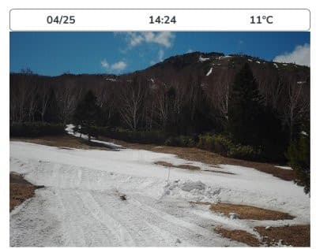
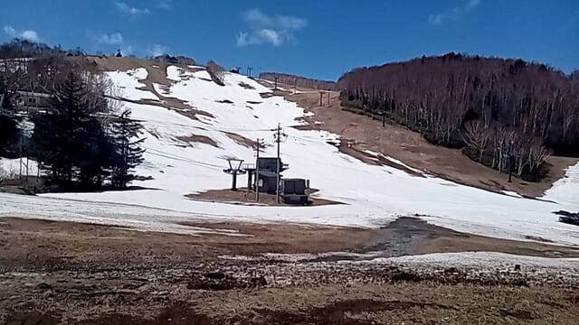
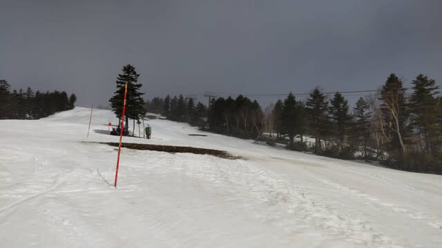
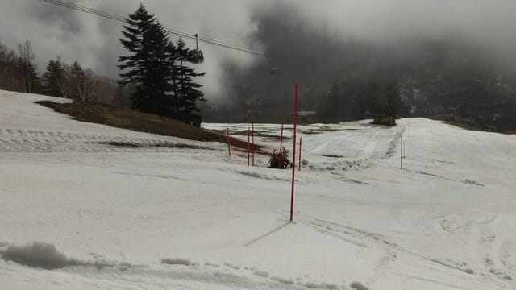
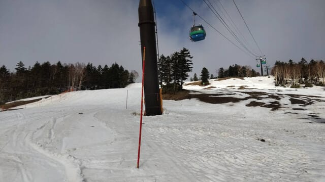
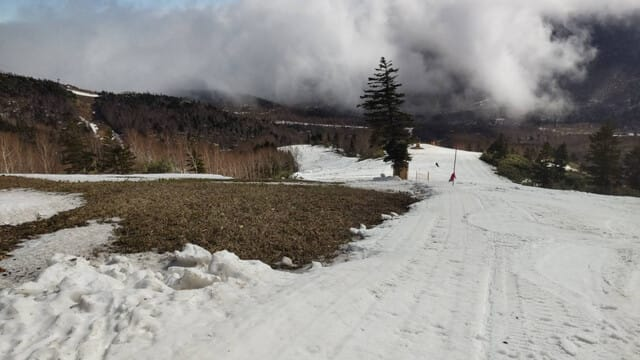
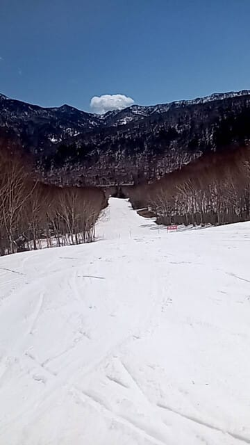

# 4月25日(木)の志賀高原スキー場の特派員情報！…水曜の雨＆荒天でかなり雪が減っちゃったよ(泣)．路面は夏タイヤでOK．

📅 投稿日時: 2024-04-26 01:52:07

えー．

本日の志賀高原．

やはり予想通り，早朝まで雨が

残ったみたいですが．

その後，午前のうちに日が射し

はじめて，10時頃にはすっきり晴れた

ようですね…

ライブカメラを見ても，昼過ぎは

すっかり晴れてるのが見れました．

…が．

なんだか，かなり雪を寄せて

コース幅が思いっきり狭くなってますね…

ここまで雪寄せしているのって，

意地でもGW最後まで営業してやる

という執念が見える…

（[焼額山スキー場ライブカメラ](https://www.princehotels.co.jp/ski/shiga/livecamera/)より）

で．

今日も特派員の皆さんから写真が送られて

来ましたが．

ふぎゃーーー！！！

昨日の雨＆強風で，強烈に雪が減り

ました…！！！（激烈涙）

先週はまだほぼ全面に雪がついていた

一ノ瀬ダイヤモンド．

もうほぼ終了ですね（泣）

そして焼額のGSコースも…

うん．

先週の週末は全く問題なかった

このあたりも，土が出始め…

ゴンドラをくぐるあたりも，

かなり雪を寄せたようで．

このあたり，かなりコース幅が狭く

なりましたね（激泣）

ここがわずか4日まで，幅いっぱい問題なく

滑れたコースとは思えない…（泣）

まぁ，これだけ雪を寄せた分，コースが

長持ちしてくれればいいんだけど．

…でも，見た感じそこまで雪の厚みは

なさそうだから…

やっぱりGSコースはGW前半で終わりそう

かな（涙）

ただ，パノラマコースとサウスコースは

まだコース幅いっぱい滑れて，

問題ないみたいなので．

最悪サウスコースがGW最後まで

もってくれるといいな…

うーん．

何度も言うけど，このGWが平年並みなら

GW最後まで雪がもちそうだったんだけど．

GW中も，4/30～５/1とか，何回か高温＆雨に

やられそうなので．

ホントに最後までもってくれるのか，

かなり心配…

あまり贅沢は言わないから．

５月１日が雨じゃなく，ドカ雪になって

１mくらい積もってくれないかな…←それ，すごい贅沢すぎるから
