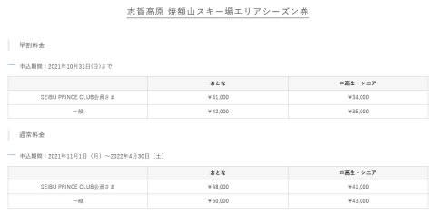
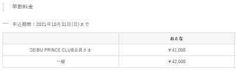
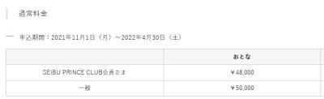
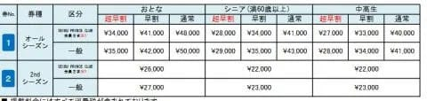
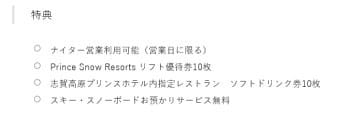

# 志賀高原焼額山スキー場のシーズン券情報が出たよ！…やっぱり超早割は無くなったか（涙）

📅 投稿日時: 2021-09-02 02:12:23

えー．

本日（というか，日付が変わったのでもう昨日かな）9月1日．

…やっと，志賀高原焼額山スキー場の

シーズン券情報が出てきました！

例年なら，8月31日までに申し込めば

超早割

でお安いお値段で買える，焼額限定

シーズン券でしたが．

今年はなかなか発売されず．

8月下旬になってようやく

「9月1日発売！」

と案内されて．

「なぬ？？9月1日発売？？

…これは，もしかすると超早割が無いのか…？」

と危惧していたのですが．

本日．

ようやくやってきた焼額シーズン券発売日．

待ってました～！

…と，料金案内を見ると…

（[焼額山スキー場ホームページ](https://www.princehotels.co.jp/ski/shiga/informations/21-22Seasonticket/2/)より，以下同）

うげげげげ！！！

やっぱり，超早割は無くなってます（涙）

10月31日までに購入した場合の早割と，

それ以降の通常料金の2種類のみですね…

残念…

早割料金は，申し込めば無料ですぐ

会員になれるプリンスクラブ会員で

大人41000円．

中高シニアは34000円．

通常料金は，プリンスクラブ会員で

大人48000円，

中高シニアは41000円．

うーん．

昨シーズンはこんな感じだったので．

早割料金・通常料金は値上げが無いものの．

昨シーズンはあった超早割34000円．

これが無くなって，早割41000円を

払わなきゃならなくなると．

実質7000円の値上げですね…（泣）

そして，昨シーズンあった，

2ndシーズン券が無くなりました

もしかしたら，シーズン中に追加で発表される

可能性も残ってますが…

そうそう，あと，

昨シーズン，中高生はシニアより1000円安かったけど．

来シーズンは中高生とシニアは，高いほうの

シニア料金と同じになりましたね…

で．

注意書きをみると，昨シーズンと同じで．

「ナイター営業利用可能」

となってます．

あれ？ナイターは使えても，

早朝に使えないの…？

と一瞬思いますが．

昨シーズンは焼額限定券であれば，

一日券でも4時間券でも早朝が滑れたので．

あえてシーズン券にも「早朝利用可能」と

書かなかったようで．

おそらく，来シーズンもそれと同じで．

シーズン券でも早朝が滑れるんだと

思います…

ってなことで．

早朝・ナイターにも使える焼額限定シーズン券ですが．

超早割が無く，41000円も払わなきゃならないと

なると．

ナイターと早朝だけで，41000円分も使わない

ので．

全山共通シーズン券と焼額シーズン券の

2枚持ちは無くなったな

と．

人としていろいろヤバい危険な道に

踏み込むことが無くなったことに，

ちょっと安心した，

Skier_Sだったのでした…

PS．ただ，全山共通券が5月5日までという噂もあり．

そうすると，5月6，7，8日は焼額券を買わねば

ならず．

この3日間だけで12000円近く払わなきゃ

ならないことを考えると．

「もしかしたら7000円高くてもありか？」

と思ったけど．

5月6，7，8日に雪が無くなるリスクを考えると，

やっぱり無いな．
