# 2007年8月　三宅島ドルフィンスイム＆ダイビング旅行記　その11

📅 投稿日時: 2013-09-25 02:28:41

あー．

あれですね．

水曜日にタオから帰ってきたばかりなので．

この3連休，初日はどこにも行かなかったのですが．

＃仕事が溜まっていていけなかったという説も…(涙)

…やはり，せっかくの3連休．

どこかに行かないともったいない！

…という，アウトドアの血が騒ぎ．

結局後半2日間で，ちょいと出かけてきました…

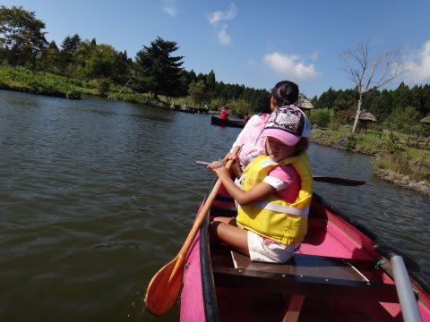

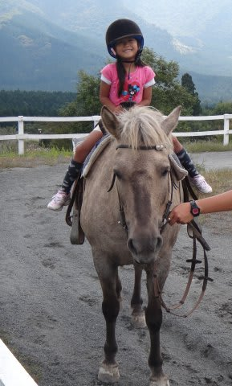

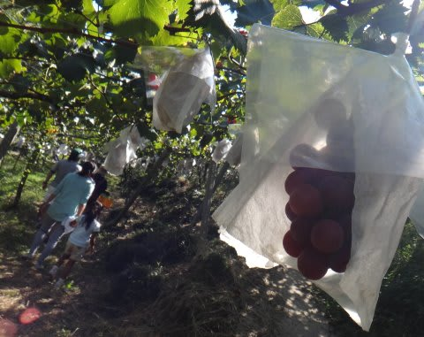

…昨日は3連休最終日で，高速が死ぬほど渋滞していたので，

200km下道で帰ってきました．

帰宅は深夜11時過ぎ…(屍)．

そして今日は早朝から，日帰り関西某所へ出張．

最終新幹線で戻ってきたという…(涙)．

でも．

夜中にブログの記事を書く自分．

えらい！

＃…こんなブログ，更新されなくても困る人いないって…←自己突っ込み

では，本文の三宅島レポートへ，Go!

-----

って感じで．

ゴロゴロの岩を乗り越えて．

三宅島のラストダイブへGo!

エントリーして，浅い岩場を沖に向かって進むと…

ここでもキンギョハナダイが結構群れてます．

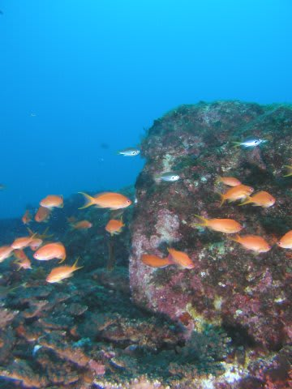

あ，イトヒキベラもいますね．

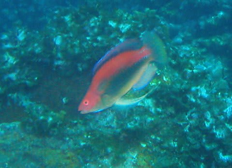

沖側のドロップオフには小さなハナゴイが群れてます．

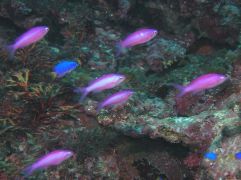

ドロップオフの外洋側にはカスミアジやツムブリなんかも…

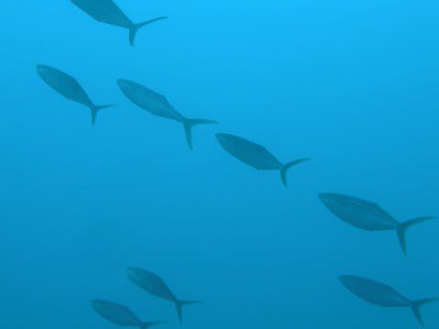

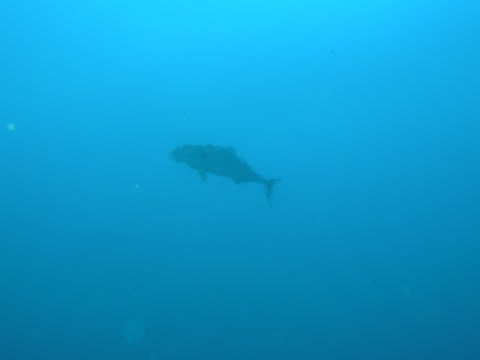

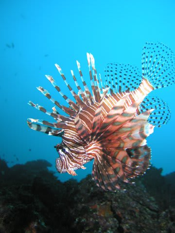

後半は，また浅瀬に戻ってきて，

超ミニサイズのクマノミちびやら…

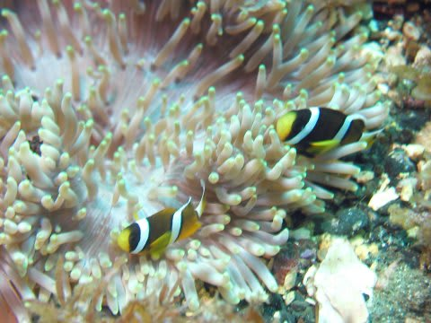

ウミウシだとかツユベラ幼魚やら…

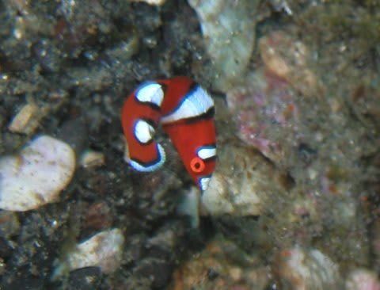

マクロモノをいっぱい見せてもらってエグジット．

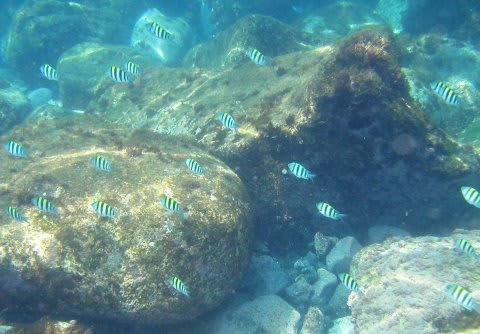

このダイブも70分．

昨日のダイブも70分だったので，このショップは

結構ねちっこくマクロモノを見せてくれる

ロングダイブのお店でした…
