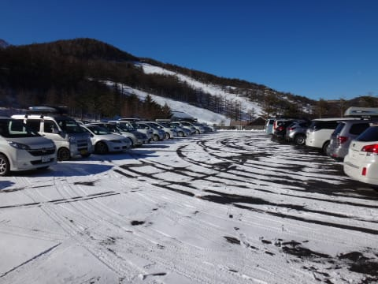
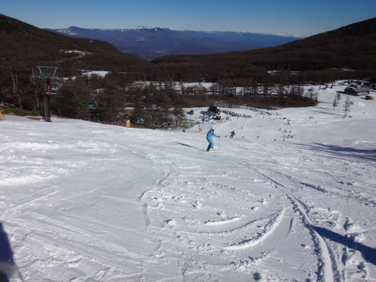

# 11月23日，アサマ2000の2013/2014シーズンのオープン日に滑ってきました

📅 投稿日時: 2013-11-24 00:00:36

🏷️ カテゴリ: [2014スキー滑走日記](c992167609b6415052179ee69ea1ea7d8.md)

というわけで．

本日は．

昨日予告したとおり，本日オープンのアサマ2000へ

行ってきましたよ～！

…でも．

今朝は．

予期せぬ関越の渋滞により．

＃対向車線の事故見渋滞2連発…(涙)

ゲレンデ到着が10時と出遅れててしまいましたが…(悲)

で．遅れながらもアサマ2000へ近づくと．

うむ？

なんと．

朝10時なのに，峠のてっぺん近辺は，路面にかなり雪があるではないか…

と思ったら．

峠の向こう側は，完全に雪道じゃないかっ…！

…アサマ2000への道，本格的な雪道です．

帰りの時間まで，完全に路面は積雪路面のままでしたので，

夏タイヤでは絶対に無理ですよ～っ！！！

　　・車が崖の下に落ちても「やっぱり，予想通りだな」と諦めがつく方

　　・なにか物理現象を超越した力により，車を操作できる方

などという特殊条件を満たさない方は，スタッドレスを履いて行くか，せめてチェーンを

もって行くことをお勧めしておきます

駐車場もこんな感じでしたよ～！

で．ちょっと遅れてゲレンデに着いたわけですが．

をを！

全面真っ白な，Goodなバーンが待ち構えてるではないか！

さらに．

レストハウス前から，板を履いて滑っていけるよ…

オープン日にここまで雪があるのは初めてかも？？

ちなみに．

11月中はリフト1日券は3000円．

その代わり，営業は午後3時には終わっちゃいますが…

ということで．

リフトで山頂へ．

いやー！

コンディション良さそう！

コースは，人工雪の上に天然雪が載っていて…

アサマにしては，やわらかい雪だなっ！！

人もそんなに多くなく，スキーヤーのレベルも高いので滑りやすくて，いいなっ！

ちなみに，リフトは午前中は5分ちょっと待ち．

でも，10時半ごろから，朝イチレーサーたちが帰り始め…

11時過ぎには2-3分にまで縮まり…

12時前には，1分程度～ほぼ待ちなし，という快適状態に！

昼になっても，気温がそれほど上がらなくて，雪が緩まなくて

いいな！

リフトも待たず，雪も良くて，天気も良くて…

11月でこんなに楽しくていいの！？？

って，思っていたけど…

そこはやっぱりアサマ2000．

昼ごろには，下地の固い雪が出始めて…

いつも通り，小回りレーンが自然発生し…

午後には，ガリガリの小回りレーンと，小回りレーンの間に

たまったやわらかい雪の，しましま模様のゲレンデが完成！

…んでも，今年は天然雪がそこそこ積もっているので．

小回りレーンも，例年のツンツルテン殺人アイスバーンにならず．

硬めバーンとはいえ，ある程度エッジが効く雪だったし．

コース脇（この写真なら向こう側）も十分雪があって，

そこを滑ればやわらかいままだったので．

日が完全に隠れる，リフトストップの15:00まで滑り続けたのでした…

いやー．

でも，今日は．

そんなに混まなかったし．

雪は（一部硬かったことを除けば，）天然雪が載っていて

この時期のアサマとしては上出来だったし．

天気が良かったのに，雪が緩んだりブッシュが出てくるようなことも

なかったし．

恵まれたコンディションだったなっ！！！！

## 💬 コメント一覧

### 💬 コメント by (miya)
**タイトル**: うらやましいー
**投稿日**: 2013-11-24 10:15:17

久々コメントです。

結構雪ありますねー。

でもあのシマシマゲレンデはいつもてこずります…

私は来週平日丸沼からスタートです。

その前にタイヤ履き替えないと…

### 💬 コメント by (Skier_S)
**タイトル**: miyaさま
**投稿日**: 2013-11-25 10:16:29

今年は雪多いですよ～！

ゲレンデまでの道もかなりの積雪が

あるかと。

急ぎタイヤ替えることをオススメしておきます。

でも、ゲレンデコンディションは

よかったですよ！

