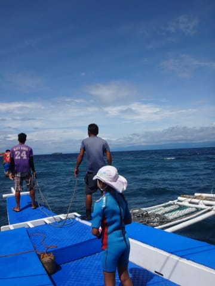
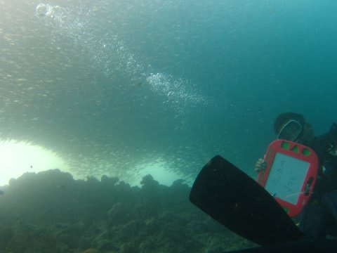
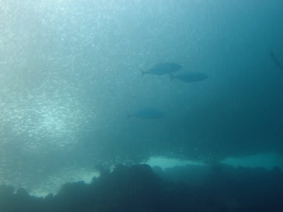
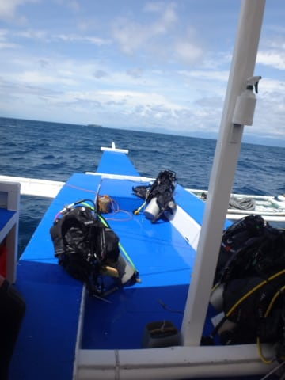
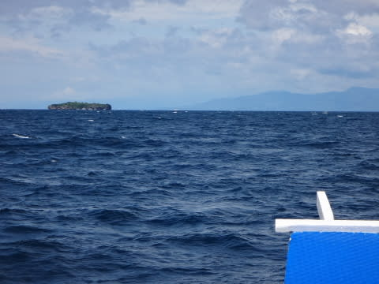
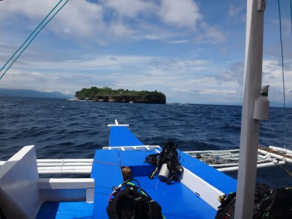
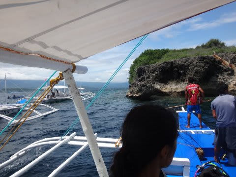
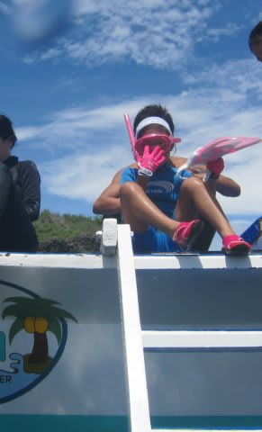
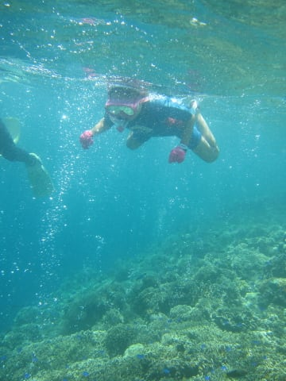

# 2015年8月　子連れでモアルボアルでダイビングその13…2日目，午前のダイビング

📅 投稿日時: 2016-07-08 01:03:37

🏷️ カテゴリ: [ダイビング日記](ce3a7a8d424d112fce83ee85c81a0e344.md)

はいはいはいはい．

今日も，比較的早い時間に帰ってくることができました．

＃って言っても，日付変わってないか…？？

だもんで．

今日も無事，ダイビング旅行記の連載です．

では，去年の8月のモアルボアル旅行記，Go!

（あぁ…もう1年近く前の話じゃないか…っ！！＿）

ーーーー

ということで．

私が潜りに行きたくて仕方がなかったイワシポイントに，

妻が潜りに行った1本目．

みんなが上がってくるのを，

留守番の私は，ボートの上で娘と二人で

待っていると…

ダイバーが浮上してきたらしく，ボートスタッフの

動きがあわただしくなってきました…

そして，無事ダイバーを回収し，

ただちに2本目のポイントへ移動を開始します．

で．

イワシポイントへ潜った妻に．

聞かなきゃいいのに，聞くわけですね．

私「どうだった？イワシ，いたの？？」

妻「…

　　…

　　…すごかった」

え？

…やっぱり，すごかったの？？

妻撮影の写真を見せてもらうと…

は，はうぅ？？

う，うぐぐぐ！？？

見渡す限りのイワシの群れに，カスミアジか何かがアタックを

かけているよっ！？？

頭上見渡す限り，見渡せる範囲より広く広がっている

イワシの群れを，ひたすら堪能できたようで…

う，うらやましすぎるっ！！！

う，うらやますぃ～っっっ！！（悔し涙）

ってことで．

うらやましい私と，

イワシを満喫して満足なそれ以外の全員を乗せて．

船は，2本目のポイントへ向かいます…

2本目のポイントは．

そうです．

この写真の先に見えている縞，

ぺスカドール島です．

ぺスカドール島…

それは，フィリピン語で「漁師の島」を意味するらしく．

それほど，魚が多い島で昔から有名だったらしい島．

ホテルの海の沖，船で20分ほどのところにぽつんと浮かぶ，

上陸もできないような小さな島です．

ってことで．

船で20分ほど．

…かなり短い時間でぺスカドール島へやってきました…

ぺスカドール島の脇で，

船をアンカリングしますが．

1本目のポイントからほど近く．

1本目を潜った人は，まだ2本目に行けるほどの水面

休憩時間が稼げていませんね～．

…で．

今，船が島の風下，波の無い穏やかな海でアンカリング

しているので…

これは，あれだ．

泳げますね．

わが娘…

ってことで．

さっき潜っていない私と娘は，

さっそく船から飛び込んで…

そして，お待ちかねのシュノーケリングタイムです！

