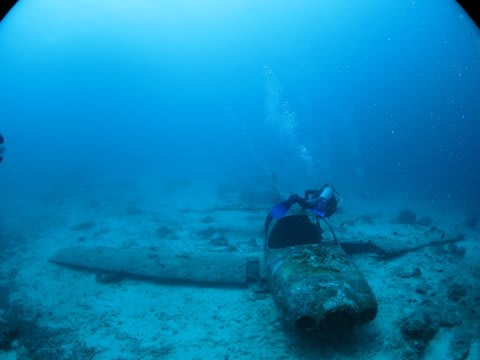
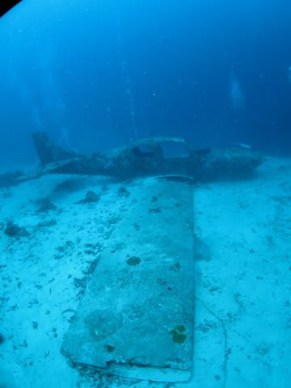

# 2015年8月　子連れでモアルボアルでダイビングその6…珍しい，沈飛行機ダイビング

📅 投稿日時: 2015-10-29 01:31:47

🏷️ カテゴリ: [ダイビング日記](ce3a7a8d424d112fce83ee85c81a0e344.md)

えー．

スキー情報ではなく．

ダイビング旅行記になったとたん．

一気にこのBlogのアクセス数が激減する

今日この頃，いかがお過ごしでしょうか←ブログタイトルから，誰もダイビング旅行記なんて期待してないから…!

でも．

継続は力なりっ！！←だから，何の？

今日もめげずに．

ダイビング旅行記へ，Go！

---

ってことで．

2015年の，記念すべき初ダイブ．

そう，10か月ぶりのダイビングですが…

うむ．

えーっと．

とりあえず，いつもの絞り優先モード，絞り解放F1.8,

太陽がかなり暗めなので…

海の色を出すためのマイナス露出補正は少なめ，

-2/3段くらいかな．

で，フラッシュ常時発光，

あとは，写した絵を見て，フラッシュ調光範囲を確認しながら，

ISOを調整していきますか…

…って感じで，カメラをいじっていたら．

やってきました，沈飛行機．

…でも．

慣れていないカメラの操作に必死で．

海を見るよりも，一生懸命液晶画面をのぞき込んでいた気が…

珍しい沈飛行機も，

「珍しいなぁ～」

と見るよりも，

どんなふうにカメラに写っているのか，

確認して露出補正やらISOの微調整を入れるのに

必死だったカモ…．

で．

しばし飛行機を眺めた後は．

飛行機の周りを離れて…

ゆっくりと周りの景色を眺めながら移動します…

ダイビング後半は，さすがにカメラの操作にも

慣れてきたけど．

…フラッシュの調光範囲や適切な絞り値などの感覚を，

すーーーーーっかり忘れており．

適切な外光（背景の海の明るさ）とフラッシュ光のバランスが

取れるようになるまで，一苦労…

というか，1本目ではそのあたりの感覚を全然思い出せず．

ううーーーむ．

これなんか，もう少し背景光が絞られても良かったかなぁ…

…って感じで．

ダイビングを思い出す⇒初めてのカメラに慣れる⇒撮影の感覚を思いだす…

ってのに，必死で．

何を見たんだか，あんまり覚えてないまま，浮上となったのでした…

うーむ．

なんだか，この1本．

じかに海をみている時間より，液晶を眺めていた

時間の方が長かったかも…

あれですね．

運動会で，子供を撮影しなきゃならない親が．

「せっかく運動会のその場にいたのに，

　液晶越しでしか子供を見ていない」

ってのと，同じ感じですね．←いや，違うから．

## 💬 コメント一覧

### 💬 コメント by (いか)
**タイトル**: Unknown
**投稿日**: 2015-10-29 06:32:24

沈飛行機と言っても、ジャンボジェットが沈んでいるわけではないんですね(笑)

勝手に勘違いしていました。

### 💬 コメント by (マルハバ)
**タイトル**: Unknown
**投稿日**: 2015-10-29 07:51:26

＞ブログタイトルから，誰もダイビング旅行記なんて期待してないから…!

いや、これがなかったら

星の数ほどあるスキー関連ブログの中からここには辿り着かなかったのかも・・・

### 💬 コメント by (Skier_S)
**タイトル**: いかさま
**投稿日**: 2015-10-30 00:49:46

ジャンボジェットが沈んでいるポイントが

あったら，もう何を置いてもそこに潜りに

行ってみたいです…（笑）．

ミクロネシアの，トラック諸島とかだと

第2次大戦中の戦闘機などが沈んでる

ポイントがいっぱいあるようですが…

### 💬 コメント by (Skier_S)
**タイトル**: マルハバさま
**投稿日**: 2015-10-30 00:52:05

そう言ってくださる人がいるとありがたいのですが．

このBlog，ダイビング旅行記にはほとんどコメントも

ないし，夏モードになると冬モードから読者半減します（涙）．

ダイビング旅行記を楽しみにしている人もいることを

願うばかり…

### 💬 コメント by (KENKEN)
**タイトル**: 自分もですよ
**投稿日**: 2015-10-30 22:21:22

これ(子連れダイビングログ)がなければ自分も辿りついていません。

先日石井スポーツで志賀高原(共通)の早割りチケットを購入しました。

GWまで使用可能と記載があるのですが、奥志賀のことなのかな？

あと初めてKANDAHARに行きストック(半額品)買っちゃいました。

自分は(普通の人なので)12月のシーズンインを楽しみに準備を進めます。

### 💬 コメント by (Skier_S)
**タイトル**: KENKENさま
**投稿日**: 2015-10-31 01:05:14

あら．

そうでした…

KENKENさんも，ダイビング記事から

たどり着いたんですよね．

志賀高原は，奥志賀と一の瀬，高天ヶ原が

GWまで営業ですので，一の瀬も行けますよ～．

カンダハーは，アウトレット店ですか？

あそこは結構掘り出し物があるので，

愛用してます．

…12月と言わずに，ぜひ11月に初滑りを！

