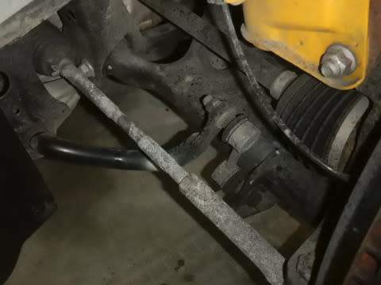
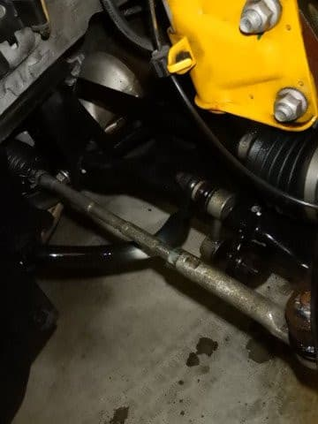

# この時期恒例！LEVORG君のスタッドレスを夏タイヤに交換したよ

📅 投稿日時: 2020-05-02 00:49:19

えー．

本日，炎の北海道民さんからコメントがありましたが．

北海道で最後まで営業を続けていた，

札幌国際とテイネスキー場．

要請に基づき，5月1日をもって営業終了と

なるようです…

これで，本州で最後まで営業していた

鹿沢も，4月29日で終了しているので．

ついに，

日本中のスキー場全てが営業終了

となりました…（激涙）

いや，この状況ですから，営業終了するのは

やむを得ないことなんですが．

まさか，感染症が理由でスキーシーズンが

終わってしまうとは，今シーズンインの時には

全く誰も予想しえなかった事態となりましたね…（泣）

そして，緊急事態宣言は5月末まで伸びそうなので．

GW明けのスキー場再開もあり得なくなりました…

あぁ…

こんなシーズン終わりになるとは…

…

…

いや．

まだ，希望がある．

5月いっぱいダメでも．

5月に無事に感染が収束すれば，

6月に，月山で滑れるかもしれないのだ…っ！

まだ，希望を捨てちゃダメだっ！！

今シーズンは，終わっていないぞ…っ！！！

…と，絶望しないために自分に言い聞かせた後は，

本日の本題へ．

えー．

大体この時期，スタッドレスタイヤから

夏タイヤへの交換時期ですけど．

志賀高原はGWでも雪が積もることがあるので，

我が家は，いつもならGWが終わるころに

タイヤ交換をするわけですが…

今シーズン，もし仮にスキー場に行けたとしても，

次に行くのは道路に雪が無い6月の月山に

なるわけなので．

今シーズンは，いつもより早めにタイヤ交換を

することにしました…

ってなことで．

11月下旬の[海外出張出発日の午前中に
強引に交換した](e2982de8e823d5cb787d5766176563761.md)スタッドレスタイヤ．

こいつをまず外します…

うーむ．

今シーズンは走行距離が少なめと言いながらも，

1シーズン，スキー場往復だけで15,000km

近く走った我が車．

夏と違って，冬の間は凍結防止剤が

撒かれた道を走ることも多いし．

汚れの混ざったドロドロ雪道を走る距離は，

雪国の人より多いくらいなので，

さすがにかなり汚れてます（涙）

そして，このタイロッドですが…

スバル車は，日本車には珍しい前タイロッド．

（大体の日本車は，車軸後ろ側タイロッド．

　素人目には前タイロッドの方が，

　荷重が大きい旋回外側が引張り応力になるので

　合理的な気がするんだけど…)

このタイロッドが，一番前にあるぶん

凍結防止剤の混ざった水を一番多く浴びるので，

表面が塩を吹いたように真っ白になってます…！！

たぶんクロモリ系の高強度合金で，

（もしかするとアルミ鍛造？）

無塗装の鋳造肌そのままなので，

防錆塗装に守られておらず，このままだと

腐食まっしぐらじゃないですかっ…！！（驚愕）

…こりは，やばい！

しっかり磨かねば！

と，いつもの下周り洗浄を始めますが．

まず最初は，フェンダー内部のプラスチックを

ピカピカにして…

続いて，金属部品を556で磨いていくのだ！

うーん．

これで大体きれいになったかな…

タイロッドもこれだけきれいになれば，

まぁ安心でしょう．

下側から見ても，とても5万2000km走った車と

思えないくらいきれいになったので．

後はタイロッドとアーム類，

ハブキャリアにいつもの

錆止めコートを塗っておきます…

同じく，左フロントも作業しますが…

あぁ…こちらもタイロッドがかなり塩を

吹いてますね（涙）

このままだと，腐食が進んじゃいますね…

ってなことで．

こっちもしっかり磨いて，

シャシーコート剤を吹きかけておきます…

うむ．

これで大丈夫！

そして，リヤもタイヤを外してみると…

やっぱり，リヤもかなり汚れてます（涙）

凍結防止剤が散布された道を走った後は

必ず洗車してるのですが．

それでも，1シーズンでこれだけ汚れるんだなぁ…

これも，磨く！

フェンダー内側をピカピカにして…

アーム回りも磨く！

（トーコントロールアームあたりを磨いたところ）

うむ．

大体きれいになったかな…

下から見てもきれいになったので…

こいつも，防錆コートを吹きかけて仕上げ！

ってなことで．

下周りがすっきりきれいになって，

気分一新でタイヤを装着！

無事，夏タイヤにつけかわりました～！！

これで，6月に月山に行く準備，完了だなっ！！

…でも，ホントに次に車でお出かけできるのは，

いったいいつの日なんだろうか…

## 💬 コメント一覧

### 💬 コメント by (ゆーき)
**タイトル**: Unknown
**投稿日**: 2020-05-02 13:48:50

私はいつもは4月半ばに、春用スタッドレスに変更、冬用保全のため、どーでもよい？古く溝も少ないスタッドレスに交換して、万が一の雪に備えるんですが、今年は雪が多く、冬用のまましたね、、、緊急事態宣言延長も、多少濃淡がある！と信じて、とりあえず春スタッドレスに交換するか、夏タイヤにするか、なやみちゆ、、、しかし、寂しい、、、

### 💬 コメント by (いか)
**タイトル**: Unknown
**投稿日**: 2020-05-02 17:07:01

私はタイヤ交換はお店任せな上に、今シーズンで3シーズン履いたVRXもリタイヤなので、まだそのままです笑

しかし相変わらず、ぴかぴかになってますね～

私もどこにも行かないでヒマなので、夜中にこっそり車の静音化とかマフラー磨きとかエンジンスイッチに赤いカバーシールを貼ったりと、、、

### 💬 コメント by (ほっぽ)
**タイトル**: タイヤ交換
**投稿日**: 2020-05-03 00:11:51

Ｓさん

毎回思う、タイヤ交換でここまで下回りを綺麗にする人は見たことがありません。

これだけ丁寧に扱ってもらうと、車もオーナーに恵まれたと思います。

私も安心して経過を見ていられます。(^^;

コロナ自粛で走行距離が伸びていませんね。

このまま続くと２回目の車検も通せてしまうかもしれませんね。

### 💬 コメント by (Skier_S)
**タイトル**: LEVORGで全然走ってない4月
**投稿日**: 2020-05-03 02:05:51

＞ゆーきさま

え？春用スタッドレスに換えて，また夏は夏タイヤに換えるんですか…？

年3回タイヤ交換ですか！

ホイールも3セット必要だし，大変そうですね…

しかし，私も寂しいです…

＞いかさま

もう，自分でタイヤを換えないと落ち着かない人なので（笑）．

雪道を走らなければここまで気にしなくていいのかもしれませんが，

凍結防止剤が撒かれまくった道を走るので，ホントはシーズン中に

何回かタイヤを外して洗いたいくらいの気分です（笑）．

＞ほっぽさま

ついつい磨いちゃうんですよね～…

やっぱり，うちの車は凍結防止剤を浴びる量が半端じゃなく，

雪国の車よりもひどいと思うので…

スキー板も車も，こまめにメンテしないと気が済まない人です（笑）．

でも，このままコロナ騒ぎが続くと，今年はかなり走行距離が

短くなりそう…

