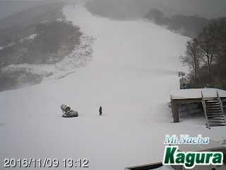
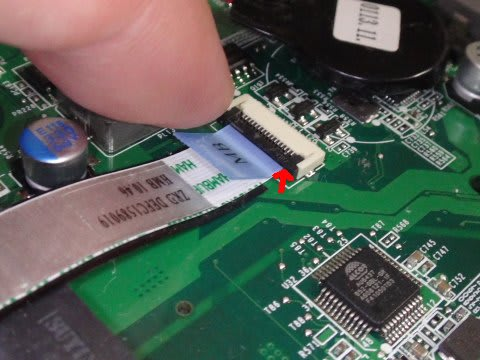

# 5年前のeMachinesのPC，E732-F32CをいまさらSSD化してみた　その2

📅 投稿日時: 2016-11-10 01:43:10

来てますね～

来てますよ．

冷え込みが…

わがホームゲレンデ，[焼額でも積雪](https://www.facebook.com/yakebitaiyama/photos/a.533933973368620.1073741847.116999658395389/1130904557004889/?type=3&theater)が

あったようですし．

志賀で一番最初にオープンする，[熊の湯も
人工降雪を開始](http://ameblo.jp/kumakumanoyu/entry-12217896493.html)して．

かぐらメインバーンも，人工降雪機を

動かしているようですね～！

…でも．

がっつり冷え込んだ9日のあとは…

青矢印で示したように．

11日以降，しばらく冷え込みそうな日がなさそうなので．

うーむ．

19日オープン予定のかぐらや熊の湯，アサマ2000など．

無事オープンできるかな～．

うーむ．

また，冷え冷え踊りを踊らないといけないのか…？？←それは避けたい

ってことで．

昨日に引き続き．

本題の，SSD換装レポートへ，Go!

---

ということで．

240GのSSDを買ってきて．

これを5年熟成済みのPCへ組み込むわけですが．

それには，熟成済みPCを分解しなくてはいけないわけですな．

まず，PCを裏返して…

で，この矢印で示された，20か所（！）ものネジを

みんな外します．

緑色の矢印で示したネジを外し忘れがちなので，

注意してください．

そのあとは，バッテリーを外して，

バッテリーの陰に隠れている，この4か所のネジも外します．

ここまでネジを外すと，裏蓋が外せるようになりますので．

バッテリー側の，筐体の隙間をググッと広げるように持ち

上げます．

このとき，手前側はこのような感じで．

イヤホンとスピーカージャックが邪魔になるので，そのままでは

外せません．

この状態で，裏蓋を写真の手前側にちょっと引っ張るようにずらすと…

こんな感じで，裏蓋が外れて．

晴れてPCの中身とご対面！

ハードディスクは…

ここにありますね．

ハードディスクの上に，FPCが渡っているので．

邪魔なこいつは外してしまいましょう．

この，本体側コネクタ．

この，黒い部分を矢印のように上に持ち上げると…

ケーブルが外せます．

ケーブルが無事外せたら…

あとは，HDDをこの矢印方向にずらすだけ．

こんな感じで，あっさりとハードディスクが

外せました～！！

次は，このハードディスクの中身を，

SSDにコピーする作業を行ないます…

（続く）
