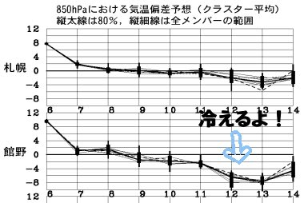
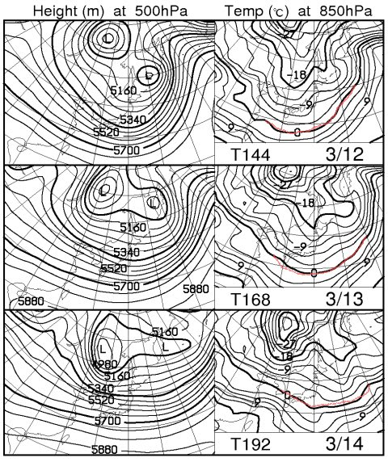

# 定番！今週末の志賀高原の天気は？

📅 投稿日時: 2012-03-08 01:10:15

えー．

この週末の天気ですが．

10日の土曜は．

あー．

現時点では曇り～雪．

金曜の夜からちらちら降り始めますか．

木曜まで気温が結構高まって．

そのあとあんまり降雪がないので．

朝のうちは，コースコンディションはかりかりした感じでしょうね～．

その上に重めの新雪がうっすら積もった状況でしょう．

土曜の昼間も雪が降りますが．

これはかなりベットリとした，ウェアにつくとすぐ溶けちゃう

ような雪かな～．

昼間は，カリカリしたゲレンデもちょいと緩むかも．

日曜は土曜より冷えますね．

昼間も0度を越えるような気温にはあがらないかな．

現時点ではまだ雪か晴れか微妙なところ．

志賀は，おそらく晴れかなぁ．

やっぱり，積雪がそんなにないので．

カリカリした下地は一日中残りそう．

でも，土曜に重めの雪がちょびっと積もるので，

緩斜面は下地が隠れてくれるかな～．

で．

なんかすごく悔しいことに．

月曜の12日から13日にかけて．

かなりいい感じで冷えて，そこそこ雪が降りそうなのだ．

こんな感じで，赤い線で示した850hpaの0度線も日本からずっと南まで下がるし…

うーん．14日あたりがいいスキー日和になりそうだなぁ．

## 💬 コメント一覧

### 💬 コメント by (雪上の翁)
**タイトル**: Unknown
**投稿日**: 2012-03-08 09:22:33

金～土で志賀に行きます～。

が、

どうも微妙な天気になりそうですね。

### 💬 コメント by (Skier_S)
**タイトル**: 金・土は微妙…
**投稿日**: 2012-03-09 01:38:28

木曜日に気温が上がったので，

金曜は雪が固くなりそう…

で，曇り時々雪，って感じでしょうか．

雪はかなり湿った重い雪です．

土曜も微妙…な感じですよね

私は残念ながら，なぜかこの土曜のみ

志賀高原に出没しません…

日曜は焼額滑ってる予定ですが．

残念ながら行き違いのようです…

### 💬 コメント by (雪上の翁)
**タイトル**: いま第一ゴンドラです。
**投稿日**: 2012-03-09 10:55:41

まさに天気予報通りです^^;

雲時々湿り雪です。

程良くゆるんで滑りやすい雪です～(^-^)/

### 💬 コメント by (Skier_S)
**タイトル**: やっぱり緩みましたか…
**投稿日**: 2012-03-09 22:58:48

気温的に雪は緩みにくいかな，と思ったんですが，湿った雪の湿気で

雪が緩んでるみたいですね～．

志賀高原，楽しんできてください！

