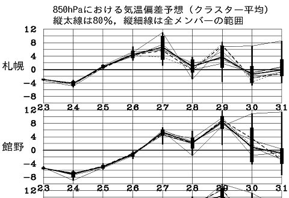
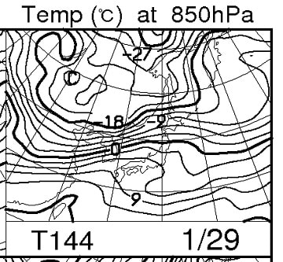

# うむ？25日でひえひえ祭り終了か…？27日からむしろ平年より気温が高い日が続くように…

📅 投稿日時: 2017-01-25 00:28:39

えー．

本日はちょいと泊り出張にきているので．

ショートバージョンでの更新ですが．

…とりあえず．

タイトルにあるように．

1月12日あたりから続いた，ひえひえ祭り．

2週連続で．

週末に「もういいから…」

ってほどの積雪をもたらし．

まだ明日まで，雪を降らし続けそうな，

かなり強烈な寒波でしたが．

…そう．

モノゴトはいつか終わるわけで．

…この26日をもって．

ひえひえ祭り，終了のようです（涙）．

はい．こんな感じで．

27日以降，平年より高い気温が続くようになりそうです…

…ってか．

29日．

平年比＋8度まで気温が上がりそうなんですが！？？

なに？これ…

29日の850hpa図を見ると…

あう…（屍）．

0度線は東北地方のあたり．

志賀高原は＋6度線が近づいているくらいなので…

危険だ．

これは，危険だ…っ！！

とりあえず．

今のところ，29日の昼間．

降水量はなさそうなので．

雨が降る

という恐怖はなさそうなんだけど…

この週末は，これまでと打って変わって．

気温がちょっと高めになりそう…

まぁ，今のところ．

土日は晴れそうなだけ，まだましかな～…

でも．

今後の予想，どうなるかまだ分かりません．

まさか…

まさか…雨にならないとは思うんだけど…

とりあえず．

ひえひえ祭り，明日でいったん終了です（ちょっと涙）．

…しかし．

また，冷え冷え踊りを踊らなきゃならなくなることは

避けたい．

全力で，避けたいところ．

また明日，詳細天気予想やりますので…

## 💬 コメント一覧

### 💬 コメント by (Goku)
**タイトル**: 極寒
**投稿日**: 2017-01-25 14:46:17

おっしゃる通り、今日のヤケビは最高気温マイナス10度と激寒です。

ゴンドラ以外乗れません。

### 💬 コメント by (かず)
**タイトル**: Sさんの読み通り火曜軽い雪でしたよ
**投稿日**: 2017-01-25 20:51:29

非圧雪のところでもも以上　コース脇の埋まってしまったところでは腰以上で大変でした　しかしノーズが重くゴンドラでヤケビのプロの方に相談したところ原因分かりました　次回準備して当たるといいです　滑り方調整して昼無しB無し笑の16時まで楽しめました

僕の中で今期一番です　今週末はお休みしまーす

### 💬 コメント by (Skier_S)
**タイトル**: 冷え冷え祭りもラストスパート
**投稿日**: 2017-01-26 02:55:05

＞Gokuさま

えええええ～！！！

平日スキー，いいなあ…

私も行きたいです…

でも，やっぱり寒かったんですね．

＞かずさま

火曜は軽かったですか！

それも腰パフですか？？

うらやましい…（羨望）

しかし，予想があたったようで良かったです…

