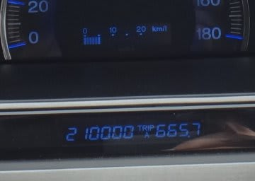

# プロジェクトX始動…まだ未発表の，BR　LEGACYのE型の情報！

📅 投稿日時: 2013-05-12 00:00:32

(7月23日追記)

…なんだか，BRレガシィの情報を探してここに来る方が多いようですが．

　　BRレガシィE型購入までのお話＆ドライビングインプレッション，

　　燃費，アイサイトの体験談とかの購入後のレポートを書いてますので．

　　興味ある方は，[こちら](eb1b0e385b422753c3e3aad5a58c12234.md)からたどってください．

えー．

21万kmを突破して，順調に走行距離を伸ばしている我が愛車．

＃2万1000kmじゃないよ(笑）

この6月で7年目の車検時期がきてしまうので．

ついに．

買い替えプロジェクト始動です…

ということで．

まずはスバルのディーラーへ情報収集へ行ったわけですが…

…

…そこでゲットした，ちょいとマニアックな情報をば…

昨年5月，マイナーチェンジしてD型となったBRレガシィ．

今年5月17日にも毎年恒例のマイナーチェンジが入り，E型になります…

で．

まだ発表前のE型のカタログを見せてもらったので．

その情報をば…

E型は．

エンジン，足回り，内装はそのままで．

見た目も，一番安いグレードからD型のS-Packageと同じ

一部がブラックアウトしたフロントライトになったのと，

フロントグリルがシルバーからガンメタになった以外，

まーったく一緒です．

…S-Package以上は変わってないんじゃないかな？

見分けはほとんどつきません(笑）．

でも．グレード構成の見直しで．

D型に比べ，かなりのディスカウント感があります！

さらに，

懐かしの「B-SPORT」というグレード名が復活します．

最安グレードは…

D型　2.5i 243万6000円→ E型　2.5i B-SPORT　252万

　9万円ほどアップするけど，アイドリングストップと

　マルチインフォメーションディスプレイ，左右独立コントロール

　オートエアコン，16インチブレーキディスクがつきます…

D型のL Packageに近いですね．シートが電動じゃなく，ホイールは

16インチですが…

で．なんと．

D型 のアイサイト付の一番安いグレードは，

D型　2.5i EyeSight　289万8000円

でしたが…

E型はこの最安グレードのアイサイトつきが選べます．

E型 2.5i B-SPORT EyeSight　262万5000円，

ってことで．

D型より，27万円安く，アイサイト付きに乗れますね…！

シートが手動，ホイールは16インチってのが気にならなければ，

かなりお買い得になった気が…

＃手動シート＆16インチホイールで，20kg軽いというメリットが有るので

＃私はこっちのほうがいい…

もし，電動シートで17インチホイールがどうしても欲しい！ってなら，

E型 2.5i B-SPORT EyeSight G-Package　278万2500円

　これは，電動シート，17インチホイール以外に，アルミペダル，

　アルミサイドシル，カーテンエアバッグが追加されます．

　…これでも，D型の一番安いアイサイトより12万ほど安い…！！

S-Package，および2.0DITは，D型→E型の変更はほとんどなし．

お値段のみ，4-5万円くらい下がりました…

あ，2.5GTはなくなりましたね～

ターボは，2.0DITのみです．

ということで．

E型は下からB-SPORT,B-SPORT EyeSight,B-SPORT EyeSignt G-Package，

EyeSight S-Package，2.0DITのアイサイト有り＆無し…

というグレード構成になります．

って感じで．

スキーブログに似つかわしくないマニアック情報でしたが．

かなーーーーーり安くなったアイサイト．

うーーーーーむ．

惹かれる．

ひかれるぞっ！

## 💬 コメント一覧

### 💬 コメント by (miya)
**タイトル**: EyeSigntほしい
**投稿日**: 2013-05-13 23:55:44

いつも楽しく拝見してますー。

1月3連休の大渋滞の時以来のコメントです。。

E型は安くなっていいですね。

私もBRですが、オプション設定にEyeSigntどころかクルーズコントロールさえなかったA型です…。

…次は絶対にA型は買いません…。

私はすでにシーズン終了してますが、レポート楽しみにしてますので、まだまだ頑張ってくださいー。

### 💬 コメント by (Skier_S)
**タイトル**: え？クルーズコントロール無かった？
**投稿日**: 2013-05-14 00:23:38

どうも～

お久しぶりです～．

A型，クルーズコントロールも無かったんですね…．

E型はEyeSightを狙っている人には，かなりお得になった気がします…

さすがBRも5年目に突入，来年はフルモデルチェンジかと思いますが，

E型を買って新しいA型がでたら，やっぱりちょっと悔しくなるかな～

と思っていたのですが…

その場合は，「A型はやめたほうがいいんだ！」

というmiyaさんの言葉を胸に，悔しさを押し殺せばいいんですね(笑）．

まだ私のスキーシーズンは続きますので，ご愛読のほど！

