# 2018年8月，モアルボアルで小5の娘をダイバー化！その１…いざ，出発！

📅 投稿日時: 2018-11-16 00:03:52

🏷️ カテゴリ: [ダイビング日記](ce3a7a8d424d112fce83ee85c81a0e344.md)

えー．

本日もまだ某国へ滞在中ですが．

今日もダイビング旅行記です…

では，どうぞ～！

----

今回．

飛行機と宿の予約をした後．

いつも通り，

「ほんとにこの日にちゃんと夏休みが取れるのか？」

という微妙な状況になったものの…

なんとか，休みがつぶされることもなく．

[去年のパラオのようなご無体](eae2bc906ffc8911f5b43d715cf8b7b33.md)を言われることなく．

無事8月上旬の出発日を迎えることが

できました…（一安心）

で．

出発の日．

午前中のフライトのため，朝早くに家を出て．

やってきました成田空港．

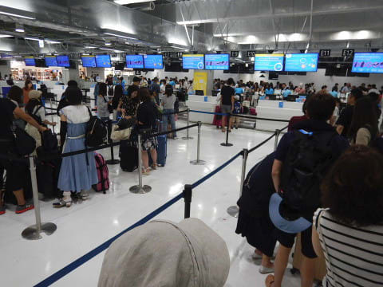

ここしばらく，フィリピンエアーで行くことが

多かったフィリピンですが．

LCCのバニラエアがセブ直行便を出していて．

かなり安くチケットが取れたので，

今回，初めて成田空港のLCC用ターミナルである，

第3ターミナルを利用することに．

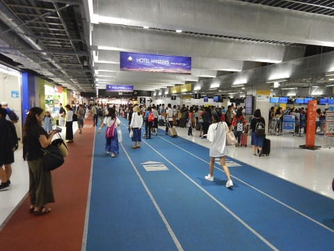

確かに，第1，第2ターミナルと比べると．

建物のつくりがものすごい安っぽい…

それよりも．

鉄道やバスは，第1ターミナルか第2ターミナルにしか

接続せず．

（空港外駐車場への送迎も，第3ターミナルには送ってくれません…）

第1か第2のターミナルから，シャトルバスでいちいち移動しなくては

ならないという不便さ…

大きなダイビング荷物を持っていると，

ターミナル間移動はかなり大変です（涙）

ターミナル内のお店もそれほど多くなく．

まぁ，実用一点張りのLCC用らしいターミナルですね…

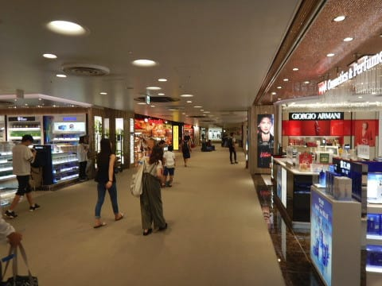

出国審査を通過した後は，そこそこお店がありますが．

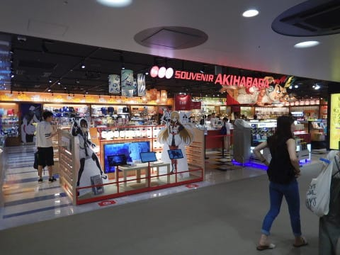

第1・第2ターミナル並みは期待しないほうが身のためです．

ってな感じで．

バニラエアの搭乗ゲートまでやってきたので．

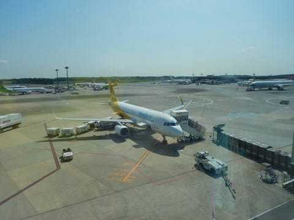

しばらく待合室で待つと…

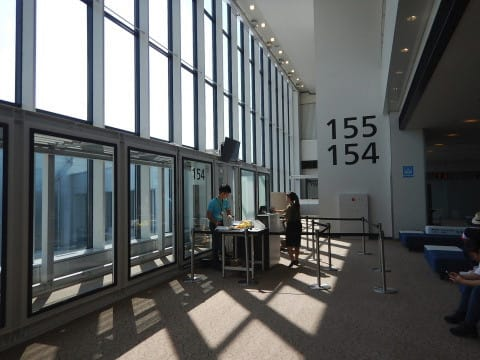

搭乗時間になったので，

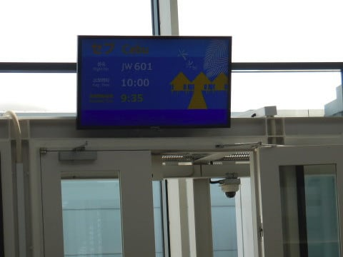

いざ搭乗！

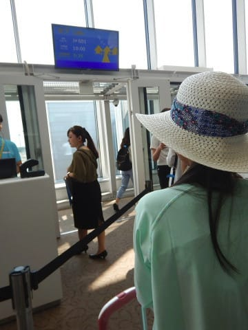

…って，搭乗ゲートから一回階段を

降りるの？

すぐボーディングブリッジじゃないの？

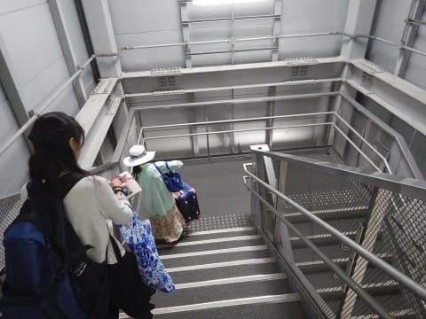

階段を降りた後，地上を歩いて…

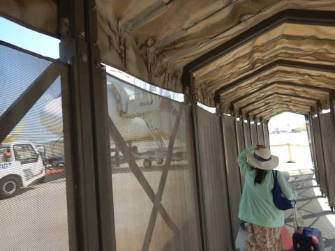

…そして，タラップで乗機するわけですか…

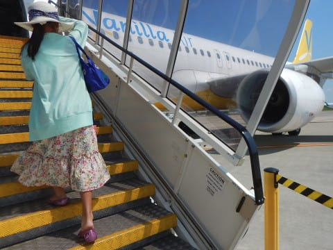

さすがLCCターミナル．

お金のかかるボーディングブリッジは要らないという

割りきりですね．

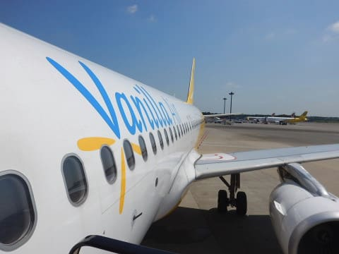

ってことで．

初めてのバニラエアの機体に乗り込みます…

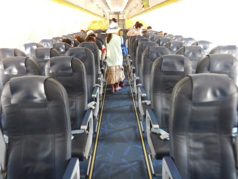

シートにも広告書かれているところが，

LCCらしい感じですね．

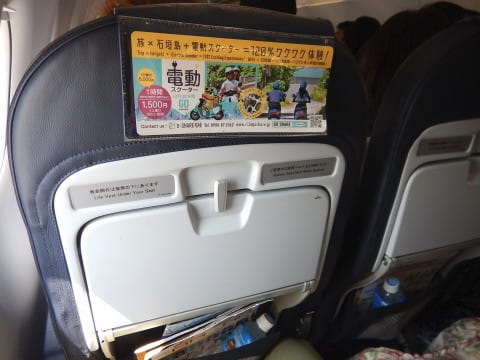

ほぼ定刻通りに，

飛行機は動き始めますが…

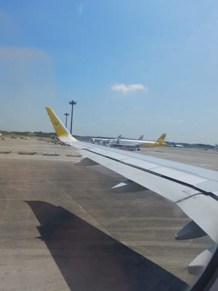

ちょうどB-787型機のRRトレントエンジンの

不具合修理がたけなわのころ．

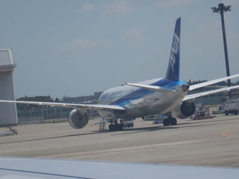

そこかしこに，エンジンが外されたANAの

B-787が止められてました…

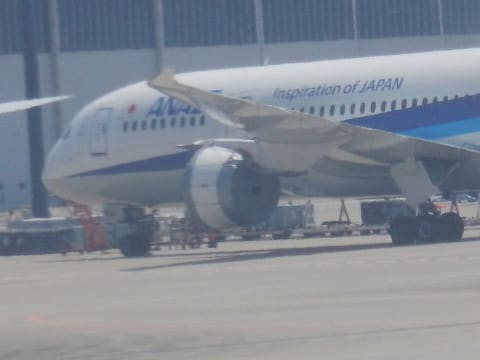

ってなことで．

滑走路に到着し…

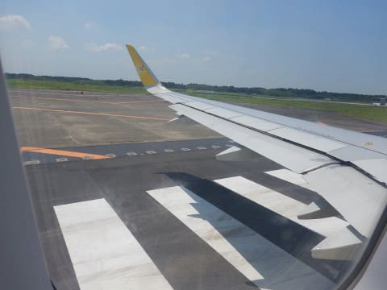

離陸！

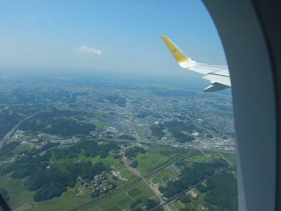

フライト時間は，わずか4時間ちょい．

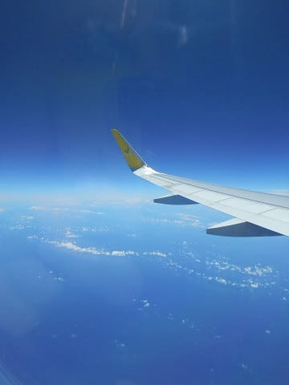

LCCなので，機内食はなく．

有料サービスしかありませんが…

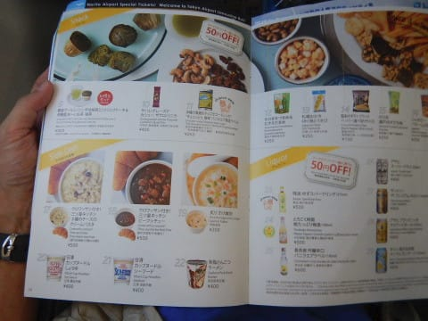

まぁ，4時間程度なら，食事なくて

十分だよね．

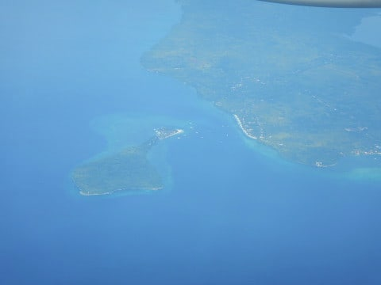

という感じで．

午後2時ごろ，セブ空港に到着です！

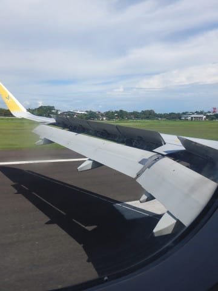

## 💬 コメント一覧

### 💬 コメント by (Hide)
**タイトル**: 最近の利用減りました・・・
**投稿日**: 2018-11-16 07:15:52

第３ターミナルは足を踏み入れたことがないですねえ。

かなり割り切った作りとは聞いてましたが。

ここ7～８年で羽田の国際線がかなり充実したので、”日系赤組”の私は成田の利用がほとんどなくなりました・・・。

しかも横○からだとNEX出てるとはいえ成田はちょっと不便で羽田は25分位で行けちゃいますからね。

### 💬 コメント by (Hide)
**タイトル**: PS
**投稿日**: 2018-11-16 07:19:29

羽田にも飛べない”青い”飛行機がそこいらじゅうに止まってました（笑）

### 💬 コメント by (Skier_S)
**タイトル**: Hideさま
**投稿日**: 2018-11-16 22:06:18

わたしも出張ではスターアライアンス組ですが、

プライベート旅行では安さ1番なので、

LCCになっちゃいます…

第3ターミナル、かなり割り切った作りでした。

今回の出張も、帰りは羽田便が取れず成田着です。

空港から家まで遠い…(涙)

今、ちょうど某空港のラウンジで出発待ち中です。

