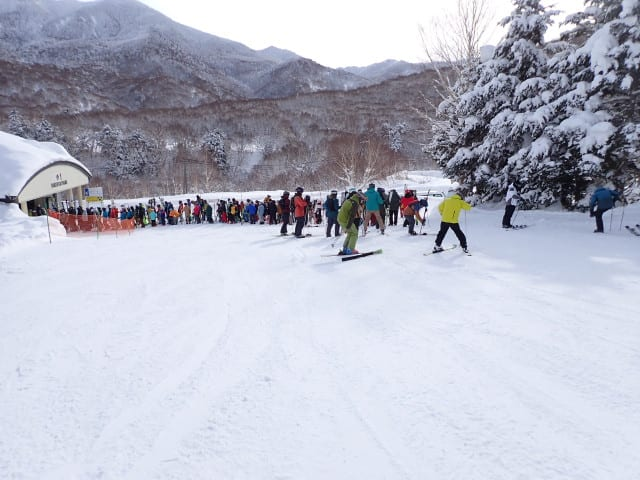
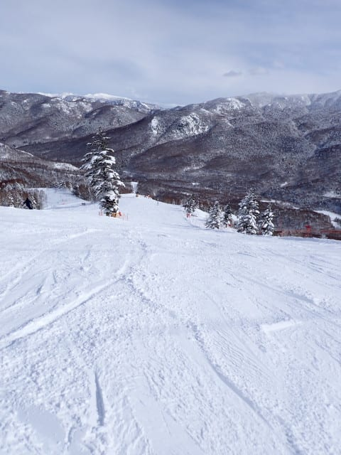
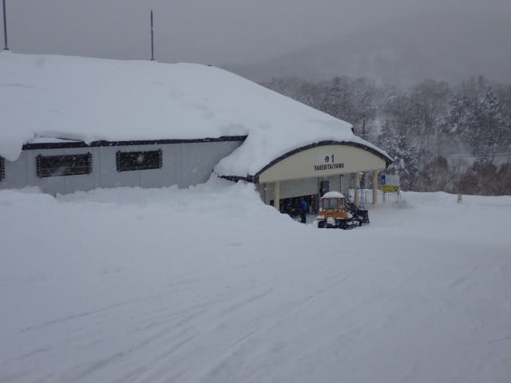

# 2025/1/12(日)，3連休中日の志賀高原焼額山スキー場は…昼間は晴天！ゴンドラはちょっと混むタイミングもあったけど昼はガラガラ！

📅 投稿日時: 2025-01-13 00:27:21

🏷️ カテゴリ: [2025スキー滑走日記](cacd3fbf84d4a679ee61a5894c3f95e14.md)

はいはいはいはい．

3連休中日の本日も，志賀高原で滑って

ましたよ～！！

ってなことで．

今日も焼額第1ゴンドラからスタート．

朝8時半の営業開始時の待ちはこの程度で，

3連休中日としては驚きの少なさ…！

そして，朝は曇り空だったけど．

山頂に出ると…

はい．予想通り晴れ！！

昨日は予言レベルで天気と雪質を当てましたが，

今日も当てましたよ～！！

で，山頂の気温は-10℃をわずかに上回る

程度で…

－9℃という予想と1℃以下の精度で

当てましたよ～！

昨晩からの積雪は，これも予想通りで

ほぼなくて．

いい感じに締まったシマシマバーンですよ！

朝日が射す，気持ちよい天気の中…

スピードがそこそこ乗る締まり具合

なのに，トップシーズンの柔らかさを

兼ね備える，このクストリーム最高

グレードのシマシマをいただく，

このあさイチのシアワセと言ったら…！

何本かGSコースのシマシマを3本ほど

味わった後，パノラマコースへ行きますが…

景色がいいですね～！！

そして…パノラマコースはまだまだ

シマシマが残ってるよ…！！

ホントに今日は雪質も天気もいい…

ってな感じで．

いい天気のいい雪を楽しんでたけど．

営業開始から1時間ほどたった9時半には

コース上の人口が増えてきて…

一ノ瀬方面から人が流れてくる

第2高速はゲートの外まで列が伸びて

きて…

そして10時には…

うぎゃぎゃーーーーー！！

第1ゴンドラも今シーズン最高の

こんな長い列になっちゃいました…！！（泣）

ただ，8人乗りの第1ゴンドラは列の流れも

早く，これで10分待たなかったし．

これがゴンドラ待ちピークでした…

第1ゴンドラが混むと焼額の呪いが解ける

仕掛けの私．

焼額ゴンドラが混雑する11時過ぎまで，

奥志賀へ脱出！

エキスパートコースはわずかに荒れ始めて

いたけど，下地がしっかりした圧雪で，

いい感じ！

11時ごろになると，一ノ瀬方面から奥志賀に

人が流れてくるので…

11時近くになるとちょいと人口密度が上がって

きますね（泣）

ただ，奥志賀のリフトの最大混雑はこの程度．

なので，全然リフト待ちは気にならないん

ですけどね…

あ，奥志賀ゴンドラは10分以上待ちますよ！

…で，奥志賀がこのくらいに混んでくる

時間になると．

逆に焼額がすいてくるので，焼額に戻ります…

ちょうどお昼近いということもあり，

みんなお昼休みに行ったのか…

焼額，ガラガラなんですが…！！

天気はいいけど，最高気温は4度程度で，

雪質はいいし…

雪が締まり気味なので，昼になっても

全然バーンが荒れず，コンディションが

良いまま！

11時過ぎから午後1時過ぎまでは，

ゴンドラ待ちもせいぜい搬器1－2台待ちの

こんな感じが続いたし…

雪質がいいし，天気がいい3連休中日に，

こんなガラガラでいいんですか…！！？？

ってな感じの最高バーンを滑っていたら．

午後2時過ぎになって，なぜかまた人口密度が

ちょっと上がってきました…（ちょい泣）

ただ，午後2時半から3時ごろはちょっと

混んだけど，ゴンドラ待ちはゲートの

外にまでは出ない程度だったし．

天気が良かった本日．

午後はだんだん雲が増えていき，

夜に雪が降るという予想だった

ところ，夜の雪の降り始めが

ちょっと早くなって…

午後3時半過ぎになって，雪が

結構降ってきました…！！

強く降ってる時間は短かったけど，

この短い時間でバーンの上に数cmほど

雪が乗るくらいに積もってて…

雪が結構降ってきたのもあり，

バーンはまたガラガラになってきましたよ！！

そんな中，今日も営業終了までしっかり

滑り倒したのでした…

ってなことで．

3連休中日で混むことを覚悟したけど．

焼額のゴンドラが混んだのは10時から

11時前までだったし．

コース上の人口密度も思ったほどひどく

なかったし．

天気も雪質もいい中，たっぷり楽しめた

3連休の中日だったのでした…

…いやーー．

今日も満足，満足…

…

だけど．

今日もまだ終わりませんよ．

そうですよ～！

今日もいつも通りのナイター参戦！！

最高雪質の焼額クオリティのシマシマ

バーンを，朝に続いて2度楽しめる

デリシャスなナイターですよ～！！

見よ！！

この最高シマシマを…！！

シアワセ…シアワセなナイターだよ！！

やっぱり焼額ナイター最高…！！

昨日より人が多かったけど，

コース上では好きなラインを取れたし．

営業開始から1時間たってもまだまだ

こんな感じのシアワセバーン…！！

ってなことで．

今日も朝イチからナイター終了まで，

いつも通り昼休みも取らず，

ひたすら滑り倒したのでした…

良かった．

この3連休，恵まれてるよ…

というわけで．

3連休最終日の明日まで志賀高原で

滑ってます～！！

## 💬 コメント一覧

### 💬 コメント by (ねも)
**タイトル**: Unknown
**投稿日**: 2025-01-13 04:22:01

Ｓさん　お久しぶり！

赤倉観光リゾートです。こちらも楽しく滑走(^^;)

連休初日は空いていて特にgood！　お互い素晴らしいスキーでした✌️

今日はちょっと無理じゃない？(笑、雨の予報)　私はおとなしく引き揚げかな。

### 💬 コメント by (Skier_S)
**タイトル**: ＞ねもさま
**投稿日**: 2025-01-14 01:25:23

赤倉観光リゾート良かったですか…3連休空いてたんですね．

結局月曜はおとなしく引き上げちゃったんでしょうか？

### 💬 コメント by (富山県民)
**タイトル**: Unknown
**投稿日**: 2025-01-14 06:46:30

こんにちは。　

三連休中日の1月12日は薄曇りだったのですね。

それと北アルプスも見えたのですね。

三連休では1月12日が最も好条件だったと思います。

私はこの日は糸魚川シーサイドバレーに行きました。

薄曇り時々晴れという感じでした。

### 💬 コメント by (Skier_S)
**タイトル**: ＞富山県民さま
**投稿日**: 2025-01-15 02:00:57

12日はそこそこ天気も良く，北アルプスも見えて，いい感じでしたよ~！！

糸魚川シーサイドバレーも天気が良かったんですね…

