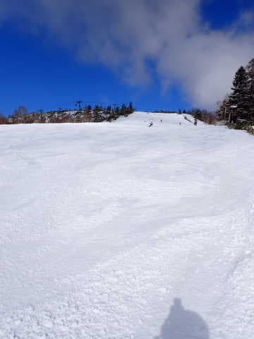
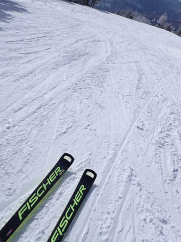

# 2023/4/9(日)の志賀高原スキー場は…新雪10cm，－10℃の冷え冷え晴れ！4月としてはベストに近いコンディションだったよ！

📅 投稿日時: 2023-04-10 01:03:10

ってなことで．

今日も早朝6時から一の瀬ラストの16:20まで

しっかり滑り倒し，そこから300km運転して

深夜に帰宅というパターンなわけですが…

本日の志賀高原は…

良かった．

いやーー．恵まれた一日だった…

そうです．

神様はちゃんと見ていてくれたのです…！

昨日，あのひどい状況で滑った私のために，

神様は4月としては最高級に恵まれた

バーンコンディションをプレゼントして

くれました！！

昨日お願いした50cmには足りないけど．

私の願いを聞いてくれて，神様は10~20cmの

冷え冷え新雪を恵んでくれました…！！！

いやーーー．

今日は良かった…（しみじみ）

まず．

今日は早朝スタートの6時から参戦しましたが…

あさ6時の山頂の気温は-10℃と冷え冷えで．

予想を超えて，10~20cmの新雪が積もって

くれました！！！

春の時期は夕方圧雪なので，

圧雪後に積もった雪がバーンの上に

乗っていて…

4月の雪としてはかなり冷え冷えの

プチ新雪バーン！！

2月末から高温続きで，全く冷え冷え雪が

積もらなかった今シーズン．

まさかこの時期に，こんな新雪が滑れるとは…！！

そして，朝6時半ごろにはすっきり晴れてき

ましたよ…っ！！！

それでも気温が冷えてるので，雪はしばらくは

全く緩む気配はなく．

まるでトップシーズンの雪みたいなんですが！！

早朝の時間帯が終わっても，まだまだ雪は

緩まずに，いい感じの冷え冷えバーンなんですが！？？

そして，新雪も一通り踏まれると，完全

圧雪になって…

いや．

これはいい！！この時期にこのバーンが

滑れたら，最高レベルのGoodコンディション！！

で．

今日は午前11時ごろには焼額のバーンが

ちょっと荒れ始めてきたし．

柔らかい新雪部分，ちょっと滑りが悪くなって

きたのもあり，一の瀬方面へ移動してみましたが…

一の瀬は…

11時になっても，正面バーンはしっかり締まって

思いっきり責められるバーン状況じゃないですか！！

いいんですか！！？？

こんなに恵まれてて，いいんですか…！！

ただし．

気温は低めだったものの，やはり日差しが

強かったので…

午後1時ごろには，残念ながらバーンが

結構荒れはじめてきて…

午後2時半くらいになると．

うーん．

小回りレーンのツルツルと，その間に重い雪が

溜まって凸凹になっていった，微妙な

バーン状況に…

午後3時ごろになると，正面バーン下部は，

かなり重いザラメが溜まってかなり

バンピーな凸凹になり，エキサイティングな

感じになってきたけど…

それでも，普通のこの時期の晴天なら，

板が埋もれていくくらいのザブザブの

ドボドボになるところ．

今日は一日気温が低く，晴天なのに

ザブザブになったり，緩斜面が完全な

ストップ雪になったりすることはなく．

この時期としては恵まれたコンディションで

ラストまで滑ることができたのでした…

いやー．

今日はリフトもゴンドラも待たなかったし．

雪もこの時期としては最高級に良かったし．

恵まれた一日だった…

ずっとこんな日が続いてくれるといいんだけど…

でも．

明日月曜から，また気温が上がりそうだし．

12日は雨がちょっと降るかもしれないし…

それよりも．

また次の週末の15，16日に，

狙ったかのように高温の雨が降りそう…(涙)

今の天気図だと，15日か16日はかなり荒れた

天気になる可能性が高いし．

志賀のかなりのゲレンデが，16日の日曜で

危機的状態になる可能性が…（泣)

しかし，なぜまた狙ったように週末に

荒天の雨になるかな～（激涙）

PS.

今日，焼額を脱出した理由は．

そうです．

こういうのに参加するためでした…！

また後日，試乗レポート書くので，

お楽しみに…！！

（まだ3月上旬のエキップさん試乗会で

乗った板のレポートも書けてないけど…）
