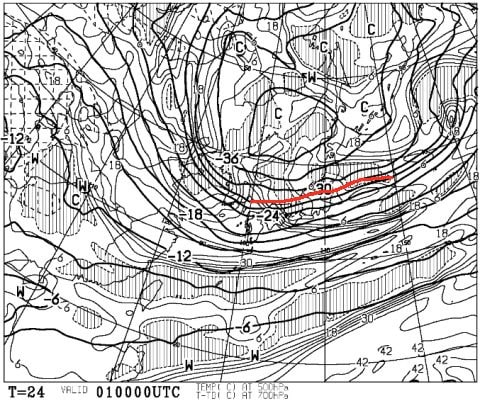

# 2019/3/31(日)志賀高原焼額山スキー場速報レポート…そして4/1,2,3日の天気予想…この3日間は，トップシーズンの冷え冷えコンディション！

📅 投稿日時: 2019-04-01 02:06:52

🏷️ カテゴリ: [2019スキー滑走日記](c3e4496fc0fb7f9c17ff21214a35b1ace.md)

ということで．

いつものことながら．

日曜の本日は，定番の深夜帰宅…（涙）

だもんで．

本日の志賀高原，いつもの速報モードで

お送りするわけですが．

…その前に．

明日月曜日から3日間の天気図．

なんだか，すごいんですが…っ！！！

まず，4/1月曜の500hpa図を見てみると．

ええええええ！！！！

なんじゃ，こりゃ！！

真冬の寒気を示す，-30℃線が

志賀高原にかかってますよ！

これは…

4月ではありえないレベルの冷えですね．

この日の850hpa気温図を見ると．

赤い0℃線ははるか南．

志賀高原には，水色の-6℃線が

かかっているくらいなので…

朝は-10℃近くまで下がりそう！

昼間も，-5℃程度までしか上がらない，

冷え冷え！

これ，ホントに4月か！？？

そして，地上天気図は…

日本海側に降水域が予想されているので．

おそらく．

志賀高原．

降ります．

それも，4月とは思えない，

軽い新雪が…

そして．

4月2日の火曜日の500hpa図を見ると．

えええええ！！

なに！？？

何ですか！これはっ！！

赤い-30℃線どころか．

水色の-36℃線が志賀に近づいてますよ！？？？

これは…真冬でもそうそうやってこない

強烈な歓喜寒気

ってやつなんですが！

4月になって，こんな寒気が

やってくるなんて…！

当然，2日火曜の850hpa図も

すごいことになっていて．

赤い0℃線は，はるか小笠原

くらいまで南下していて．

志賀には-9℃線が近づいて

いますけど…っ！！

これ…ホントに真冬．

1月か2月，それも冷えた時の

天気図なんですけど…！

地上天気図は，この日も日本海側に

降水域が予想されている，冬型なので．

この日も，志賀高原は冷え冷え雪が

降り続けそうです…

そして．

さらに3日の水曜の500hpa図を見ると．

この日も，-30℃の真冬の寒気は，

関東まで下がってますよ！！

これ，関東近辺でも真冬の寒さに

なるってことですね…

そして，850hpa図を見ても．

赤い-0℃線ははるか太平洋の南．

志賀高原には，-6℃線どころか．

水色の-9℃線が近づいているので．

志賀高原の朝は，-10℃を下回るかも？

もう，4月なんですけど？

とても4月とは思えない冷え込み…

そしてこの日も．

地上天気図は冬型なので．

雪が降りそうですね…

とりあえず．

本日午後から始まった，冷え冷え祭り．

4/1の午前1時過ぎに．

上林チェーンベースでも

積雪が始まってます…

4月に入ってから．

上林で積雪があるってのは

そうそうないパターンです．

もう，冷え冷えです！！

この月，火，水は，

毎日積雪は10～20cmずつくらいで，

ディープパウダーとは言えないけど．

トップシーズンのパウダーが積もる

3日間になりそう…！

いや．

この月，火，水．

仕事を休んででも滑りに行きたい…（願望）

で．

この冷え冷え祭り．

週末までもってくれればいいんですが…

残念ながら，4/5の金曜日以降．

850hpaの0℃線は，志賀よりはるか

北に上がっちゃいます…（涙）

金曜は，もしかしたら液体が

降るかも(泣）

せっかくの，月・火・水の最高の

冷え冷えパウダーが，金曜で解けて．

そして，土日は4月らしい，暖かい

日差しでザブザブ雪になりそう…（涙）

あぁ…

週末まで最高のままでいてほしかった…

もう，ホントに水曜あたり，仕事休んで

滑りに行きたい（涙）

ってなわけで．

ここまでで終わりにしてもいいくらいの

記事のボリュームですが．

一応，今日も志賀高原で滑っていた

わけですから．

本日の志賀高原の速報レポートをば…

えー．

今日も早朝から参戦したわけですけど．

朝6:30は，かなりの雪降りでスタート．

コース全面，圧雪の上を，

5cm程度の新雪が覆ってますよ！

通常営業開始のころには雪も上がり．

視界も良くなってきて…

そこそこ気温も低かったので．

コーズ全面，ほぼトップシーズンの

雪質！

…で．

雪が良いのに．

昼間には時折日が射すタイミングも！

だのに．

昼間も気温は-3℃程度と低く．

雪は日が射しても緩むことなく，

いい雪質のまま…！！

いや…

明日からもう4月なんですが！

とても4月と思えない雪質で．

さらにコース上の人も少なく．

いや…

恵まれてる．

3月最終日でこんな冷え冷え

コンディションって…

今シーズン3月，結構恵まれてるよ…（感動）

そして．

リフト営業終了のころには．

また，冷え冷え雪が結構な

勢いで降り始めました…！

うーむ．

これは．

月曜のコンディション，良さそうな

感じ…

ってなことで．

とても3月末日と思えない感じで．

今年は2月より3月の方が

まともなゲレンデで滑れた気がする

という，不思議な状況で，

3月最終日も終わっていったのでした…

うむ．

2月は暖かかったので，

かなりヤバい感じだったけど．

3月は冷えて，かなり雪が降ったので．

今年のGWは．

このままなら無事営業できそうな予感…！

ってことで．

明日詳細レポートやります～！

## 💬 コメント一覧

### 💬 コメント by (かず)
**タイトル**: Unknown
**投稿日**: 2019-04-01 12:33:01

昨日は白馬で試乗会でした　土曜の予定だったのですが雨の試乗会も悲惨なので日曜にしました　しかしボコボコ　ワックスも取れててさっぱり分からず　土曜のほうが良かったらしいです

急遽今週水木で行く予定にして仕事バタバタです　笑

### 💬 コメント by (はなげ親分)
**タイトル**: Unknown
**投稿日**: 2019-04-01 14:48:13

奇跡の３月が終わってしまいましたね～

奇跡ついでに４月も土日だけでもいいので(もう平日は予定無し 笑)真冬になってくれたらなぁ!

### 💬 コメント by (Rikoriko)
**タイトル**: Unknown
**投稿日**: 2019-04-01 19:50:09

こんばんは〜。今日のパウダー最高でしたよ〜。今日はテレマークでしかも太板だったのでフワフワ浮いて思わず『キャッホ〜！！』と叫んでしまいました〜。４月にこんな雪を滑らせてもらえるなんて、神様ありがとう❤って感じです。

月火水の予報ありがとうございます。

テレビの天気予報でも明日は中野飯山や志賀高原に大雪・着雪注意報が出ていてビックリ！！です。

志賀だけでなく中野市でも終日雪予報でした。

いつもなら雪の降る日は休息日と決め込むのですが、もうシーズン終盤で残り少ないので明日も雪の中滑って来ようと思っていま〜す。へへへ。

### 💬 コメント by (yumi)
**タイトル**: Unknown
**投稿日**: 2019-04-01 20:41:00

Ｓさぁ～ん❄️⛷️😍

お仕事 休んで 滑りましょう🎵～

🎉🎉🎉🎉🎉

### 💬 コメント by (Skier_S)
**タイトル**: ダメだ…寝てしまった
**投稿日**: 2019-04-02 07:00:20

＞かずさま

志賀は日曜良かったんですけどね～！

圧倒的に，土曜より日曜が良かったです．

でも，日曜の白馬はすごい降ってパフパフパウダー

楽しめたんじゃないですか？

＞はなげ親分さま

いやーーー．

2月の状況と，3月の長期予想から考えると．

奇跡の3月でしたね～．

4月も，長期予想を見ると結構冷えそうです！

長期予想，ここしばらく見事に外してるので

当てになりませんが…

＞Rikorikoさま

…月曜，良かったみたいですね…

火曜もいいですよ．

今日はパウダー20cmじゃないかな…

水曜もいいし．

木曜昼頃まで最高のコンディションが続きます．

楽しんできてください…

＞yumiさま

休んで滑りに行きたい（涙）

年度末・年度初めは厳しいです…（泣）

