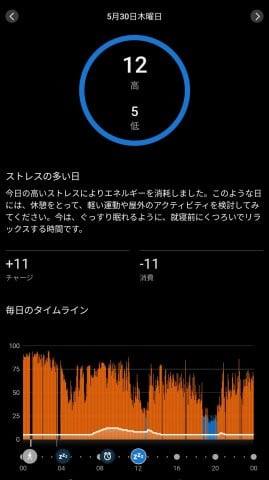
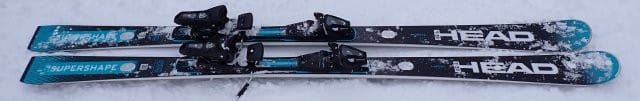
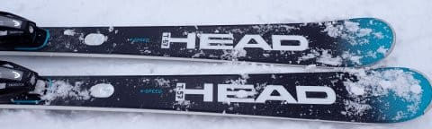
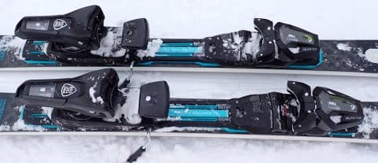
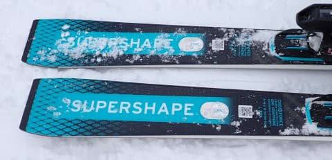
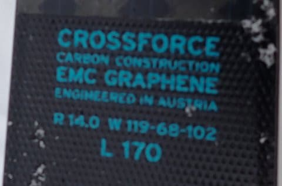

# 2025シーズンモデルのスキー板，試乗レポートその7… HEAD Supershape e-SPEED

📅 投稿日時: 2024-05-31 01:12:49

昨日も仕事がいろいろ切羽詰まっていて，

まともに更新できませんでしたが…

今日はいつもに比べれば早めに仕事が

終わったので，Blog記事を何とか書く

時間がとれたものの，←でも，いつも通りとっくの昔に日付が変わってるけど

ものすごい疲れが（涙）

Garminさんのストレスレベル＆Body Batteryを

みると，かなりヤバいことになっていたので．

今日は早めに寝ないとまずい…

ちなみに，グラフが青色になっているのが

休んでいる時間，赤色がストレスが高い

時間ですが…

ほぼ一日，ストレスレベルがかなり高い状況．

Garminを使っている人は，これがどれだけ

ヤバいかわかるはず（笑）．

ってなことで．

早く寝たいところだけど．

今日はちゃんと更新！！

2025シーズンのスキー板の試乗レポート，

ヘッド編です！

〇HEAD Supershape e-SPEED 170cm

エキスパート向けオールラウンド

長さ170cmですが，R=14mという，どちらかというと

小回りよりのオールラウンド板．

今シーズン，フルモデルチェンジなのかな？

以前はe-SPEED PROのプレート違いだったような

気がするんですが…

今は，e-SPEEDとe-SPEED PROはサイドカーブから

何から，まったく違う板になっているみたいですね．

とりあえず，履いてみたところ．

フレックスは割としっかりしているけど…

グリップがかなりマイルド目ですね．

試乗したコンディションが，5～10cmほど

積もった新雪が蹴散らされた．かなり

柔らかいバーンだったというのもあるかも

知れないけど…

柔らかいモフモフ雪では，あまりグリップを

感じられず，板がずれていく感じ．

柔らかい雪ではあまりグリップが感じられ

なかったということもあり，スピードを出した

時の安定感も，今一つ物足りない感じ．

あ，低速や中速でキョロキョロするとかいう，

そんなレベルの安定感のなさではなく，

板自体もしっかりしていて，比較的重さも

あるので，板がたたかれてバタバタするという

こともないです．

あくまで私のトップスピードレベルの

かなりのスピードを出したときの安定感が，

グリップの弱さゆえにトップモデルクラスに

比べると弱いかな…という感じ．

で．

角付けを強めにしてグリップさせてみると，

強めのサイドカーブに乗って板が

回っていきます．

トップとテールがグリップして板がたわんで

曲がっていく…というより，

角付けしてエッジが噛みこんだ瞬間からクッと

エッジが捉えて回っていく感じの板．

そのため，あまり板をたわませられない人でも

サイドカーブで楽にカービングに入っていけるし，

グリップも強くないのでカービングから

ズレに入れるのもすごい楽です．

あまりガッツリグリップしないので，

ずらしを多用したい人には扱いやすいんじゃ

ないでしょうか．

硬い斜面で試せなかったので，

硬い斜面だとまた違った評価になるのか

もしれませんが．

今までのSupershape e-SPEEDと比べると，

ちょっと優しめになった感じで，

私には残念ながらちょっと物足りない

感じだった板ですが．

あまりガッツリ滑らないし，検定とかも

狙ってないって感じの人向けにいい

板かな～．

リアルにガッツリ滑る人は，e-SPEED PROや

SL EVOを買った方が良いかも．

## 💬 コメント一覧

### 💬 コメント by (副院長)
**タイトル**: Unknown
**投稿日**: 2024-05-31 13:27:30

こんにちわ、ガーミン使ってますが、すごいストレスレベルです。僕は2/3は休憩です。S様は眠ってる時間が皆無ですね。どうぞご自愛くださいませ。

### 💬 コメント by (Skier_S)
**タイトル**: >副院長さま
**投稿日**: 2024-05-31 23:57:23

私の今週のGarminさんはずっとこんな感じです…

限りなく低空飛行を続けてます（泣）

ここ数日間，最高でもBody Batteryが40くらいまでしか上がらない感じで

かなり疲れてます…

ヤバい…

