# 2月12日の志賀高原は…晴天，3月並みのポカポカ陽気で，重い雪に（涙）

📅 投稿日時: 2016-02-12 23:33:50

ということで．

平日の本日も，志賀高原で滑っております．

夢にまで見た平日スキーです！！

ってわけで．

本日の志賀高原ですが…

朝からすっきり晴れ模様！

…昨日からの強い日差しで，道路も結構

アスファルトが出てきてますねぇ…

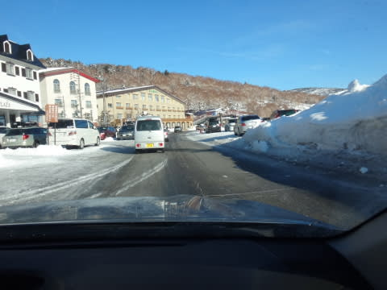

＃ところどころ凍っていたので，注意がひつようでしたが…

で．

山頂に出ると…

日差しが強いけど，放射冷却で-4度ですか．

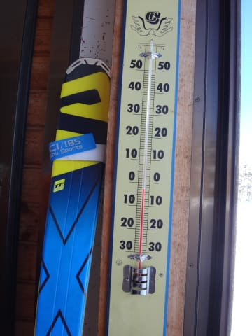

うむ…

まだなんとか，マイナス気温をキープしているようだな．

んで．

山頂は当然，ぴかぴか晴天に照らされた…

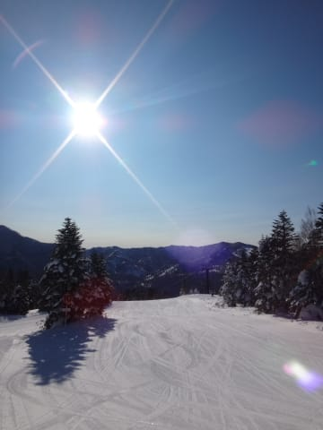

最高のシマシマバーンが待っているのだ！！！

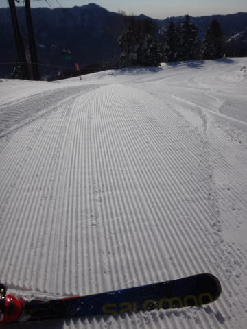

ふははははっ！

朝イチのしましま，いただきま～すっ！！！

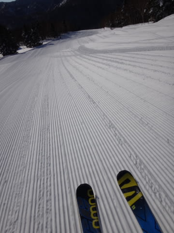

いやー．

今日のシマシマも，昨日のシマシマに負けず劣らずの美味！

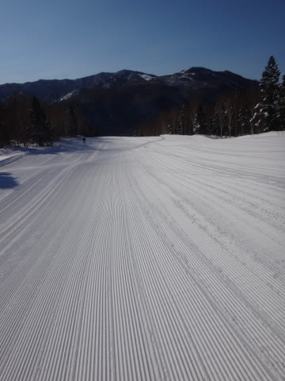

朝のうちは，気温も冷えてて最高っ！！！

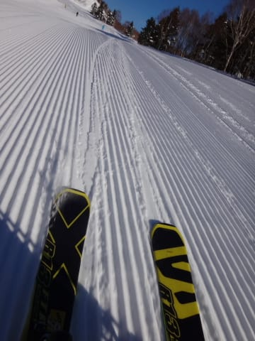

…と，

美味しいシマシマをいただいていると．

…あれ？

今日って，奥志賀ゴンドラ，強風で運休なの？？

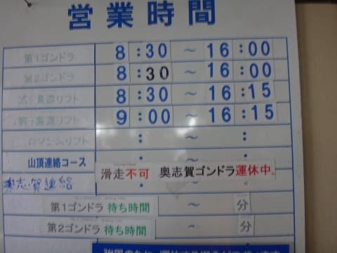

…ヤケビは1ゴン，2ゴンとも動いていて，

そんな強風に感じないけど…

ってことで．

奥志賀で滑れなかった人が，次々とやってきた焼額．

えええええ～っ！

なんじゃ，これっ！！？？

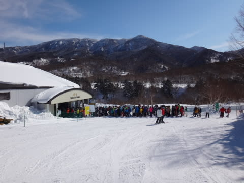

朝10時近くには，ゴンドラ10分待ちを超えました…（涙）

今日は平日モードで，ゴンドラ搬器をフルに出してなかったので．

列が進むのが遅く，短い列でもかなりの待ち時間に…

うーーーむ．

連休の谷間なので，搬器をフルで出しておいてくれれば…（残念）

で．さらに．

こんな強烈な日差しの中．

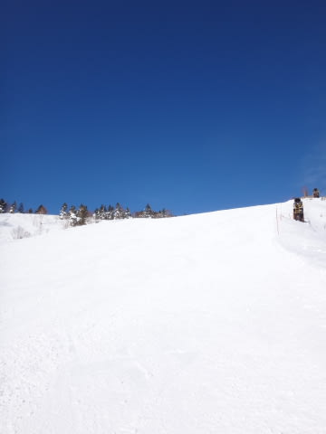

ゲレンデの雪質も…

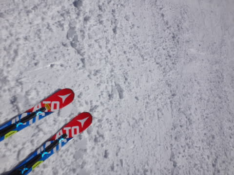

朝10時過ぎには，もうかなりダマダマに固まった，

重い雪になってきました…（涙）

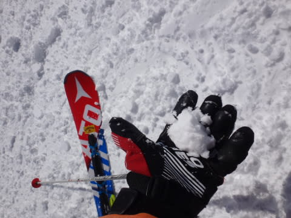

いつもなら待ち時間が解消される11時を過ぎても，

ゴンドラ待ちが長く．

さらに雪質劣化のダブルパンチのため．

焼額の呪いがかかっているため，焼額から離れられない私が．

今日は一の瀬へ脱出してしまいました…

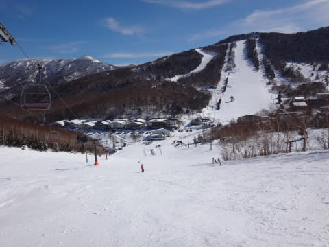

一の瀬ファミリーてっぺんから，

今日は北アルプスがすっきり見えますね～！

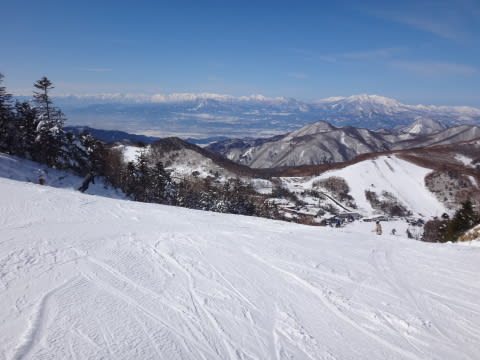

天気が良く．

気温もプラスに上がってしまい．

…なんだか，春スキーのような陽気に…

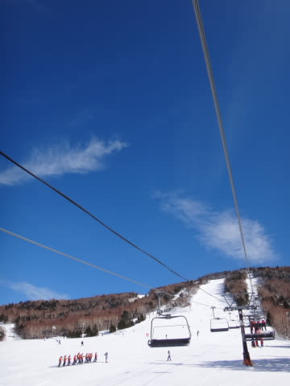

でも．

西斜面で朝のうちは太陽を正面から浴びない，

一の瀬ファミリー．

今日みたいに日差しで雪が解けちゃうような日は，

焼額よりも雪がいいですね～！

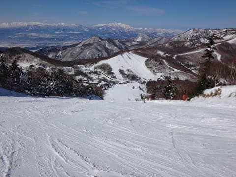

昼過ぎまでは，正面バーンは結構いい感じの雪！

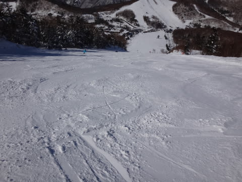

そして，リフトも飛び乗り状態！

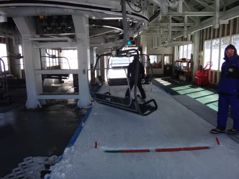

…

でも．

気温がプラスの本日．

…さすがに，西からの日が当たる午後は，

一の瀬ファミリー正面バーンの雪も…

あら．

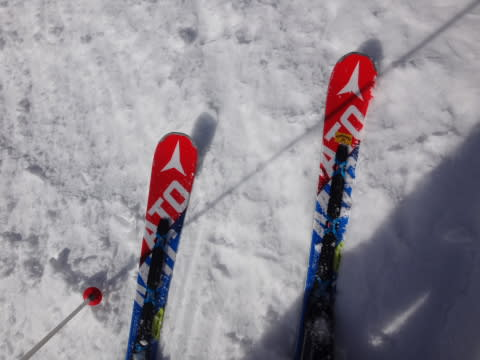

なんだか，

しっとりとした3月の雪に…（涙）

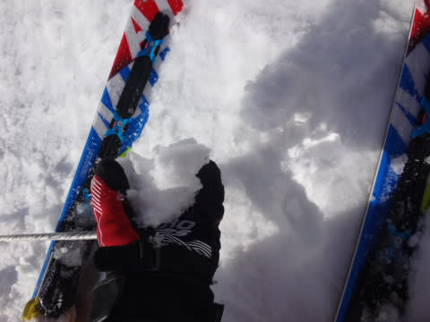

そんな中．

本日は，パーフェクターが人も少なく，

貸し切りバーン状態で．

そのおかげで，雪も終日荒れないままだったので．

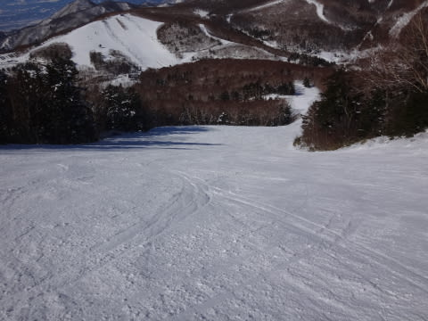

夕日が照らすリフトストップまで，パーフェクターをグルグル

していたのでした…

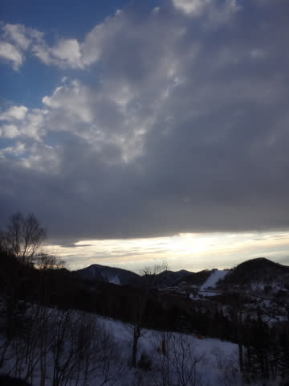

…で．

そう．

昨日は行かなかったけど．

今日は一の瀬ナイターへ！

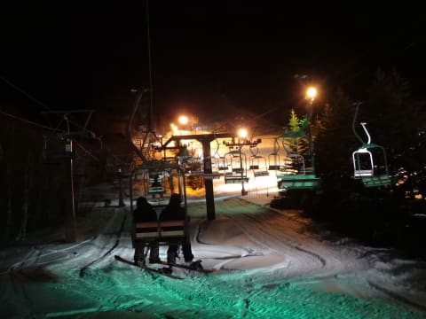

予想より人が多かったけど…

でも，きれいなシマシマバーンをたっぷり楽しみ．

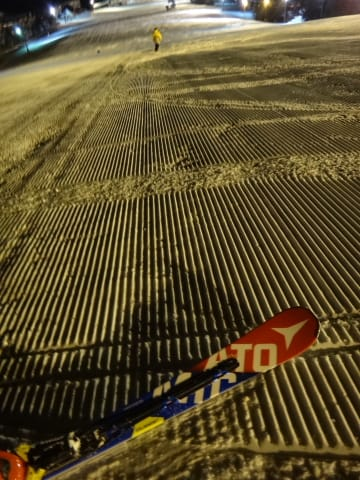

…今日は私にしては珍しく．

ほぼ一日，一の瀬で過ごしたのでした…

…しかし．

ナイター営業中も，気温がプラスだったのが，

ちと不気味…

で，明日，土曜ですが．

終日気温が+5度程度と，4月並みの気温で．

やっぱり，春の雪になっちゃいそうです…（涙）

でも．

せめてもの救いは，雨にはならなさそうってことかな．

終日曇りで，うまくいけば午前中は日もさすくらいかも？？

…まぁ，高温＆雨＆強風の日曜日がそのあとに待ってますが（涙）

とりあえず．

皆さん．

わかってますよね？？

気温冷え冷え，雨じゃなく雪になって，風よ収まれ踊り

を踊り続けましょう…っ！！

＃一部，冷え冷え踊りの歌詞を問い合わせいただいたようですが．

＃…皆さんの心の中から自然に沸き起こる懇願の叫び声，

＃それが冷え冷え踊りの歌詞です…←なんのこっちゃ

## 💬 コメント一覧

### 💬 コメント by (Goku)
**タイトル**: まさか・・・
**投稿日**: 2016-02-13 13:12:06

Sさんがヤケビを離れるって相当ですね。

でも、朝イチGS気持ち良さそー♪

パーフェクターも相当良さそう。

実はわたしパーフェクター好きなんですよね～

わたしは今週末、スキーお休みにしました。

### 💬 コメント by (Skier_S)
**タイトル**: Gokuさま
**投稿日**: 2016-02-13 22:43:43

いや…あまりにもゴンドラ待ち時間が長かったので（涙）

でも，朝イチは最高でしたよ！

…でも．

今日で，雪はすごいことになっちゃいました…

でも，明日はもっとすごくなるのかも…（激泣）

