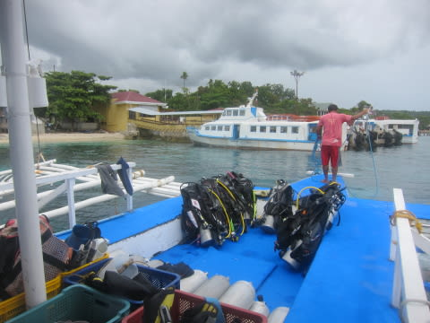
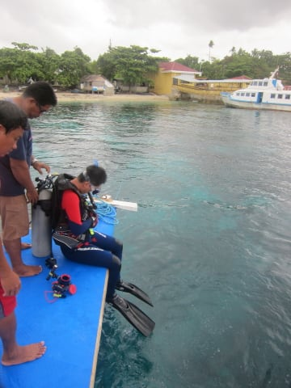
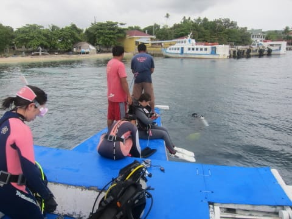
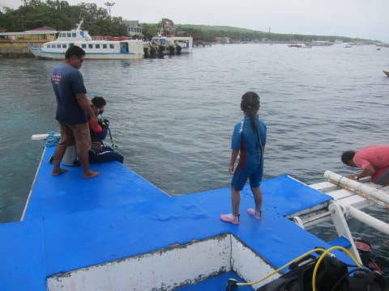
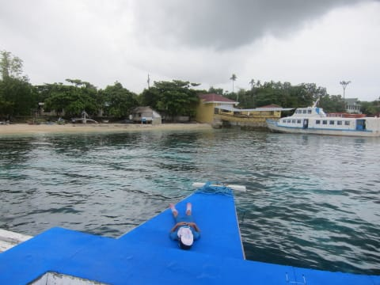
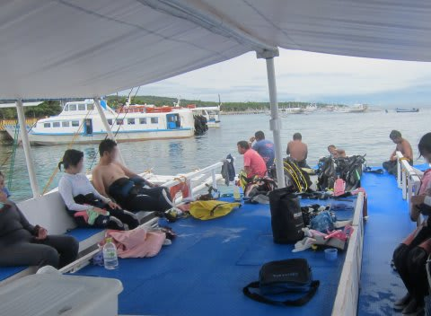
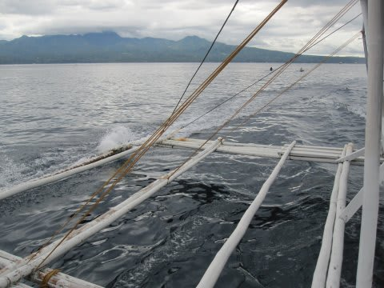
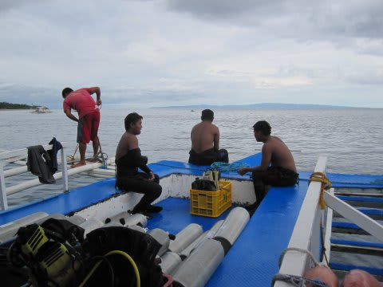
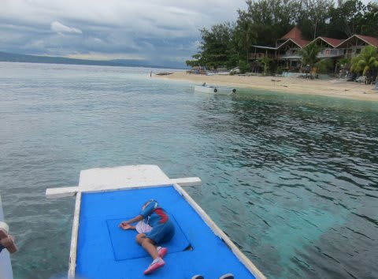
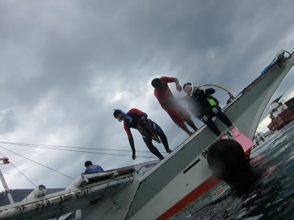

# 2013年11月　フィリピン・オスロブ　子連れでジンベエを見るぞっ！　その21

📅 投稿日時: 2014-08-04 00:25:31

ってことで．

昼休みを終えた船は，午後のポイントに向かって移動しますが…

うむ？

船が止まったところ．

こんな桟橋が近くにある，岸辺なんですけど．

まさかここでダイビングじゃないよね…．

ダイビング前にここに用事があって，立ち寄ったのかな…？

と，思ったところ．

どうやらここがポイントのようです．

次は，妻が潜り，私が留守番なので．

妻をはじめとするダイバーたちは準備をして…

次々海へエントリーしていきました．

エントリーしたダイバーを見送った娘．

天気も悪いし，さっきのビーチほど海に魅力を

感じなかったからか．

私「どうする？泳ぐ？」

娘「…泳がない」

…ををを！

どうした，娘！

お前でも泳ぎたくないなんてことがあるのか！！！

という感じで．

午前中と食後に結構泳いだので，眠かったのか．

娘はお昼寝タイムに…

船の上でのお昼寝姿がサマになっていて．

まぁ，なんとも，

船に慣れまくっている娘だこと…

んじゃ，私もやることがないから，

ちょっと寝てましょうか…

と，1時間近く寝てると…

私もぐっすり熟睡していたらしく．

気づいたら，ダイバーたちが戻ってきました．

だもんで，船は4本目のポイント…

つまり，本日最後のポイントへ移動します．

移動時間わずか5分ほどで到着…

娘はまだ寝てますね．

ってことで．

しばし休憩時間の後，本日4本目…

私にとっての本日2本目のエントリーです．

…っていうか．

この旅行の最後のダイビングですね．

…よく考えたら．

昨日は午前中ずっとシュノーケリングだったので，

昨日のダイビングは1本だけ．

そして，今日は2本で．

今回の旅行では，全部合わせてもたった3本しか潜らないのか…
