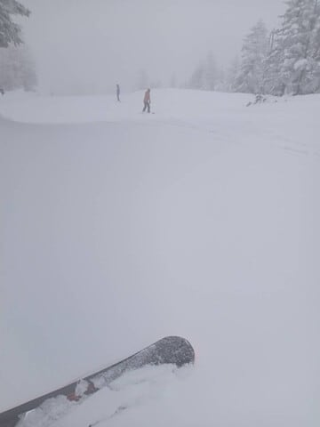
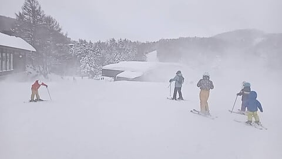
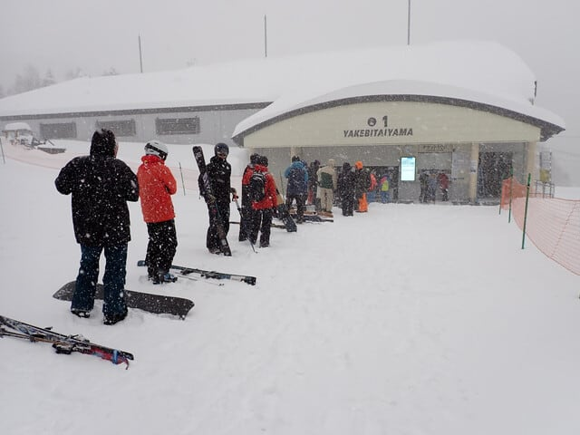
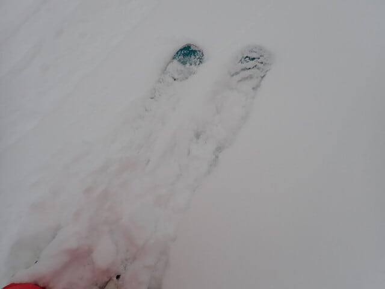

# 2024/12/22(日)の志賀高原焼額山スキー場の写真追加…冷え冷え終日雪降り，根性の無いスキーヤーふるい落とし機能全力発動の一日

📅 投稿日時: 2024-12-24 02:16:25

🏷️ カテゴリ: [2025スキー滑走日記](cacd3fbf84d4a679ee61a5894c3f95e14.md)

日曜も一日雪が降り続けた志賀高原ですが．

今日送られてきた特派員レポートによると…

月曜の朝にかけても雪が50cm以上

積もったようです！！

さらに朝の気温も-15℃近い激冷え

だったみたいですね～！！

ただ，今日は雪が強く降ったのは朝まで．

風はそこそこあったみたいで，第2ゴンドラは

風のため10時近くまで動かなかったようですが，

それ以外のリフトは予定通りに営業開始！

昼間は雪はほとんど降らず…

そして，本日オープンのオリンピックコース．

予定の10時から遅れてオープンだったようですが．

重めの新雪ながらも日曜よりは軽い雪が，

50cm以上乗っていたようです…！

とりあえず．非圧雪部分は結構重い雪が

どっさり積もった状態だったみたいですが…

緩斜面でこのようにつかまると，

その後はかなり重い雪をラッセルしないと

進まないような状況だったようです…

月曜朝に降り止んだ雪は，また今降りはじめて

きたようで．

また明日1日，雪が積もる1日になりそうです…

ちなみに，雪は今晩，月曜夜からまた

火曜も一日降り続けそうで…

いや．

この12月，降りますね～！！

ってなことで．

日曜帰宅後に速報した志賀高原，今日は

詳細レポートです…！

まず，日曜朝ですが…

麓の湯田中でも，一晩でこれだけ

積もりましたよ～！！

日曜は強風で奥志賀は全面運休．

焼額は全リフト営業しましたが…

8:30の第1ゴンドラ営業開始時は，

全面運休の奥志賀から流れてきた人も

多かったのに，天気が悪かったからか

ゴンドラはそれほど並んでません！

そして，山頂に出ると…

気温は-11℃！！

-10℃以下という予想がおおむね当たり！

第1ゴンドラ山頂から奥志賀方面への

連絡路は，奥志賀が全面運休なので

クローズされてましたが．

この写真を見ても，朝からいい

降りっぷりですね…

で．

コースは，圧雪コースでも圧雪の上に

10～20cmの雪が乗っていて…

全面新雪状態！

…こういう状態では．

そうです．太板の出動です！！

昨シーズンは雪が少なく，1度も出番が

なかったセンター108mmの太板，

2シーズンぶりの出動だ！！

コース全面ブーツパフの新雪の

1本目は，めちゃくちゃ気持ちよかった！

昨シーズンではほとんど味わうことの

なかった新雪を思う存分楽しめた感じ！

ただ…コース脇のパウダーに入ると，

膝パフくらいの新雪ですが．

雪が重すぎてスピードが乗らず，

ほぼ直滑降で突っ切らないといけない

感じなので…

非圧雪コースはちょっと避けたほうが

いい感じ．

でも，非圧雪コースに入らなくても，

圧雪コースでも太板がないと辛い

くらいの積雪なので．

圧雪コースで十分新雪が楽しめました

よ～！！

しかし．

風も強く，雪も激しく降り．

さらに重めの新雪はだんだん蹴散らされて

ボコボコになっていく上に，

視界も悪いという，

根性の無いスキーヤーふるい落とし機能

がフルで発揮されたこともあり．

第2ゴンドラもガラガラだし…

第2高速もあまり人が乗っておらず．

第1ゴンドラのみ，午前10時から11時に

このくらいの人がいたものの，

それ以外はほぼ飛び乗り状態！

ガラガラだよ…！！

コース上の人口密度は，この位がピーク

だったかな…というほどのガラガラ具合で．

この写真を見てもよくわからないけど…

昼過ぎになると，コース全面がボコボコに

なってきたのもあり．

だんだんコース上の人が減っていき，

午後になると，完全に寂しいゴースト

タウン状態になっていきました…

午後になると，ホントにゴンドラにも

誰も乗ってないよ！！

で．

これだけ激しい雪が降っている中，

人が滑らないとどうなるかというと…

そうです．

誰も雪を踏まないから，コース上が

またプチ新雪状態になっていきます…！！

…いや．

これ，圧雪コースなんですけど．

それも，散々スキーヤーに踏まれた後の

午後の圧雪コース上とは思えない

新雪っぷりなんですけど…！！

でも…

これ，人がいないパフパフ，楽しい～！！←注：激寒視界悪ボコボコ新雪なので，普通は楽しめない

楽しすぎて，今日もお昼休みも取らず

ナイター照明が着く夕方まで，思いっきり

楽しんじゃったよ～！！←注：普通の人はバーン状況が見えないボコボコ新雪で楽しめない

ってなことで．

本日も営業終了の16時まで，

いつも通りお昼休みも取らず，

ボコボコバフバフを7時間半，

ひたすら楽しみ続けたのでした…

いやーーー．

雪がガンガン積もってくれるし．

新雪がちょっと重めと言っても

4月の雪よりは100000倍マシだし．

これでガラガラなんだから．

この12月は恵まれてる…！！

今日も楽しかった～！！

と，この週末の喜びをかみしめつつ車に

戻ると．

ボコボコを滑ってヘロヘロになった肉体を

鞭打つ，車の発掘作業という肉体労働が待って

いたのだった…

まさか，昼間だけでこんなに積もるとは…
